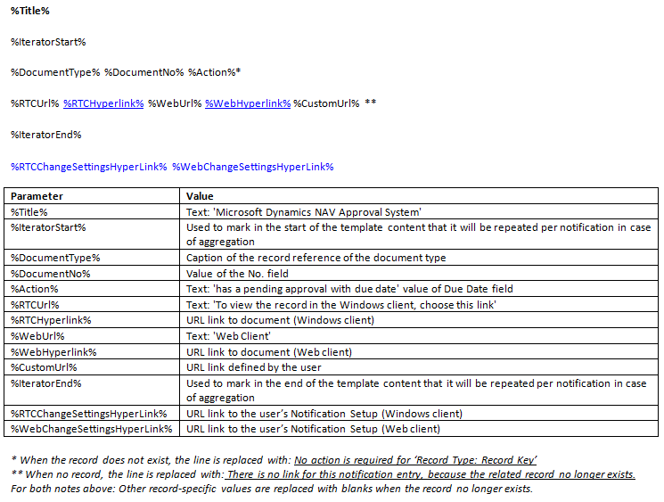

# Практическое руководство. Управление шаблонами уведомлений
Пользователи потоков операций получают уведомления, поясняющие, какие шаги им следует предпринять, либо информирующие их о статусе подзадач процесса. Можно задать, кто и когда будет получать уведомление, указав утверждающих пользователей, график уведомления пользователей, а также отклики процесса для определения получателя уведомления. Дополнительные сведения см. в разделе [Настройка уведомлений рабочего процесса](across-setting-up-workflow-notifications.md).  

 Уведомления создаются на базе шаблонов, определяющих их структуру и содержимое. Содержимое шаблона уведомления можно экспортировать, изменить и затем импортировать в этот же или новый шаблон уведомлений. Это описано в следующих процедурах.  

 Универсальная версия [!INCLUDE[d365fin](includes/d365fin_md.md)] включает три шаблона уведомлений: для уведомления о запросах утверждения, для уведомления о новых записях и для уведомления о просроченных запросах утверждения. Три заранее определенных шаблона уведомлений поддерживают методы уведомления **Электронная почта** и **Заметка**. Для просмотра содержимого трех шаблонов уведомлений просмотрите раздел "Содержимое шаблонов уведомлений" данной темы.

## Создание нового шаблона уведомлений  
1.  Выберите значок , введите **Шаблоны уведомлений**, затем выберите связанную ссылку.  
2.  В окне **Шаблоны уведомлений** выберите действие **Создать**.  
3.  Заполните поля, как описано в следующей таблице.  

    |Поле|Описанием|  
    |---------------------------------|---------------------------------------|  
    |**Код**|Обозначение шаблона уведомлений.|  
    |**Описание**|Введите описание шаблона уведомлений.|  
    |**Метод уведомления**|Укажите способ отправки уведомления — по электронной почте или в виде заметки.|  
    |**Тип**|Определите бизнес-процесс, для которого будет использоваться уведомление.   Выберите один из следующих типов:   -   **Утверждение** определяет, что шаблон применяется для уведомления пользователей рабочих процессов утверждения. -   **Новая запись** определяет, что шаблон применяется для уведомления пользователей в случае, если их утверждения требует новая запись – например, карточка клиента. -   **Просрочено** определяет, что шаблон применяется для уведомления пользователей о просроченных запросах утверждения.|  
    |**По умолч.**|Определите, будет ли шаблон уведомлений использоваться по умолчанию.|  

## Изменение шаблона уведомлений  
1.  Выберите значок , введите **Шаблоны уведомлений**, затем выберите связанную ссылку.  
2.  В окне **Шаблоны уведомлений** выберите шаблон уведомлений, который требуется изменить.  
3.  Выберите действие **Экспорт содержимого шаблона**.  
4.  В окне **Экспорт файла** выберите кнопку **Сохранить**, введите название и сохраните HTML-файл в соответствующем местоположении.  
5.  Щелкните по файлу правой кнопкой мыши, выберите **Открыть при помощи** и затем выберите соответствующую программу.  

    > [!NOTE]  
    >  Содержимое шаблонов уведомлений типа "Электронная почта" имеет формат HTML. Содержимое шаблонов уведомлений типа "Заметка" имеет формат TXT.  
6.  Отредактируйте содержимое шаблона уведомлений посредством добавления, изменения или удаления переменных-параметров для определения нужного содержимого и затем сохраните его. Дополнительные сведения см. в разделе “Содержимое шаблонов уведомлений”.  

    После этого импортируйте измененное содержимое в этот же или новый шаблон уведомлений.  
7.  Для изменения экспортированного шаблона уведомлений в окне **Шаблоны уведомлений** выберите шаблон, ранее выбранный на шаге 2.  

    Также можно импортировать измененное содержимое шаблона в новый шаблон уведомлений; для этого следуйте процедуре “Создание нового шаблона уведомлений” и выберите новый шаблон уведомлений.  
8.  Выберите действие **Импорт содержимого шаблона**.  
9. В случае изменения существующего шаблона уведомлений нажмите кнопку **Да** в сообщении о перезаписи существующего шаблона.  
10. В окне **Выбрать файл для импорта** выберите HTML-файл, измененный на шаге 6, а затем нажмите кнопку **Открыть**.  

Существующий или новый шаблон уведомлений в окне **Шаблоны уведомлений** будет заполнен измененным содержимым.  

### Содержимое шаблонов уведомлений  
Три типа шаблонов уведомлений – **Новая запись**, **Утверждение** и **Просрочка** – имеют разное содержимое.  

Значения параметров автоматически вставляются в уведомления в соответствии с типом шаблона.  

#### Новая запись  
   

#### Утверждение  
   

#### Просрочено  
   

## См. также  
 [Настройка уведомлений рабочего процесса](across-setting-up-workflow-notifications.md)   
 [Практическое руководство. Настройка электронной почты](madeira-how-setup-email.md)   
 [Практическое руководство. Настройка пользователей рабочих процессов](across-how-to-set-up-workflow-users.md)   
 [Практическое руководство. Настройка утверждающих пользователей](across-how-to-set-up-approval-users.md)   
 [Практическое руководство. Создание рабочих процессов](across-how-to-create-workflows.md)   
 [Использование очередей работ для планирования задач](admin-job-queues-schedule-tasks.md)   
 [Рабочий процесс](across-workflow.md)   

