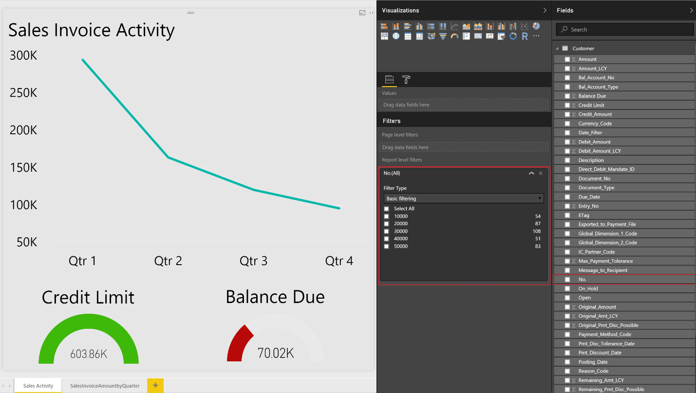
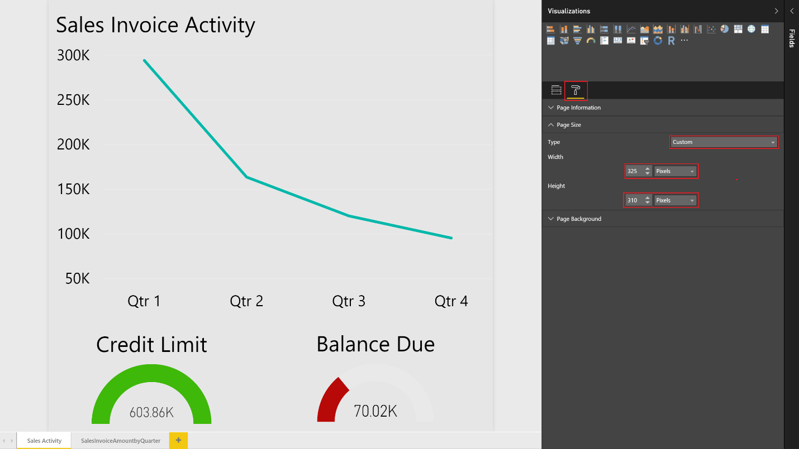

# Просмотр данных в списках в отчетах Power BI в Dynamics NAVViewing List Data in Power BI Reports in Dynamics NAV
[!INCLUDE[d365fin](includes/d365fin_md.md)] включает элемент управления информационной панелью на нескольких ключевых страницах списков, который предоставляет дополнительные сведения о данных в списке. includes a FactBox control element on a number of key list pages that provides additional insight into the data in the list. При перемещении между строками в списке отчет обновляется и фильтруется в соответствии с выбранной операцией.As you move between rows in the list, the report is updated and filtered for the selected entry. Можно создать пользовательские отчеты для отображения в этом элементе управления, но существует несколько правил, которые следует соблюдать при создании отчетов для обеспечения требуемого поведения.You can create custom reports to display in this control, but there are a few rules to follow when creating the reports to ensure they provide the desired behavior.  

> [!NOTE]  
>   Вы должны иметь допустимую учетную запись в [!INCLUDE[d365fin](includes/d365fin_md.md)] и в Power BI.You must have a valid account with [!INCLUDE[d365fin](includes/d365fin_md.md)] and with Power BI. Кроме того, необходимо загрузить [Power BI Desktop](https://powerbi.microsoft.com/en-us/desktop/).Also, you must download [Power BI Desktop](https://powerbi.microsoft.com/en-us/desktop/). Дополнительные сведения см. в разделе [Использование [!INCLUDE[d365fin](includes/d365fin_md.md)] как источника данных Power BI](across-how-use-financials-data-source-powerbi.md).For more information, see [Using [!INCLUDE[d365fin](includes/d365fin_md.md)] as a Power BI Data Source](across-how-use-financials-data-source-powerbi.md).  

## Набор данных отчетаReport Data Set
При создании отчета в Power BI Desktop укажите источник данных или веб-службу, содержащую данные, связанные со списком, с которым требуется связать отчет.When you create the report in Power BI Desktop, specify the data source or web service that contains the data related to the list that you want to associate the report with. Например, если нужно создать отчет для списка продаж, убедитесь, что набор данных содержит информацию, связанную с продажами.For example, if you want to create a report for the Sales List, ensure that the data set contains information related to sales.  

Для фильтрации данных в отчетах на основе записи, выбранной на странице списка, следует использовать первичный ключ в качестве фильтра отчета.To filter data on the reports based upon the record selected from the list page, the primary key must be used as a report filter. Первичный ключ должен быть частью набора данных для правильной фильтрации отчетов.The primary keys will need to be part of your data set in order for the reports to filter correctly. В большинстве случаев первичным ключом для списка является **Номер**.In most cases, the primary key for a list is the **No.** .field.  

## Определение фильтра отчетаDefining the Report Filter
Для отчета требуется наличие базового фильтра отчета (не фильтра страницы или визуального фильтра и не расширенного фильтра) для правильной фильтрации в элементе управления информационной панелью Power BI.The report is required to have a basic report filter (not a page or visual filter and not advanced filter) to filter correctly in the Power BI Fact Box Control. Фильтр, передаваемый в отчет Power BI с каждой страницы списка, будет основываться на первичном ключе, как описано в предыдущем разделе.The filter that is passed to the Power BI report from each list page will be based on the primary key as described in the previous section.  

Для определения фильтра для отчета выберите первичный ключ из списка доступных полей, а затем перетащите это поле в раздел **Фильтр отчета**.To define a filter for the report, select the primary key from the list of available fields, and then drag and drop that field into the **Report Filter** section.  

## Цвет и размер отчетаReport Size and color
Отчет должен иметь размер 325 х 310 пикселей.The size of the report must be set to 325 pixels by 310 pixels. Это необходимо для правильного масштабирования отчета в доступном пространстве, допускаемом элементом управления информационной панелью Power BI.This is required for the proper scaling of the report in the available space allowed by the Power BI Fact Box control. Чтобы определить размер отчета, поместите фокус вне области макета отчета, а затем щелкните значок валика.To define the size of the report, place focus outside of the report layout area, and then choose the paint roller icon.

Можно изменить ширину и высоту отчета, выбрав значение **Пользовательский** в поле **Тип**.You can change the width and height of the report by choosing **Custom** in the **Type** field.

Аналогично, если необходимо, чтобы фон отчета переходил в цвет фона элемента управления информационной панелью Power BI, определите пользовательский цвет фона отчета как *E5E5E5*.Similarly, if you want to have the background of the report blend into the background color of the Power BI Fact Box control, define a custom report background color of *E5E5E5*. Это необязательно.This is optional.  

## Отчеты с несколькими страницамиReports with Multiple Pages
В Power BI можно создать один отчет с несколькими страницами.With Power BI, you can create a single report with multiple pages. Визуальные элементы, которые должны отображаться на страницах списка [!INCLUDE[d365fin](includes/d365fin_md.md)], должны находиться на первой странице отчета в Power BI.The visuals that you want to see in the [!INCLUDE[d365fin](includes/d365fin_md.md)] list pages must be on the first page of the report in Power BI.  

> [!NOTE]  
>  На информационной панели Power BI может отображаться только первая страница отчета. Если необходимо отобразить другие страницы, следует развернуть отчет и использовать вкладки в нижней части отчета для перехода на другие страницы.The Power BI Fact Box can show only the first page of your report; if you want to see other pages, you must expand the report and use tabs at the bottom of the report to navigate to other pages.  

## Сохранение отчетаSaving Your Report

При сохранении отчета рекомендуется, чтобы имя отчета содержало имя страницы списка, на которой требуется отобразить отчет.When you save your report, it's a best practice that the name of the report contains the name of the list page that you want to display the report in. Например, слово *Поставщик* должно содержаться в имени отчета в отчетах, которые будут доступны в списке "Поставщик".For example, the word *Vendor* must be contained somewhere in the report name for reports that you want to make available on the Vendor list.  

Это не обязательно, однако это ускоряет процесс выбора отчетов.This is not a requirement; however, it will make the process of selecting reports quicker. При открытии страницы выбора отчета на странице списка передается фильтр на основании имени страница для ограничения количества отображаемых отчетов.When the report selection page is opened from a list page, we will pass in a filter based on the page name to limit the reports that are displayed.  Вы можете удалить фильтр, чтобы получить полный список доступных отчетов в Power BI.You may remove the filter to get a full list of reports available to you in Power BI.  

## Устранение неполадокTroubleshooting
В этом разделе приводится обходное решение для большинства типичных проблем, которые могут возникнуть при создании отчета Power BI.This section provides a workaround for the most typical issues that can occur when you create the Power BI report.  

**Пользователь не видит требуемый отчет на странице "Выбор отчета"** Если не удается выбрать отчет, можно проверить имя отчета, чтобы убедиться, что оно содержит имя страницы списка.**User does not see a report on the Select Report page they want to select** If you cannot select a report, a possible solution is to verify the name of the report to ensure it contains the name of the list page. Также можно удалить фильтр, чтобы получить полный список доступных отчетов Power BI.You can also clear the filter to get a full list of Power BI reports available.  

**Отчет загружен, но пуст, не отфильтрован или отфильтрован неверно** Проверьте, что фильтр отчетов содержит правильный первичный ключ.**Report is loaded but blank, not filtered or filtered incorrectly** Verify that the report filter contains the right primary key. В большинстве случаев это поле **Номер**,In most cases, this is the **No.** но в таблице **Операция ГК**, например, следует использовать поле **Номер операции**.field, but in the **G/L Entry** table, for example, you must use the **Entry No.** field  .

**Отчет загружен, но отображает неверную страницу** Проверьте, что страница, которую требуется отобразить, — это первая страница в отчете.**Report is loaded, but it shows the page you have not expected** Verify that the page you want displayed is the first page in your report.  

**В отчетах отображаются ненужные серые границы, отчет слишком мал или слишком большой****Report appears with unwanted gray boarders, is too small or too large**

Проверьте, что отчет имеет размер 325 х 310 пикселей.Verify that the report size is set to 325 pixels x 310 pixels. Сохраните отчет, а затем обновите страницу списка.Save the report, and then refresh the list page.  

## См. такжеSee Also
[Использование [!INCLUDE[d365fin](includes/d365fin_md.md)] как источника данных Power BI](across-how-use-financials-data-source-powerbi.md)[Using [!INCLUDE[d365fin](includes/d365fin_md.md)] as a Power BI Data Source](across-how-use-financials-data-source-powerbi.md)  
[Добро пожаловать в [!INCLUDE[d365fin_long](includes/d365fin_long_md.md)]](index.md)  [Welcome to [!INCLUDE[d365fin_long](includes/d365fin_long_md.md)]](index.md)    
[Установка [!INCLUDE[d365fin](includes/d365fin_md.md)]](setup.md)  [Setting Up [!INCLUDE[d365fin](includes/d365fin_md.md)]](setup.md)    
[ФинансыFinance](finance.md)  

