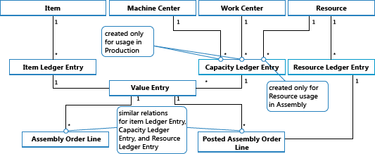

# Сведения о проектировании: учет заказа на сборку
Учет заказа на сборку основан на тех же принципах, что и учет похожих операций заказов на продажу и потребления/выход производства. Однако эти принципы объединены в заказах на сборку, которые имеют собственный пользовательский интерфейс учета, как в заказах на продажу, в то время как фактический учет операций осуществляется в фоновом режиме в виде прямого учета журнала товаров и ресурсов, как для производственного потребления, выхода и производственной мощности.  

Аналогично учету производственного заказа использованные компоненты и использованные ресурсы преобразуются и выпускаются как сборочный элемент при учете заказа на сборку. Дополнительные сведения см. в разделе [Сведения о проектировании: учет производственного заказа](design-details-production-order-posting.md). Однако поток затрат для заказов на сборку менее сложен, в частности из-за того, что учет себестоимости сборки выполняется только один раз и поэтому не создает запасы НЗП.  

Следующие проводки журнала имеют место при учете заказа на сборку.  

-   Журнал товаров учитывает положительные операции книги товаров, представляя выпуск сборочных элементов из заголовка заказа на сборку.  
-   Журнал товаров учитывает отрицательные операции книги товаров, представляя потребление компонентов сборки из строк заказа на сборку.  
-   Журнал ресурсов учитывает использование ресурсов сборки (временных единиц) из строк заказа на сборку.  
-   В журнале производственных мощностей учитываются операции стоимости, связанные с использованием ресурсов, из строк сборочного заказа.  

На следующей схеме показана структура операций журнала товаров и ресурсов, результатом которых является учет заказа на сборку.  

  

> [!NOTE]  
>  Машинные и рабочие центры включены для указания того, что операции книги операций производственных мощностей можно создать из производства и сборки.  

На следующей схеме показано, как данные сборки попадают в операции ГК во время учета.  

  

## Порядок учета  
Учет заказа на сборку осуществляется в следующем порядке.  

1.  Учитываются строки заказа на сборку.  
2.  Учитывается заголовок заказа на сборку.  

В следующей таблице показана последовательность действий.  

|Действие|Описанием|  
|------------|-----------------|  
|Инициализация учета|1.  Выполните предварительные проверки. 2.  Добавьте учетный номер и измените заголовок заказа на сборку. 3.  Выпустите заказ на сборку.|  
|Почта|<ol><li>Создайте заголовок учтенного сборочного заказа.</li><li>Скопируйте строки комментария.</li><li>Выполните учет строк заказа на сборку (потребление):   <ol><li>Создайте окно статуса для расчета потребления при сборке.</li><li>Получите остаток, на котором будет основываться строка журнала товаров.</li><li>Сбросьте использованное количество и остаток.</li><li>Для строк заказа на сборку типа "Товар":   <ol><li>Заполните поля в строке журнала товаров.</li><li>Резервирования перемещения в строку журнала товаров.</li><li>Выполните учет строки журнала товаров для создания операций книги товаров.</li><li>Создайте строки складского журнала и учтите их.</li></ol></li><li>Для строк заказа на сборку типа "Ресурс":   <ol><li>Заполните поля в строке журнала товаров.</li><li>Выполните учет строки журнала товаров. В результате создаются операции журнала производственных мощностей.</li><li>Создайте и учтите строку журнала ресурсов.</li></ol></li><li>перенос значений поля из строки заказа на сборку в только что созданную строку учтенного заказа на сборку.</li></ol></li><li>Выполните учет заголовка заказа на сборку (выход):   <ol><li>Заполните поля в строке журнала товаров.</li><li>Резервирования перемещения в строку журнала товаров.</li><li>Выполните учет строки журнала товаров для создания операций книги товаров.</li><li>Создайте строки складского журнала и учтите их.</li><li>Сбросьте количества сборки и остаток.</li></ol></li></ol>|  

> [!IMPORTANT]  
>  В отличие от производственного выпуска, который учитывается по ожидаемой себестоимости, выпуск сборки учитывается по фактической себестоимости.  

## Коррекция себестоимости  
 После учета заказа на сборку, то есть после сборки компонентов (материала) и ресурсов в новый товар, можно определить фактическую себестоимость сборочного элемента и фактическую себестоимость запасов использованных компонентов. Это достигается пересылкой себестоимости из учтенных операций источника (компоненты и ресурсы) в учтенные операции назначения (сборочный элемент). Пересылка затрат осуществляется путем расчета и создания новых операций, называемых операциями корректировки, которые связываются с операциями распределения.  

 Пересылаемые затраты на сборку обнаруживаются с помощью механизма обнаружения уровня заказа. Дополнительные сведения о других механизмах обнаружения коррекций см. в разделе [Сведения о проектировании: коррекция себестоимости](design-details-cost-adjustment.md).  

### Обнаружение коррекции  
Функция обнаружения на уровне заказа используется в сценариях преобразования, производства и сборки. Функция работает следующим образом:  

-   Коррекция себестоимости выявляется путем пометки заказа всякий раз при учете материала или ресурса как потребленного или использованного.  
-   Перенаправление себестоимости производится путем применения себестоимости из материала или ресурса к операциям выхода, связанным с тем же заказом.  

На следующем графике показана структура операции корректировки и корректировка затрат на сборку.  

  

### Выполнение коррекции  
Распространение обнаруженных корректировок из затрат на материалы и ресурсы в операции выпуска при сборке выполняется пакетным заданием **Коррекция себест. запасов**. В нем предлагается функция многоуровневой коррекции, которая состоит из следующих двух элементов:  

-   Коррекция заказа на сборку — перемещение себестоимости из использования материала и ресурсов в операцию выхода при сборке. Строки 5 и 6 в алгоритме ниже отвечают за это действие.  
-   Одноуровневые коррекции — себестоимость перемещается для отдельных товаров с помощью метода учета себестоимости. Строки 9 и 10 в алгоритме ниже отвечают за это действие.  

  

> [!NOTE]  
>  Элемент "Создание коррекций НЗП" в строках 7 и 8 отвечает за пересылку производственного материала и использования производственной мощности выходу незавершенных производственных заказов. Это не используется при корректировке себестоимости заказа на сборку, потому что концепция НЗП не применима к сборке.  

Дополнительные сведения о том, как выполнить учет себестоимостей из сборки и производства в главной книге, см. в разделе [Сведения о проектировании: учет запасов](design-details-inventory-posting.md).  

## Затраты на сборку всегда фактические  
 Понятие незавершенного производства (WIP) не применимо в учете заказа на сборку. Затраты на сборку учитываются как фактическая себестоимость, но не как ожидаемая себестоимость. Дополнительные сведения см. в разделе [Сведения о проектировании: учет ожидаемой себестоимости](design-details-expected-cost-posting.md).  

Это возможно благодаря следующей структуре данных.  

-   В поле **Тип** в строках журнала товаров в таблицах **Книга операций по произв. мощностям** и **Операция стоимости** параметр *Ресурс* используется для определения операций сборочных ресурсов.  
-   В поле **Тип операции книги товаров** в строках журнала товаров в таблицах **Книга операций по произв. мощностям** и **Операция стоимости** параметры *Выход при сборке* и *Потребление при сборке* используются для определения операций сборочного элемента и операций использованных сборочных компонентов соответственно.  

Кроме того, поля учетной группы в заголовке заказа на сборку и строки заказа на сборку заполняются по умолчанию следующим образом.  

|Объект|Тип|Учетная группа|Общая товарная группа|  
|------------|----------|-------------------|------------------------------|  
|Заголовок заказа на сборку|Товар|Учетная группа товаров|Общая товарная группа|  
|Строка заказа на сборку|Товар|Учетная группа товаров|Общая товарная группа|  
|Строка заказа на сборку|Ресурс||Общая товарная группа|  

Соответственно, только фактические затраты учитываются в главной книге, и промежуточные счета не заполняются сведениями учета заказа на сборку. Дополнительные сведения см. в разделе [Сведения о проектировании: счета в главной книге](design-details-accounts-in-the-general-ledger.md).  

## Сборка для заказа  
Операция товарной книги, полученная из учета продажи сборки на заказ, фиксируется применимо к соответствующей операции товарной книги для выхода сборки. Соответственно, себестоимость продажи сборки на заказ определяется на основе сборочного заказа, с которым она была связана.  

Операции книги товаров типа "Продажа", которые создаются в результате учета количеств сборки на заказ, отмечаются как **Да** в поле **Заказ на сборку**.  

Учет строки заказа на продажу, в котором часть составляют товары в запасах, а другая часть приходится на сборку на заказ, создает отдельные учтенные операции книги товаров, одну для количества запасов и одну для количества сборки на заказ.  

## См. также  
 [Сведения о проектировании: себестоимость запасов](design-details-inventory-costing.md)   
 [Сведения о проектировании: учет производственного заказа](design-details-production-order-posting.md)   
 [Сведения о проектировании: методы учета себестоимости](design-details-costing-methods.md)  
 [Управление себестоимостью товаров](finance-manage-inventory-costs.md)  
 [Финансы](finance.md)  
 [Работа с [!INCLUDE[d365fin](includes/d365fin_md.md)]](ui-work-product.md)  

