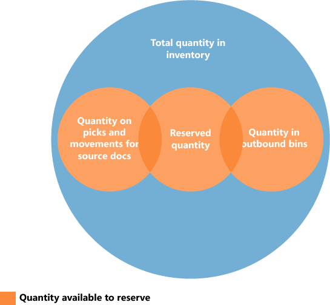

# Сведения о проектировании: наличие на складе
Система должна постоянно контролировать доступность товаров на складе, чтобы исходящие заказы могли эффективно обрабатываться и обеспечивать оптимальные поставки.  

 Наличие отличается в зависимости от распределений на уровне ячеек, если выполняются складские операции, такие как подбор и перемещение, и если система резервирования налагает ограничения, которые следует соблюдать. Довольно сложный алгоритм проверяет выполнение всех условий перед распределением количеств по подборам для расходов товаров.  

## Содержимое ячейки и резервирования  
 В любой установке приложения управления складом количества товаров существуют и как складские операции в области приложения "Склад", и как операции книги товаров в области приложения "Товары". Эти два типа операций содержат разные сведения о том, где существуют товары и доступны ли они. Складские операции определяют доступность товара по ячейкам и типу ячеек, что называется содержимым ячейки. Операции книги товаров определяют наличие товара по его резервированиям в исходящих документах.  

 Специальная функция в алгоритме подбора существует для расчета количества, доступного для подбора, когда содержимое ячейки связывается с резервированиями.  

## Количество, доступное для подбора  
 Например, если в алгоритме подбора не учитываются количества товаров, которые были зарезервированы для ожидающей отгрузки заказа на продажу, эти товары могут быть подобраны для другого заказа на продажу, который отгружается раньше, в результате чего не выполняется первый заказ. Чтобы избежать этой ситуации, алгоритм подбора вычитает зарезервированные для других исходящих документов количества, количества в существующих документах отбора и количества, отобранные, но еще не отгруженные и не потребленные.  

 Результат отображается в поле **Доступное кол-во для подбора** окна **Журнал подбора**, где это поле вычисляется динамически. Стоимость также вычисляется, когда пользователи создают складские подборы непосредственно для исходящих документов. К таким исходящим документам могут относиться заказы на продажу, производственные потребления или исходящие перемещения, в которых результат показан в связанных полях количества, например **Кол-во для обработки**.  

> [!NOTE]  
>  Что касается приоритета резервирований, количество для резервирования вычитается из количества, доступного для подбора. Например, если количество, доступное в ячейках подбора, составляет 5 единиц, а 100 единиц находятся в ячейках размещения, то при попытке зарезервировать более 5 единиц для другого заказа отобразится сообщение об ошибке, поскольку должно быть доступно дополнительное количество в ячейках подбора.  

### Расчет количества, доступного для подбора  
 Доступное для подбора количество вычисляется следующим образом.  

 количество, доступное для подбора = количество в ячейках подбора - количество в подборах и перемещениях - (зарезервированное количество в ячейках подбора + зарезервированное количество в подборах и перемещениях)  

 На следующей схеме показаны разные элементы вычислений.  

   

## Количество, доступное для резервирования  
 Поскольку основные понятия содержимого ячейки и резервирования сосуществуют, количество товаров, доступных для резервирования, должно быть согласовано с распределениями в исходящих документах склада.  

 Должно быть возможно зарезервировать все товары в запасах за исключением тех, для которых уже начата исходящая обработка. Соответственно, количество, доступное для резервирования, определяется как количество во всех документах и всех типах ячеек за исключением следующих исходящих количеств:  

-   Количество в незарегистрированных документах подбора  
-   Количество в ячейках отгрузки  
-   Количество во входящих производственных ячейках  
-   Количество в ячейках общего доступа  
-   Количества в ячейках сборки  
-   Количество в ячейках коррекции  

 Результат отображается в поле **Общее доступное кол-во** в окне **Резервирование**.  

 В строке резервирования количество, которое невозможно зарезервировать, поскольку оно распределено на склад, отображается в поле **Кол-во, распред. на складе** в окне **Reservation**.  

### Расчет количества, доступного для резервирования  
 Доступное для резервирования количество вычисляется следующим образом.  

 количество, доступное для резервирования = общее количество в запасах - количество в подборах и перемещениях для документов-источников - зарезервированное количество - количество в исходящих ячейках  

 На следующей схеме показаны разные элементы вычислений.  

   

## См. также  
 [Сведения о проектировании: управление складом](design-details-warehouse-management.md)

