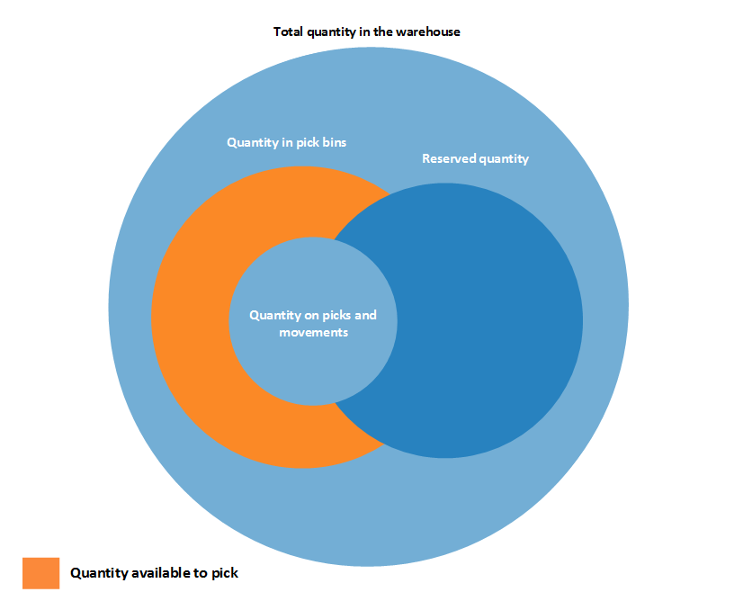

# Сведения о проектировании: наличие на складеDesign Details: Availability in the Warehouse
Система должна постоянно контролировать доступность товаров на складе, чтобы исходящие заказы могли эффективно обрабатываться и обеспечивать оптимальные поставки.The system must keep a constant control of item availability in the warehouse, so that outbound orders can flow efficiently and provide optimal deliveries.  

 Наличие отличается в зависимости от распределений на уровне ячеек, если выполняются складские операции, такие как подбор и перемещение, и если система резервирования налагает ограничения, которые следует соблюдать.Availability varies depending on allocations at the bin level when warehouse activities such as picks and movements occur and when the inventory reservation system imposes restrictions to comply with. Довольно сложный алгоритм проверяет выполнение всех условий перед распределением количеств по подборам для расходов товаров.A rather complex algorithm verifies that all conditions are met before allocating quantities to picks for outbound flows.  

## Содержимое ячейки и резервированияBin Content and Reservations  
 В любой установке приложения управления складом количества товаров существуют и как складские операции в области приложения "Склад", и как операции книги товаров в области приложения "Товары".In any installation of warehouse management, item quantities exist both as warehouse entries, in the Warehouse application area, and as item ledger entries, in the Inventory application area. Эти два типа операций содержат разные сведения о том, где существуют товары и доступны ли они.These two entry types contain different information about where items exist and whether they are available. Складские операции определяют доступность товара по ячейкам и типу ячеек, что называется содержимым ячейки.Warehouse entries define an item’s availability by bin and bin type, which is called bin content. Операции книги товаров определяют наличие товара по его резервированиям в исходящих документах.Item ledger entries define an item’s availability by its reservation to outbound documents.  

 Специальная функция в алгоритме подбора существует для расчета количества, доступного для подбора, когда содержимое ячейки связывается с резервированиями.Special functionality in the picking algorithm exists to calculate the quantity that is available to pick when bin content is coupled with reservations.  

## Количество, доступное для подбораQuantity Available to Pick  
 Например, если в алгоритме подбора не учитываются количества товаров, которые были зарезервированы для ожидающей отгрузки заказа на продажу, эти товары могут быть подобраны для другого заказа на продажу, который отгружается раньше, в результате чего не выполняется первый заказ.If, for example, the picking algorithm does not consider item quantities that are reserved for a pending sales order shipment, then those items might be picked for another sales order that is shipped earlier, which prevents the first sales from being fulfilled. Чтобы избежать этой ситуации, алгоритм подбора вычитает зарезервированные для других исходящих документов количества, количества в существующих документах отбора и количества, отобранные, но еще не отгруженные и не потребленные.To avoid this situation, the picking algorithm subtracts quantities that are reserved for other outbound documents, quantities on existing pick documents, and quantities that are picked but not yet shipped or consumed.  

 Результат отображается в поле **Доступное кол-во для подбора** окна **Журнал подбора**, где это поле вычисляется динамически.The result is displayed in the **Available Qty. to Pick** field in the **Pick Worksheet** window, where the field is calculated dynamically. Стоимость также вычисляется, когда пользователи создают складские подборы непосредственно для исходящих документов.The value is also calculated when users create warehouse picks directly for outbound documents. К таким исходящим документам могут относиться заказы на продажу, производственные потребления или исходящие перемещения, в которых результат показан в связанных полях количества, например **Кол-во для обработки**.Such outbound documents could be sales orders, production consumption, or outbound transfers, where the result is reflected in the related quantity fields, such as **Qty. to Handle**.  

> [!NOTE]  
>  Что касается приоритета резервирований, количество для резервирования вычитается из количества, доступного для подбора.Concerning the priority of reservations, the quantity to reserve is subtracted from the quantity available to pick. Например, если количество, доступное в ячейках подбора, составляет 5 единиц, а 100 единиц находятся в ячейках размещения, то при попытке зарезервировать более 5 единиц для другого заказа отобразится сообщение об ошибке, поскольку должно быть доступно дополнительное количество в ячейках подбора.For example, if the quantity available in pick bins is 5 units, but 100 units are in put-away bins, then when you try to reserve more than 5 units for another order, an error message is displayed because the additional quantity must be available in pick bins.  

### Расчет количества, доступного для подбораCalculating the Quantity Available to Pick  
 Доступное для подбора количество вычисляется следующим образом.The quantity available to pick is calculated as follows:  

 количество, доступное для подбора = количество в ячейках подбора - количество в подборах и перемещениях - (зарезервированное количество в ячейках подбора + зарезервированное количество в подборах и перемещениях)quantity available to pick = quantity in pick bins - quantity on picks and movements – (reserved quantity in pick bins + reserved quantity on picks and movements)  

 На следующей схеме показаны разные элементы вычислений.The following diagram shows the different elements of the calculation.  

   

## Количество, доступное для резервированияQuantity Available to Reserve  
 Поскольку основные понятия содержимого ячейки и резервирования сосуществуют, количество товаров, доступных для резервирования, должно быть согласовано с распределениями в исходящих документах склада.Because the concepts of bin content and reservation co-exist, the quantity of items that are available to reserve must be aligned with allocations to outbound warehouse documents.  

 Должно быть возможно зарезервировать все товары в запасах за исключением тех, для которых уже начата исходящая обработка.It should be possible to reserve all items in inventory, except those that have started outbound processing. Соответственно, количество, доступное для резервирования, определяется как количество во всех документах и всех типах ячеек за исключением следующих исходящих количеств:Accordingly, the quantity that is available to reserve is defined as the quantity on all documents and all bin types, except the following outbound quantities:  

-   Количество в незарегистрированных документах подбораQuantity on unregistered pick documents  
-   Количество в ячейках отгрузкиQuantity in shipment bins  
-   Количество во входящих производственных ячейкахQuantity in to-production bins  
-   Количество в ячейках общего доступаQuantity in open shop floor bins  
-   Количества в ячейках сборкиQuantity in to-assembly bins  
-   Количество в ячейках коррекцииQuantity in adjustment bins  

 Результат отображается в поле **Общее доступное кол-во** в окне **Резервирование**.The result is displayed in the **Total Available Quantity** field in the **Reservation** window.  

 В строке резервирования количество, которое невозможно зарезервировать, поскольку оно распределено на склад, отображается в поле **Кол-во, распред. на складе** в окне **Reservation**.On a reservation line, the quantity that cannot be reserved, because it is allocated in the warehouse, is displayed in the **Qty. Allocated in Warehouse** field in the **Reservation** window.  

### Расчет количества, доступного для резервированияCalculating the Quantity Available to Reserve  
 Доступное для резервирования количество вычисляется следующим образом.The quantity available to reserve is calculated as follows:  

 количество, доступное для резервирования = общее количество в запасах - количество в подборах и перемещениях для документов-источников - зарезервированное количество - количество в исходящих ячейкахquantity available to reserve = total quantity in inventory - quantity on picks and movements for source documents - reserved quantity - quantity in outbound bins  

 На следующей схеме показаны разные элементы вычислений.The following diagram shows the different elements of the calculation.  

   

## См. такжеSee Also  
 [Сведения о проектировании: управление складомDesign Details: Warehouse Management](design-details-warehouse-management.md)

