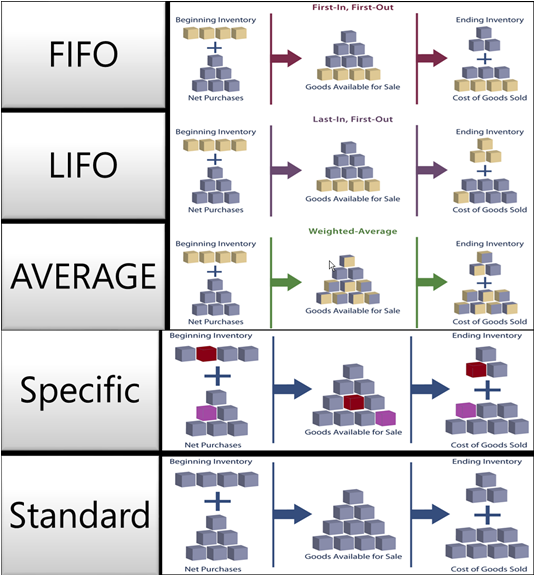

# Сведения о проектировании: методы учета себестоимости
Метод учета себестоимости определяет, будет ли выделяться заглавными буквами фактическая или бюджетная себестоимость и использоваться при расчете себестоимости. Наряду с датой и порядком учета метод учета себестоимости также влияет на способ записи потока затрат. Следующие методы поддерживаются в [!INCLUDE[d365fin](includes/d365fin_md.md)]:  

|Метод учета себестоимости|Описанием|Варианты использования|  
|--------------------|---------------------------------------|-----------------|  
|Обслуживание в порядке поступления|Себестоимость единицы товара — это фактическая стоимость товара в любой приходной накладной, выбранная по методу FIFO.   В переоценке склада предполагается, что пункты, помещенные на склад первыми, продаются первыми.|В бизнес-средах, в которых себестоимость продукта стабильна.   (При росте цен в балансовом отчете указывается большее значение. Это означает, что налоговые обязательства возрастают, но кредитный рейтинг и возможность займа наличных повышается.)   Для товаров с ограниченным сроком годности, поскольку самые старые товары необходимо продать до истечения срока годности.|  
|LIFO|Себестоимость единицы товара — это фактическая стоимость товара в любой приходной накладной, выбранная по методу LIFO.   В переоценке склада предполагается, что пункты, помещенные на склад последними, продаются первыми.|Недопустимо во многих странах/регионах, так как может использоваться для снижения прибыли.   (Если цены растут, значение в отчете о прибылях и убытках уменьшается. Это означает, что налоговые обязательства сокращаются, но возможность займа наличных снижается.)|  
|Среднее|Себестоимость единицы товара рассчитывается как средняя себестоимость единицы в каждый момент времени после покупки.   Во время оценки товаров на складе программа предполагает, что все запасы продаются одновременно.|В бизнес-средах, в которых себестоимость продукта нестабильна.   Если имеются сложенные или смешанные запасы, которые нельзя разделить, например химикаты.|  
|Определенный|Себестоимость единицы товара — это точная стоимость, по которой была получена конкретная единица.|При производстве или торговле легко опознаваемыми товарами с высокой себестоимостью единицы.   Для товаров, которые подлежат регулированию.   Для товаров с серийными номерами.|  
|Стандартное|Себестоимость единицы товара предварительно задается на основе оценки.   Если фактическая себестоимость реализуется позднее, стандартная себестоимость должна быть скорректирована относительно фактической себестоимости с помощью значений отклонения.|Если управление себестоимостью играет критическую роль.   При серийном производстве для оценки себестоимости материалов, трудовых затрат и дальнейшего производства.   Если есть необходимость поддержания стандартов дисциплины и штата.|  

 На следующем изображении показан поток затрат на хранимые запасы для каждого метода учета затрат.  

   

 Методы учета себестоимости отличаются способом оценки расхода склада и тем, используют ли они фактическую себестоимость или стандартную себестоимость в качестве базы оценки. В следующей таблице поясняются различные характеристики. (Метод LIFO не используется, поскольку он очень похож на метод FIFO.)  

||FIFO|Среднее|Стандартное|Определенный|  
|-|----------|-------------|--------------|--------------|  
|Общая характеристика|Прост в понимании|На основе вариантов периодов: **День**/**Неделя**/**Месяц**/**Квартал**/**Учетный период**.   Может вычисляться либо по товарам, либо по товарам, складам и вариантам.|Прост в использовании, но требует квалифицированного обслуживания.|Требуется трассировка товаров во входящей и исходящей транзакции.   Как правило используется для сериализуемых товаров.|  
|Применение/Коррекция|Приложение выполняет трассировку **остатка**.   В результате коррекции себестоимости передаются в соответствии с применением количества.|Приложение выполняет трассировку **остатка**.   Себестоимость рассчитывается и передается на **дату переоценки**.|Приложение выполняет трассировку **остатка**.   Применение на основе FIFO.|Все применения являются фиксированными.|  
|Переоценка|Переоценка только количества, по которому выставлены счета.   Может быть выполнена по товарам или операциям книги товаров.   Может быть выполнена задним числом.|Переоценка только количества, по которому выставлены счета.   Может быть выполнена только по товару.   Может быть выполнена задним числом.|Переоценка количеств, по которым счета выставлены, и количеств, по которым счета не выставлены.   Может быть выполнена по товарам или операциям книги товаров.   Может быть выполнена задним числом.|Переоценка только количества, по которому выставлены счета.   Может быть выполнена по товарам или операциям книги товаров.   Может быть выполнена задним числом.|  
|Прочее|Если расход склада записывается задним числом, существующие операции НЕ применяются повторно для обеспечения правильного потока затрат FIFO.|Если приход или расход склада записывается задним числом, средняя себестоимость пересчитывается и все затронутые операции корректируются.   При изменении периода или типов расчета необходимо скорректировать все затронутые операции.|Воспользуйтесь окном **Стандартный журнал** для периодического обновления и сворачивания стандартных затрат.   НЕ поддерживается для каждой единицы хранения.   Исторические записи не существуют для стандартных себестоимостей.|Для использования определенной трассировки товаров не обязательно использовать определенный метод учета себестоимости. В этом случае себестоимость НЕ зависит от номера партии, а от предполагаемой стоимости с выбранным методом учета затрат.|  

## Пример  
 В этом разделе приводятся примеры влияния разных методов учета затрат на инвентарную стоимость.  

 В следующей таблице показаны приходы и расходы склада, используемые в этих примерах.  

|Дата учета|Количество|Номер операции|  
|------------------|--------------|---------------|  
|01-01-20|1|1|  
|01-01-20|1|2|  
|01-01-20|1|3|  
|02-01-20|-1|4|  
|03-01-20|-1|5|  
|04-01-20|-1|6|  

> [!NOTE]  
>  Результирующее количество запасов равно нулю. Следовательно, стоимость запасов также должна равняться нулю независимо от метода учета себестоимости.  

### Влияние методов расчета себестоимости на оценку приходов склада  
 **FIFO**/**LIFO**/**По средней**/**По серийным номерам**  

 В случае товаров, для которых используются методы учета себестоимости, в которых оценка основывается на фактической себестоимости (**FIFO**, **LIFO**, **По средней** или **По серийным номерам**), приходы склада оцениваются по стоимости приобретения товара.  

 В следующей таблице показано, как приход склада оценивается для всех методов учета затрат, кроме **стандартного**.  

|Дата учета|Количество|Сумма себестоимости (факт.)|Номер операции|  
|------------------|--------------|----------------------------|---------------|  
|01-01-20|1|10,00|1|  
|01-01-20|1|20,00|2|  
|01-01-20|1|30,00|3|  

 **Стандарт**  

 Для товаров, использующих метод учета себестоимости **По стандартной**, приходы склада оцениваются по текущей стандартной себестоимости товара.  

 В следующей таблице показано, как приход склада оценивается при использовании **стандартного** метода учета себестоимости.  

|Дата учета|Количество|Сумма себестоимости (факт.)|Номер операции|  
|------------------|--------------|----------------------------|---------------|  
|01-01-20|1|15,00|1|  
|01-01-20|1|15,00|2|  
|01-01-20|1|15,00|3|  

### Влияние методов расчета себестоимости на оценку расходов склада  
 **FIFO**  

 В случае товаров, для которых используется метод учета себестоимости **FIFO**, товары, которые были приобретены первыми, всегда продаются первыми (номера операций 3, 2 и 1 в данном примере). Соответственно, уменьшение товарного запаса оценивается по стоимости первого увеличения товарного запаса.  

 Себестоимость продажи рассчитывается с использованием стоимости первых приобретений запасов.  

 В следующей таблице показано, как расход склада оценивается при использовании метода учета затрат **FIFO**.  

|Дата учета|Количество|Сумма себестоимости (факт.)|Номер операции|  
|------------------|--------------|----------------------------|---------------|  
|02-01-20|-1|-10,00|4|  
|03-01-20|-1|-20,00|5|  
|04-01-20|-1|-30,00|6|  

 **LIFO**  

 В случае товаров, для которых используется метод учета себестоимости **LIFO**, товары, которые были приобретены последними, всегда продаются первыми (номера операций 3, 2 и 1 в данном примере). Соответственно, уменьшение товарного запаса оценивается по стоимости последнего увеличения товарного запаса.  

 Себестоимость продажи рассчитывается с использованием стоимости последних приобретений запасов.  

 В следующей таблице показано, как расход склада оценивается при использовании метода учета затрат **LIFO**.  

|Дата учета|Количество|Сумма себестоимости (факт.)|Номер операции|  
|------------------|--------------|----------------------------|---------------|  
|02-01-20|-1|-30,00|4|  
|03-01-20|-1|-20,00|5|  
|04-01-20|-1|-10,00|6|  

 **Среднее**  

 Для товаров, использующих метод учета себестоимости **По средней** расходы склада оцениваются путем расчета средневзвешенной стоимости оставшегося запаса на последний день периода расчета средней себестоимости, в котором был учтен расход склада. Дополнительные сведения см. в разделе [Сведения о проектировании: средняя себестоимость](design-details-average-cost.md).  

 В следующей таблице показано, как расход склада оценивается при использовании метода **средней** себестоимости.  

|Дата учета|Количество|Сумма себестоимости (факт.)|Номер операции|  
|------------------|--------------|----------------------------|---------------|  
|02-01-20|-1|-20,00|4|  
|03-01-20|-1|-20,00|5|  
|04-01-20|-1|-20,00|6|  

 **Стандарт**  

 В случае товаров, для которых используется метод учета себестоимости **По стандартной**, расходы склада оцениваются так же, как при использовании метода учета себестоимости **FIFO**, за исключением того, что оценка основывается на стандартной, а не на фактической себестоимости.  

 В следующей таблице показано, как расход склада оценивается при использовании **стандартного** метода учета себестоимости.  

|Дата учета|Количество|Сумма себестоимости (факт.)|Номер операции|  
|------------------|--------------|----------------------------|---------------|  
|02-01-20|-1|-15,00|4|  
|03-01-20|-1|-15,00|5|  
|04-01-20|-1|-15,00|6|  

 **Определенный**  

 Методы учета себестоимости основаны на предположении, что себестоимость переносится из прихода склада в расход склада. Однако если существует более точная информация о потоке затрат, можно переопределить это предположение, создав фиксированное применение между операциями. Фиксированное применение создает связь между расходом склада и определенным приходом склада, а также направляет поток затрат соответствующим образом.  

 В случае товаров, для которых используется метод учета себестоимости **По серийным номерам**, расходы склада оцениваются в соответствии с приходом склада, связанным с помощью фиксированного применения.  

 В следующей таблице показано, как расход склада оценивается при использовании **конкретного** метода учета себестоимости.  

|Дата учета|Количество|Сумма себестоимости (факт.)|Применяемая операция|Номер операции|  
|------------------|--------------|----------------------------|-----------------------|---------------|  
|02-01-20|-1|-20,00|**2**|4|  
|03-01-20|-1|-10,00|**1**|5|  
|04-01-20|-1|-30,00|**3**|6|  

## См. также  
 [Сведения о проектировании: себестоимость запасов](design-details-inventory-costing.md)   
 [Сведения о проектировании: отклонение](design-details-variance.md)   
 [Сведения о проектировании: средняя себестоимость](design-details-average-cost.md)   
 [Сведения о проектировании: применение товара](design-details-item-application.md) [Управление себестоимостью товаров](finance-manage-inventory-costs.md)  
 [Финансы](finance.md)  
 [Работа с [!INCLUDE[d365fin](includes/d365fin_md.md)]](ui-work-product.md)  

