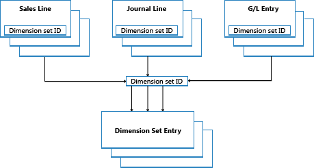

# Обзор записей набора измерений
В этом разделе описывается, как операции набора измерений хранятся и учитываются в [!INCLUDE[d365fin](includes/d365fin_md.md)].  
  
## Наборы измерений  
Набор измерений — это уникальная комбинация значений измерений. Это храниться как записи набора измерений в базе данных. Каждая запись набора измерений представляет отдельное значение измерения. Набор измерений определяется общим кодом набора измерений, который присваивается каждой операции набора измерений, которая относится к набору измерений.  
  
В следующем примере представлен набор измерений с тремя операциями набора измерений. Набор измерений определяется кодом набора измерений, который равен 108.  
  
|Код набора измерений|Код Измерения:|Код значения измерения|Имя значения измерения|  
|----------------------|--------------------|--------------------------|--------------------------|  
|108|РЕГИОН|70|Северная Америка|  
|108|БИЗНЕСГРУППА|HOME|В начало|  
|108|ОТДЕЛ|ПРОДАЖИ|Продажи|  
  
## Записи набора измерений  
Наборы измерений сохраняются в таблице **Запись набора измерений** в виде записей набора измерений с одинаковым кодом набора измерений.  
  
  
  
При создании новой строки журнала, заголовка документа или строки документа можно указать комбинации значений измерений. Вместо явного сохранения значения каждого измерения в базе данных, код набора измерений присваивается строке журнала, заголовку документа или строке документа для определения набора измерений.  
  
При редактировании и закрытии окна **Изменить записи набора измерений** проверяется существование комбинации значений измерений как набора измерений в таблице. Если в таблице встречается комбинация, соответствующий КОД набора измерений присваивается заголовку документа, строке журнала, либо строке документа. В противном случае новый набор измерений добавляется к таблице, а идентификатор нового набора измерений присваивается заголовку документа, строке журнала либо строке документа.  
  
## Повышение производительности  
При сохранении наборов измерений один раз в базе данных экономится пространство БД и улучшается общая производительность.  
  
## См. также  
[Сведения о проектировании: поиск комбинаций измерений](design-details-searching-for-dimension-combinations.md)   
[Сведения о проектировании: структура таблицы](design-details-table-structure.md)   
[Сведения о проектировании: Codeunit 408 Dimension Management](design-details-codeunit-408-dimension-management.md)   
[Сведения о проектировании: примеры кода измененных шаблонов в модификациях](design-details-code-examples-of-changed-patterns-in-modifications.md)   
[Сведения о проектировании: операции набора измерений](design-details-dimension-set-entries.md)   

