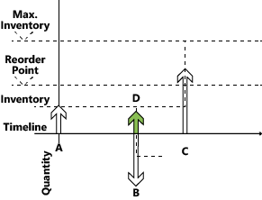

# Сведения о проектировании: обработка прогнозируемых отрицательных остатковDesign Details: Handling Projected Negative Inventory
Точка повторного заказа выражает предполагаемый спрос во время подготовки товара.The reorder point expresses the anticipated demand during the lead time of the item. Когда точка дозаказа пройдена, нужно заказывать еще.When the reorder point is passed, it is time to order more. Однако прогнозируемые запасы должны быть достаточно большими для того, чтобы удовлетворить спрос до получения нового заказа.But the projected inventory must be large enough to cover the demand until the new order is received. В то же время страховой запас должен устранить колебания в спросе и увеличить количество до целевого уровня обслуживания.Meanwhile, the safety stock should take care of fluctuations in demand up to a targeted service level.  

 Следовательно, система планирования считает, что возникла чрезвычайная ситуация, если будущий спрос невозможно удовлетворить из прогнозируемых запасов, или, иными словами, если прогнозируемые запасы становятся отрицательными.Consequently, the planning system considers it an emergency if a future demand cannot be served from the projected inventory, or expressed in another way, that the projected inventory goes negative. Система обрабатывает такое исключение, предлагая новый заказ на поставку, чтобы покрыть часть спроса, который не может быть покрыт поставкой со склада или другой поставкой.The system deals with such an exception by suggesting a new supply order to meet the part of the demand that cannot be met by inventory or other supply. Размер нового заказа на поставку не учитывает максимальные запасы или количество повторного запаса, а также модификаторы заказа, такие как "максимальное кол-во заказа", "минимальное кол-во заказа" и "заказать несколько".The order size of the new supply order will not take the maximum inventory or the reorder quantity into consideration, nor will it take into consideration the order modifiers Maximum Order Quantity, Minimum Order Quantity, and Order Multiple. Вместо этого будет отражен точный дефицит.Instead, it will reflect the exact deficiency.  

 Строка планирования для этого типа заказов на поставку отобразит предупреждающий значок аварийной ситуации с возможностью просмотра пользователем дополнительных сведений для прояснения ситуации.The planning line for this type of supply order will display an Emergency warning icon, and additional information will be provided upon lookup to inform the user of the situation.  

 На следующем рисунке поставка D представляет экстренный заказ для коррекции отрицательных остатков.In the following illustration, supply D represents an emergency order to adjust for negative inventory.  

   

1.  Поставка **A** (изначально прогнозируемые запасы) ниже точки дозаказа.Supply **A**, initial projected inventory, is below reorder point.  

2.  Создана новая поставка с прямым планированием (**C**).A new forward-scheduled supply is created (**C**).  

     (Количество = максимальный запас - уровень прогнозируемых запасов)(Quantity = Maximum Inventory – Projected Inventory Level)  

3.  Поставка **A** закрыта спросом **B**, который удовлетворен в полном размере.Supply **A** is closed by demand **B**, which is not fully covered.  

     (В соответствии со спросом **B** можно попытаться запланировать поставку C, однако это будет невозможно согласно понятию "горизонт планирования".)(Demand **B** could try to schedule Supply C in but that will not happen according to the time-bucket concept.)  

4.  Создается новая поставка (**D**) для покрытия оставшегося количества в спросе **B**.New supply (**D**) is created to cover the remaining quantity on Demand **B**.  

5.  Спрос **B** закрыт (создание напоминания для прогнозируемых запасов).Demand **B** is closed (creating a reminder to the projected inventory).  

6.  Новая заявка **D** закрыта.The new supply **D** is closed.  

7.  Ожидаемые запасы проверены; точка дозаказа не пересечена.Projected Inventory is checked; reorder point has not been crossed.  

8.  Поставка **C** закрыта (спрос больше не существует).Supply **C** is closed (no more demand exists).  

9. Окончательная проверка: необработанных напоминаний об уровне запасов не существует.Final check: No outstanding inventory level reminders exist.  

> [!NOTE]  
>  Шаг 4 демонстрирует поведение системы в версиях до Microsoft Dynamics NAV 2009 SP1.Step 4 reflects how the system reacts in versions earlier than Microsoft Dynamics NAV 2009 SP1.  

 Это завершает описание основных принципов, связанных с планированием запасов на основе политик повторных заказов.This concludes the description of central principles relating to inventory planning based on reordering policies. В следующем разделе описываются характеристики четырех поддерживаемых политик повторного заказа.The following section describes the characteristics of the four supported reordering policies.  

## См. такжеSee Also  
 [Сведения о проектировании: политики дозаказа](design-details-reordering-policies.md) [Design Details: Reordering Policies](design-details-reordering-policies.md)   
 [Сведения о проектировании: параметры планирования](design-details-planning-parameters.md) [Design Details: Planning Parameters](design-details-planning-parameters.md)   
 [Сведения о проектировании: обработка политик дозаказа](design-details-handling-reordering-policies.md) [Design Details: Handling Reordering Policies](design-details-handling-reordering-policies.md)   
 [Сведения о проектировании: планирование поставокDesign Details: Supply Planning](design-details-supply-planning.md)

