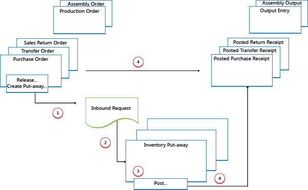
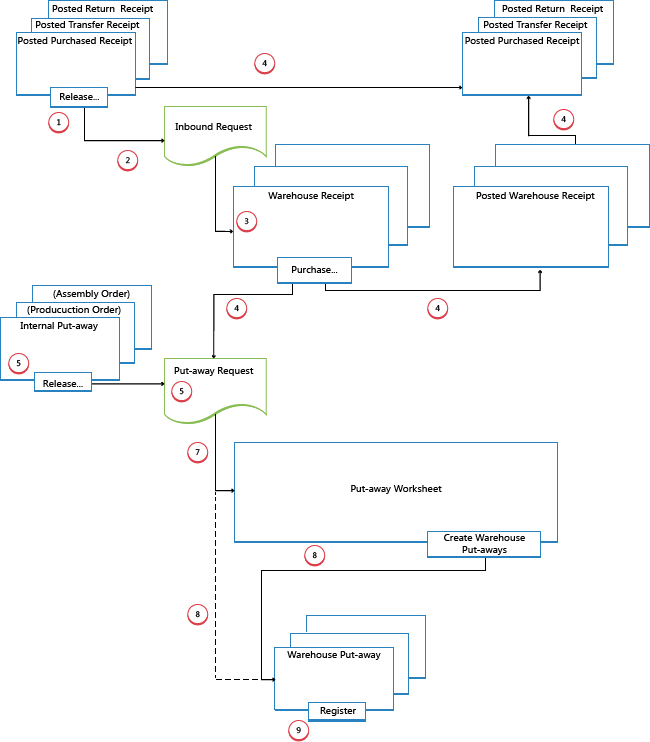

# Сведения о проектировании: входящий складской поток
Входящий поток на складе начинается с прибытия товаров на склад компании из внешних источников или с другого склада компании. Сотрудник зарегистрирует товар, как правило, сканируя штрих-код. Из зоны приемки складские операции выполняются на разных уровнях сложности для перемещения товаров в зону хранения.  

 Каждый товар определяется и сопоставляется с соответствующим входящим документом-источником. Существуют следующие входящие документы-источники.  

- Заказ на покупку  
- Заказ на входящее перемещение  
- Возврат продажи  

Кроме того, существуют следующие внутренние документы-источники, которые служат входящими источниками.  

- Производственный заказ с учетом выхода  
- Заказ на сборку с учетом выхода  

Последние два представляют входящие потоки на склад с внутренних операционных областей. Дополнительные сведения об обработке склада для внутренних исходящих и входящих процессов см. в разделе [Сведения о проектировании: внутренние складские потоки](design-details-internal-warehouse-flows.md).  

Процессы и документы пользовательского интерфейса во входящих складских потоках отличаются для базовой и расширенной конфигураций склада. Основное различие в том, что действия выполняются на уровне отдельных заказов в базовых конфигурациях складирования и они консолидируются для нескольких заказов в расширенных конфигурациях складирования. Дополнительные сведения о различных уровнях сложности склада см. в разделах [Сведения о проектировании: обзор склада](design-details-warehouse-setup.md).  

В [!INCLUDE[d365fin](includes/d365fin_md.md)] входящие процессы по получению и размещению могут быть выполнены четырьмя способами при помощи различных функций в зависимости от уровня сложности склада.  

|Способ|Входящий процесс|Ячейки|Прих. накладные|Складское размещение|Уровень сложности (см. раздел [Сведения о проектировании: настройка склада](design-details-warehouse-setup.md))|  
|------------|---------------------|----------|--------------|----------------|--------------------------------------------------------------------------------------------------------------------|  
|П|Выполните учет приемки и размещения из строки заказа|X|||2|  
|Б|Выполните учет приемки и размещения из документа складского размещения|||X|3|  
|C|Выполните учет приемки и размещения из документа складской приемки||X||4/5/6|  
|D|Выполните учет приемки из документа складской приемки и учет размещения из документа складского размещения||X|X|4/5/6|  

Выбор подхода зависит от принятых в организации практик и уровня организационной сложности. В складской среде последовательного выполнения заказов, где большая часть персонала склада работает непосредственно с документами заказов, организация может использовать метод А. На складе с последовательным выполнением заказов, на котором выполняются более сложные процессы размещения или на котором для выполнения складских операций используется специальный персонал, организация может решить разделить функции размещения и документы заказов (метода В). Кроме того, организациям, которым требуется планирование обработки нескольких заказов, может быть полезно использовать документы складской приемки (методы С и D).  

При использовании методов A, B и C действия приемки и размещения объединены в один шаг при учете соответствующих документов как полученных. При использовании метода D сначала учитывается приемка для регистрации увеличения запасов и того, что товары доступны для продажи. Затем сотрудник склада регистрирует размещение, чтобы сделать товары доступными для подбора.  

## Базовые конфигурации склада  
На следующей схеме показаны входящие складские потоки по типам документов в базовых конфигурациях склада. Номер на схеме соответствует шагам в разделах после схемы.  

  

### 1. Выпуск документа-источника / Создание размещения запасов  
При получении товаров на складе ответственный пользователь издает документ-источник, например заказ на покупку или входящий заказ на перемещение, чтобы дать складским рабочим понять, что полученные товары можно размещать в запасах. В качестве альтернативы пользователь может создать документы размещения запасов для отдельных строк заказа в режиме распределения на основе указанных ячеек и количеств для обработки.  

### 2. Создание входящего запроса  
При выпуске входящего документа-источника автоматически создается входящий складской запрос. Он содержит ссылки на тип и номер документа-источника и не отображается для пользователя.  

### 3. Создание размещения запасов  
В окне **Размещение запасов** работник склада извлекает ожидающие строки документа-источника в режиме извлечения на основе входящих складских запросов. В качестве альтернативы строки размещения запасов уже созданы в режиме распределения пользователем, отвечающим за документ-источник.  

### 4. Учет размещения запасов  
В каждой строке товаров, которые были полностью или частично размещены, работник склада заполняет поле **Количество**, а затем учитывает размещение запасов. Документы-источники, связанные со складским размещением, учитываются как полученные.  

Создаются положительные операции книги товаров, создаются складские операции и удаляется запрос на размещение, если обработка выполнена в полном объеме. Например, обновляется поле **Полученное кол-во** во входящей строке документа-источника. Создается учтенный документ приемки, например, со сведениями о заказе на покупку и полученными товарами.  

## Расширенные конфигурации склада  
На следующей схеме показан входящий складской поток по типу документов в расширенных конфигурациях склада. Номер на схеме соответствует шагам в разделах после схемы.  

  

### 1. Выпуск документа-источника  
При получении товаров на складе ответственный пользователь издает документ-источник, например заказ на покупку или входящий заказ на перемещение, чтобы дать складским рабочим понять, что полученные товары можно размещать в запасах.  

### 2. Создание входящего запроса  
При выпуске входящего документа-источника автоматически создается входящий складской запрос. Он содержит ссылки на тип и номер документа-источника и не отображается для пользователя.  

### 3. Создание складской приемки  
В окне **Складская приемка** пользователь, отвечающий за получение товаров, извлекает ожидающие строки документа-источника на основе входящего складского запроса. Несколько строк документа-источника можно объединить в один документ складской приемки.  

Пользователь заполняет поле **Кол-во для обработки** и выбирает область получения и ячейку, если требуется.  

### 4. Учет складской приемки  
Пользователь учитывает складской приход. Создаются положительные операции книги товаров. Например, обновляется поле **Полученное кол-во** во входящей строке документа-источника.  

### 5. Создание внутреннего размещения склада  
Пользователь, ответственный за размещение из внутренних операций, создает внутреннее складское размещение для товаров, которые необходимо разместить на складе, например производственный выпуск или выпуск при сборке. Пользователь указывает количество, зону и ячейку, из которых нужно разместить товары, используя функцию **Получить содержимое ячейки**. Пользователь выпускает внутреннее складское размещение, в результате чего создается входящий запрос склада, чтобы задачу можно было восстановить из документов складского размещения или из журнала размещения.  

### 6. Создание запроса на размещение  
При учете входящего документа-источника запрос на складское размещение создается автоматически. Он содержит ссылки на тип и номер документа-источника и не отображается для пользователя. В зависимости от настройки выход производственного заказа также создает запрос на размещение для размещения готовых товаров в запасах.  

### 7. Создание строк журнала размещения (необязательно)  
Пользователь, ответственный за согласование размещения, извлекает строки складского размещения из документа **Журнал размещения** на основе учтенных складских приемок или внутренних операций с выводом. Пользователь выбирает строки для размещения и подготавливает размещение, указывая, из каких ячеек брать товар, в каких ячейках его размещать и сколько единиц товара обрабатывать. Ячейки могут быть предопределены настройкой местоположения склада или ресурса операции.  

Если все размещения спланированы и присвоены складским рабочим, пользователь создает документы складского размещения. Полностью назначенные строки размещения удаляются из документа **Журнал размещения**.  

> [!NOTE]  
>  Если поле **Использовать журнал размещения** не выбрано в карточке склада, документы складского размещения создаются непосредственно на основе учтенных складских приемок. В этом случае шаг 7 можно пропустить.  

### 8. Создание документа складского размещения  
Работник склада, выполняющий размещение, создает складской документ размещения в режиме извлечения на основе учтенной складской приемки. В качестве альтернативы создается документ складского размещения, который назначается работнику склада в режиме распределения.  

### 9. Регистрация складского размещения  
В каждой строке товаров, которые были полностью или частично размещены, работник склада заполняет поле **Количество** в окне **Складское размещение**, а затем регистрирует складское размещение.  

Создаются складские операции, а строки складского размещения удаляются, если были полностью обработаны. Документ складского размещения остается открытым до тех пор, пока не будет зарегистрировано полное количество соответствующей складской приемки. Поле **Кол-во для размещения** в строках заказа складской приемки обновляется.  

## См. также  
[Сведения о проектировании: управление складом](design-details-warehouse-management.md)

