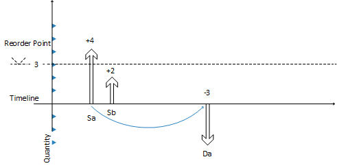

# Сведения о проектировании: отслеживание уровня прогнозируемых запасов и точки дозаказаDesign Details: Monitoring the Projected Inventory Level and the Reorder Point
Запасы — это тип поставки, но для планирования запасов система планирования разделяет два уровня запасов:Inventory is a type of supply, but for inventory planning, the planning system distinguishes between two inventory levels:  

* Прогнозируемые запасыProjected inventory  
* Прогнозируемые доступные запасыProjected available inventory  

## Ожидаемые запасыProjected Inventory  
Изначально в начале процесса планирования прогнозируемые запасы представляют собой количество общих запасов, включая поставку и спрос в прошлом, даже если они не учтены.Initially, projected inventory is the quantity of gross inventory, including supply and demand in the past even if not posted, when starting the planning process. В будущем это становится изменяющимся прогнозируемым уровнем запасов, который поддерживается общими количествами из будущей поставки и спроса, поскольку они вводятся со временем (независимо от того, зарезервированы они или размещены иным способом).In the future, this becomes a moving projected inventory level that is maintained by gross quantities from future supply and demand because those are introduced along the time line (whether reserved or in other ways allocated).  

Прогнозируемые запасы используются системой планирования для мониторинга точки повторного запаса и определения количества повторного запаса при использовании политики повторного заказа "Макс. кол-во".The projected inventory is used by the planning system to monitor the reorder point and to determine the reorder quantity when using the Maximum Qty. reordering policy.  

## Прогнозируемые доступные запасыProjected Available Inventory  
Прогнозируемые доступные запасы являются частью прогнозируемых запасов, которая на данный момент доступна для удовлетворения спроса.The projected available inventory is the part of the projected inventory that at a given point in time is available to fulfill demand. Прогнозируемые доступные запасы используются механизмом планирования при мониторинге уровня страхового запаса.The projected available inventory is used by the planning engine when monitoring the safety stock level.  

Прогнозируемые доступные запасы используются системой планирования для мониторинга уровня страховых запасов, поскольку страховые запасы всегда должны быть доступны для обслуживания неожиданного спроса.The projected available inventory is used by the planning system to monitor the safety stock level, since the safety stock must always be available to serve unexpected demand.  

## Горизонты планированияTime Buckets  
Обеспечение жесткого контроля прогнозируемых запасов очень важно для определения того, когда достигается или пересекается точка дозаказа, и для расчета правильного количества заказа при использовании политики дозаказа "Максимальное кол-во".Having a tight control of the projected inventory is crucial to detect when the reorder point is reached or crossed and to calculate the right order quantity when using the Maximum Qty. reordering policy.  

Как указано ранее, прогнозируемый уровень запасов рассчитывается в начале периода учета.As stated earlier, the projected inventory level is calculated at the start of the planning period. Это общий уровень, на котором не учитываются резервирования и похожие распределения.It is a gross level that does not consider reservations and similar allocations. Для мониторинга этого уровня запасов в последовательности планирования система отслеживает совокупные изменения за период времени или горизонт планирования.To monitor this inventory level during the planning sequence, the system monitors the aggregated changes over a period of time, a time bucket. Система гарантирует, что горизонт планирования равен хотя бы одному дню, поскольку это самая точная единица времени для события спроса или поставки.The system ensures that the time bucket is at least one day since it is the most precise unit of time for a demand or supply event.  

## Определение уровня прогнозируемых запасовDetermining the Projected Inventory Level  
Следующая последовательность описывает определение прогнозируемого уровня запасов.The following sequence describes how the projected inventory level is determined:  

* Если событие поставки, например заказ на покупку, полностью спланировано, увеличиваются ожидаемые запасы в дату оплаты.When a supply event, such as a purchase order has been totally planned, it will increase the projected inventory on its due date.  
* Если событие спроса полностью удовлетворено, прогнозируемый расход склада не будет осуществляться сразу же.When a demand event has been fully satisfied, it will not decrease the projected inventory right away. Вместо этого учитывается напоминание об уменьшении, которое является внутренней записью, содержащей дату и количество вклада в прогнозируемые запасы.Instead, it posts a decrease reminder, which is an internal record that holds the date and quantity of the contribution to the projected inventory.  
* Если планируется последующее событие поставки и оно размещается на временной шкале, учтенные напоминания о расходе изучаются по одному до планируемой даты поставки. При этом обновляются ожидаемые запасы.When a subsequent supply event is planned and placed on the time line, the posted decrease reminders are investigated one by one up until the planned date of the supply while updating the projected inventory. Во время данного процесса уровень точки дозаказа внутреннего напоминания об увеличении может быть достигнут или пройден.During this process, the reorder point level of the internal increase reminder may be reached or crossed.  
* Если введен новый заказ на поставку, система проверяет, был ли он введен до текущей поставки.If a new supply order is introduced, the system checks if it is entered before the current supply. В этом случае новая поставка становится текущей поставкой, и процедура балансировки начинается снова.If it is, the new supply becomes current supply and the balancing procedure starts over.  

Далее этот принцип проиллюстрирован графически.The following shows a graphical illustration of this principle:  

  

1. Поставка **Sa** на 4 штуки (фиксированная) закрывает спрос **Da** на -3 штуки.Supply **Sa** of 4 (fixed) closes Demand **Da** of -3.  
2. CloseDemand: создается напоминание об уменьшении на -3 (не показано).CloseDemand: Create a decrease reminder of -3 (not shown).  
3. Поставка **Sa** закрыта с излишком 1 (спрос больше не существует).Supply **Sa** is closed with a surplus of 1 (no more demand exists).  

     В результате прогнозируемый уровень склада увеличивается до +4, а прогнозируемые **доступные** запасы равны -1.This increases the projected inventory level to +4, while the projected **available** inventory becomes -1.  

4. Следующая поставка **Sb** на 2 штуки (другой заказ) уже помещена на временную шкалу.The next supply **Sb** of 2 (another order) has already been placed on the timeline.  
5. Система проверяет, имеется ли напоминание об уменьшении, предшествующее **Sb** (если нет, никакие действия не предпринимаются).System checks if there is any decrease reminder preceding **Sb** (there is not, so no action is taken).  
6. Система закрывает поставку **Sb** (спрос больше существует) либо A: путем снижения количества до значения 0 (отмена), либо B: оставляя ее как есть.System closes supply **Sb** (no more demand exists)—either A: by reducing it to 0 (cancel) or B: by leaving as is.  

     Это увеличивает прогнозируемый уровень запаса (A: +0 => +4 or B: +2 = +6).This increases the projected inventory level (A: +0 => +4 or B: +2 = +6).  

7. Система выполняет окончательную проверку на наличие напоминания об уменьшении.System makes a final check: Is there any decrease reminder? Да, имеется один в дату **Da**.Yes, there is one on the date of **Da**.  
8. Система добавляет напоминание об уменьшении, равном -3, к прогнозируемому уровню запасов одним из двух способов: A: +4 -3 = 1 или B: +6 -3 = +3.System adds the decrease reminder of -3 reminder to the projected inventory level, either A: +4 -3 = 1 or B: +6 -3 = +3.  
9. В случае А система создает заказ с прямым планирование, начиная с даты **Da**.In case of A, the system creates a forward-scheduled order starting on date **Da**.  

     В случае B достигается точка дозаказа и создается новый заказ.In case of B, the reorder point is reached and a new order is created.  

## См. такжеSee Also  
[Сведения о проектировании: политики дозаказа](design-details-reordering-policies.md) [Design Details: Reordering Policies](design-details-reordering-policies.md)   
[Сведения о проектировании: параметры планирования](design-details-planning-parameters.md) [Design Details: Planning Parameters](design-details-planning-parameters.md)   
[Сведения о проектировании: обработка политик дозаказа](design-details-handling-reordering-policies.md) [Design Details: Handling Reordering Policies](design-details-handling-reordering-policies.md)   
[Сведения о проектировании: планирование поставокDesign Details: Supply Planning](design-details-supply-planning.md)

