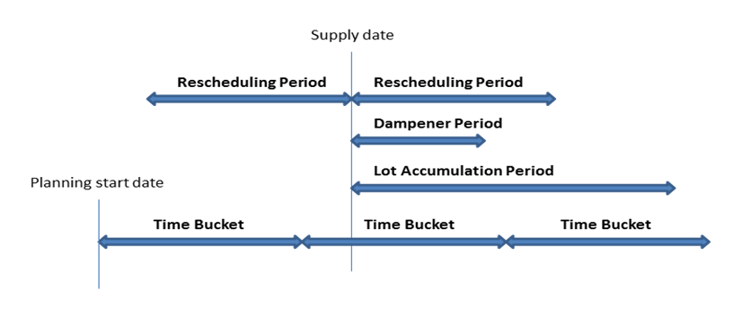
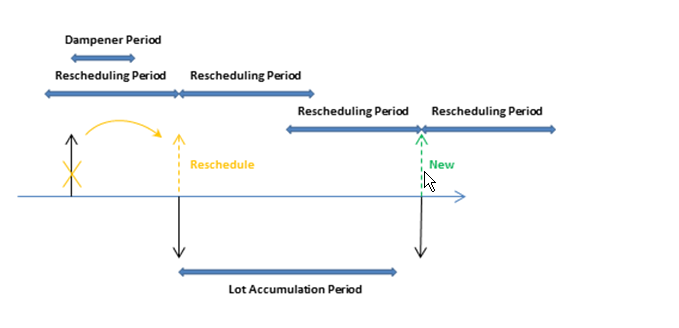

# Сведения о проектировании: параметры планированияDesign Details: Planning Parameters
В этом разделе описываются различные параметры планирования которые можно использовать в [!INCLUDE[d365fin](includes/d365fin_md.md)].This topic describes the different planning parameters that you can use in [!INCLUDE[d365fin](includes/d365fin_md.md)].  

Способ контроля поставки товаров системой планирования определяется разными настройками на карточке товара или в единице складского хранения и параметрами в разделе настройки производства.The way in which the planning system controls item supply is determined by various settings on the item card or SKU, and settings in manufacturing setup. В следующей таблице показано, как эти параметры используются для планирования.The following table shows how these parameters are used for planning.  

|НазначениеPurpose|ПараметрParameter|  
|-------------|---------------|  
|Определение необходимости планирования товараDefine if the item is to be planned|Политика дозаказа = ПустоReordering Policy = Blank|  
|Определение времени дозаказаDefine when to reorder|Горизонт планированияTime Bucket   Точка повтора заказаReorder Point   Страховой запас времениSafety Lead Time|  
|Определение количества для дозаказаDefine how much to reorder|Кол-во страхового запасаSafety Stock Quantity   Политика дозаказа:Reordering Policy:   -   "Фикс. кол-во дозаказа" и "Кол-во для дозаказа"-   Fixed Reorder Qty. plus Reorder Quantity -   Максимальное количество и максимальный запас-   Maximum Qty. plus Maximum Inventory -   Заказ-   Order -   Партия на партию-   Lot-for-Lot|  
|Оптимизация времени и количества дозаказаOptimize when and how much to reorder|Период перепланированияRescheduling Period   Период накопления лотаLot Accumulation Period   Буферный периодDampener Period|  
|Изменение заказов на поставкуModify the supply orders|Минимальное количество заказаMinimum Order Quantity   Максимальное количество заказаMaximum Order Quantity   Заказать несколькоOrder Multiple|  
|Разделение запланированного элементаDelimit the planned item|Политика производства:Manufacturing Policy:   -   Изготовление на склад-   Make-to-Stock -   Изготовление на заказ-   Make-to-Order|  

## Определение необходимости планирования товараDefine If the Item Will Be Planned  
Для включения товара или единицы продукции в процесс планирования необходимо иметь политику повторных заказов. В противном случае необходимо запланировать это вручную, например с использованием функции планирования заказов.To include an item/SKU in the planning process, it must have a reordering policy otherwise it must be planned manually, for example, with the Order Planning feature.  

## Определение времени дозаказаDefine When to Reorder  
Предложения по дозаказу обычно выпускаются, только когда прогнозируемое доступное количество равное или меньше данного количества.Reorder proposals are generally released only when the projected available quantity has fallen to or below a given quantity. Это количество определяется точкой повторного заказа.This quantity is defined by the reorder point. В противном случае количество будет равно нулю.Otherwise, it will be zero. Нуль можно скорректировать, введя количество страхового запаса.Zero can be adjusted by entering a safety stock quantity. Если пользователь определил страховое время подготовки, предложение предоставляется в период до требуемого срока оплаты.If the user has defined a safety lead time, it will cause the proposal to be delivered in the period prior to the required due date.  

Поле **Горизонт планирования** используется политиками точки дозаказа (**Фикс. кол-во дозаказа** и **Максимальное кол-во**), где уровень запасов проверяется после каждого горизонта планирования.The **Time Bucket** field is used by reorder point policies (**Fixed Reorder Qty.** and **Maximum Qty.**), where the inventory level is checked after each time bucket. Первый горизонт планирования начинается в начальную дату планирования.The first time bucket begins on the planning starting date.  

> [!NOTE]  
>  При расчете горизонтов планирования система планирования игнорирует все рабочие календари, определенные в поле **Код базового календаря** в окнах **Информация об организации** и **Карточка склада**.When calculating time buckets, the planning system ignores any working calendars that are defined in the **Base Calendar Code** field in the **Company Information** and **Location Card** windows.  

Страховой запас времени по умолчанию в окне **Производство - настройка** должен быть настроен хотя бы на 1 день.The default safety lead time, in the **Manufacturing Setup** window, should be set to at least one day. Может быть известна дата оплаты по спросу, но не время оплаты.The due date of the demand may be known, but not the due time. Планирование составляет расписание в обратном направлении, чтобы удовлетворить общий спрос, и если время подготовки страхового запаса не определено, товары могут прибыть слишком поздно, чтобы удовлетворить спрос.The planning schedules backward to meet gross demand, and, if no safety lead time is defined, the goods may arrive too late to meet the demand.  

Три дополнительных поля периода повторного заказа — **Период перепланирования**, **Период накопления лота** и **Буферный период** — также играют роль в определении времени повторного заказа.Three additional reorder period fields, **Rescheduling Period**, **Lot Accumulation Period**, and **Dampener Period**, also play a role in defining when to reorder. Для получения дополнительных сведений см. раздел "Оптимизация сроков и объемов дозаказа".For more information, see the "Optimize When and How Much to Reorder" section.  

## Определение количества для дозаказаDefine How Much to Reorder  
Если система планирования обнаруживает необходимость в дозаказе, используется выбранная политика дозаказа для определения времени и способа дозаказа.If the planning system detects the need to reorder, the selected reordering policy is used to determine when and how much to order.  

Система планирования не зависит от политики дозаказа и обычно использует следующую логику.Independent of the reordering policy, the planning system usually follows this logic:  

1. Количество предложения заказа вычисляется, чтобы удовлетворить заданный минимальный уровень запасов товаров, как правило количество страхового запаса.The quantity of the order proposal is calculated to meet the specified minimum inventory level of the item, usually the safety stock quantity. Если ничего не указано, минимальный уровень запасов равен нулю.If nothing is specified, the minimum inventory level is zero.  
2. Если прогнозируемые доступные запасы ниже страхового запаса, предлагается заказ на поставку с обратным планированием.If the projected available inventory is below the safety stock quantity, a backward-scheduled supply order is suggested. Кол--во заказа позволит по меньшей мере наполнить страховой запас. Его можно увеличить совокупным спросом в пределах горизонта планирования, политикой повторного заказа и модификаторами заказов.The order quantity will at least fill the safety stock quantity, and can be increased by gross demand within the time bucket, by the reordering policy, and by the order modifiers.  
3. Если прогнозируемые запасы ниже точки дозаказа или равны ей (рассчитаны на основе совокупных изменений в горизонте планирования) и выше количества страхового запаса, предлагается исключительный заказ с прямым планированием.If the projected inventory is on or below the reorder point (calculated from aggregated changes within the time bucket) and above the safety stock quantity, a forward-scheduled exception order is suggested. И полный спрос, который необходимо удовлетворить, и политика дозаказа будут определять количество заказа.Both the gross demand to be met and the reordering policy will determine the order quantity. Как минимум количество заказа будет равно точке дозаказа.At minimum, the order quantity will meet the reorder point.  
4. Если имеется дополнительный общий спрос, который подлежит оплате до даты окончания предложения по заказу с прямым планированием, этот спрос уменьшает текущие рассчитанные прогнозируемые доступные запасы до значения ниже страхового количества запасов, количество заказа увеличивается для составления дефицита.If there is more gross demand due before the ending date of the forward-scheduled order proposal, and this demand brings the currently calculated projected available inventory below the safety stock quantity, the order quantity is increased to make up the deficit. Затем предложенный заказ на поставку планируется в обратном порядке от даты удовлетворения совокупного спроса, который мог бы нарушить количество страхового запаса.The suggested supply order is then scheduled backward from the due date of the gross demand that would have violated the safety stock quantity.  
5. Если поле **Горизонт планирования** не заполнено, будет добавлен только полный спрос на ту же дату срока оплаты.If the **Time Bucket** field is not filled in, only the gross demand on the same due date will be added.  

     Следующие поля периода повторного заказа также играют роль в определении количества для повторного заказа: **Период перепланирования**, **Период накопления лота** и **Буферный период**.The following reorder period fields also play a role in defining how much to reorder: **Rescheduling Period**, **Lot Accumulation Period**, and **Dampener Period**. Для получения дополнительных сведений см. раздел "Оптимизация сроков и объемов дозаказа".For more information, see the "Optimize When and How Much to Reorder" section.  

### Политики дозаказаReordering Policies  
Следующие политики повторного заказа влияют на повторно заказываемое количество.The following reordering policies affect the quantity that is being reordered.  

|Политика дозаказаReordering policy|ОписаниемDescription|  
|-----------------------|---------------------------------------|  
|**Фикс. кол-во повтора заказа****Fixed Reorder Qty.**|Как минимум количество заказа будет равно количеству дозаказа.At a minimum, the order quantity will be equal to the reorder quantity. Его можно увеличить для удовлетворения спроса или соответствия требуемому уровню запасов.It can be increased to meet the demand or the desired inventory level. Эта политика повторного заказа, как правило, используется с точкой повторного заказа.This reordering policy is usually used with a reorder point.|  
|**Максимальное кол-во****Maximum Qty.**|Количество заказа вычисляется, чтобы удовлетворить максимальные запасы.The order quantity will be calculated to meet the maximum inventory. Если используются модификаторы количества, максимальный уровень запасов можно нарушить.If quantity modifiers are used, then maximum inventory can be violated. не рекомендуется использовать горизонт планирования вместе с максимальным количеством.We do not recommend that you use the time bucket together with maximum quantity. Горизонт планирования, как правило, переопределяется.The time bucket will usually be overruled. Эта политика повторного заказа, как правило, используется с точкой повторного заказа.This reordering policy is usually used with a reorder point.|  
|**Заказ****Order**|Количество заказа рассчитывается так, чтобы удовлетворить все отдельные события спроса, а набор спрос-предложение остается связанным до исполнения.The order quantity will be calculated to meet each single demand event and the demand-supply set will remain linked until execution. Параметры планирования не учитываются.No planning parameters are considered.|  
|**Партия на партию****Lot-for-Lot**|Количество рассчитывается для удовлетворения суммарного спроса, который нужно удовлетворить в данном горизонте планирования.The quantity is calculated to meet the sum of the demand that comes due in the time bucket.|  

##  Оптимизация времени и количества дозаказаOptimize When and How Much to Reorder  
Для получения рационального плана поставок планировщик обязан настроить параметры планирования, чтобы ограничить предложения по перепланированию, аккумулировать спрос (количество динамического повторного заказа) или избежать незначительных операций планирования.To obtain a rational supply plan, a planner will fine-tune planning parameters to limit rescheduling suggestions, accumulate demand (dynamic reorder quantity), or to avoid insignificant planning actions. Следующие поля периода повторного заказа позволяют оптимизировать время и количество повторного заказа.The following reorder period fields help optimize when and how much to reorder.  

|ПолеField|ОписаниемDescription|  
|---------------------------------|---------------------------------------|  
|**Период перепланирования****Rescheduling Period**|Это поле используется, чтобы определить, должно ли указание перепланировать существующий заказ или отменять его и создавать новый.This field is used to determine whether the action message should reschedule an existing order or cancel it and create a new order. Существующий заказ будет перепланирован в том же периоде перепланирования до текущего предложения и до одного периода перепланирования после текущего предложения.The existing order will be rescheduled within one rescheduling period before the current supply and until one rescheduling period after the current supply.|  
|**Период накопления лота****Lot Accumulation Period**|Если политика повторного заказа действует на уровне партий, это поле используется для объединения нескольких потребностей в поставках в один заказ на поставку.With reordering policy Lot-for-Lot, this field is used to accumulate multiple supply needs into one supply order. Начиная с первой плановой поставки система накапливает все потребности в поставке в следующем периоде накопления лота в одном заказе, который размещается на дату первой поставки.From the first planned supply, the system accumulates all supply needs in the following lot accumulation period into one supply, which is placed on the date of the first supply. Спрос за пределами периода накопления лота не покрывается этой поставкой.Demand outside the lot accumulation period is not covered by this supply.|  
|**Буферный период****Dampener Period**|Это поле используется, чтобы избежать незначительного перепланирования существующих поставок.This field is used to avoid minor rescheduling of existing supply out in time. Изменение с даты поставки на один буферный период с даты поставки не приведет к созданию сообщений о действиях.Changes from the supply date until one dampener period from the supply date will not generate any action messages.   В результате положительная дельта между предложенной новой датой поставки и исходной датой поставки всегда будет больше буферного периода.As a result a positive delta between the suggested new supply date and the original supply date will always be larger than the dampener period.|  

Время периода перепланирования, буферного периода и периода накопления лота отсчитывается от даты поставки.The timing of rescheduling period, dampener period, and lot accumulation period is based on a supply date. Горизонт планирования основан на начальной дате планирования, как показано на следующей иллюстрации.The time bucket is based on the planning start date, as shown in the following illustration.  

  

В следующих примерах черные стрелки представляют существующую поставку (вверх) и спрос (вниз).In the following examples, the black arrows represent existing supply (up) and demand (down). Красные, зеленые и оранжевые стрелки обозначают предложения по планированию.Red, green, and orange arrows are planning suggestions.  

**Пример 1**. Измененная дата находится за пределами периода перепланирования, что приводит к отмене существующей поставки.**Example 1**: The changed date is outside the rescheduling period, which causes the existing supply to be canceled. Предлагается новая поставка для удовлетворения спроса в период накопления лота.A new supply is suggested to cover the demand in the lot accumulation period.  

  

**Пример 2**. Измененная дата находится в пределах периода перепланирования, что приводит к перепланированию существующей поставки.**Example 2**: The changed date is in the rescheduling period, which causes the existing supply to be rescheduled. Предлагается новая поставка для удовлетворения спроса за пределами периода накопления лота.A new supply is suggested to cover the demand outside the lot accumulation period.  

  

**Пример 3**. В буферном периоде имеется спрос, и количество поставки в периоде накопления лота соответствует количеству поставки.**Example 3**: There is a demand in the dampener period and the supply quantity in the lot accumulation period matches the supply quantity. Следующий спрос не удовлетворен, поэтому предложена новая поставка.The next demand is uncovered and a new supply is suggested.  

  

**Пример 4**. В буферном периоде имеется спрос, и дата поставки остается неизменной.**Example 4**: There is a demand in the dampener period and the supply remains on the same date. Однако текущего количества поставки недостаточно для удовлетворения спроса в период накопления лота, поэтому предлагается действие по изменению количества для существующего заказа на поставку.However, the current supply quantity is not enough to cover the demand in the lot accumulation period, so a change quantity action for the existing supply order is suggested.  

  

**Значения по умолчанию.** По умолчанию поле **Горизонт планирования** и три поля периода дозаказа не заполнены.**Default values:** The default value of the **Time Bucket** field and the three reorder period fields is blank. Для всех полей за исключением поля **Буферный период** это означает значение 0D (ноль дней).For all fields, except the **Dampener Period** field, this means 0D (zero days). Если поле **Буферный период** пустое, будет использоваться глобальное значение в поле **Буферный период по умолчанию** в окне **Производство - настройка**.If the **Dampener Period** field is blank, the global value in the **Default Dampener Period** field in the **Manufacturing Setup** window will be used.  

## Изменение заказов на поставкуModify the Supply Orders  
Если количество предложения заказа вычислено, один или более модификаторов заказа могут скорректировать это количество.When the quantity of the order proposal has been calculated, one or more of the order modifiers can adjust it. Например, максимальное количество заказа больше или равно минимальному количеству заказа, которое больше или равно множителю заказа.For example, the maximum order quantity is larger than or equal to the minimum order quantity, which is larger than or equal to the order multiple.  

Количество уменьшается, если оно превышает максимальное количество заказа.The quantity is decreased if it exceeds the maximum order quantity. Затем оно увеличивается, если оно ниже минимального количества заказа.Then, it is increased if it is below the minimum order quantity. Наконец, оно округляется в большую сторону, чтобы соответствовать определенному множителю заказа.Finally, it is rounded up so that it matches a specified order multiple. В любом остатке используются те же коррекции, пока общий спрос не будет удовлетворен в предложениях заказа.Any remaining quantity uses the same adjustments until the total demand has been converted into order proposals.  

## Разделение элементаDelimit the Item  
Параметр **Политика производства** определяет, какие дополнительные заказы будут предложены расчетом MRP.The **Manufacturing Policy** option defines which additional orders the MRP calculation will propose.  

Если используется параметр **Изготовление на склад**, заказы связаны только с данным товаром.If the **Make-to-Stock** option is used, the orders concern only the item in question.  

Если используется параметр **Изготовление на заказ**, система планирования проанализирует производственную спецификацию товара и создаст дополнительные связанные предложения заказов для товаров нижнего уровня, которые также определяются как "Изготовление на заказ".If the **Make-to-Order** option is used, the planning system will analyze the production BOM of the item and create additional linked order proposals for those lower-level items that are also defined as make-to-order. Это продолжается при наличии товаров на заказ в нисходящих структурах спецификации.This continues as long as there are make-to-order items in the descending BOM structures.  

## См. такжеSee Also  
[Сведения о проектировании: обработка политик дозаказа](design-details-handling-reordering-policies.md) [Design Details: Handling Reordering Policies](design-details-handling-reordering-policies.md)   
[Сведения о проектировании: балансировка спроса и поставки](design-details-balancing-demand-and-supply.md) [Design Details: Balancing Demand and Supply](design-details-balancing-demand-and-supply.md)   
[Сведения о проектировании: основные понятия системы планированияDesign Details: Central Concepts of the Planning System](design-details-central-concepts-of-the-planning-system.md)

