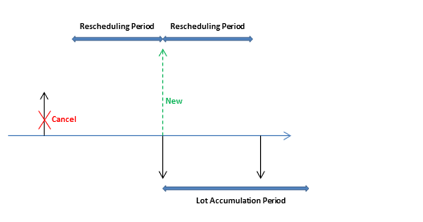

# Сведения о проектировании: параметры планирования
В этом разделе описываются различные параметры планирования которые можно использовать в [!INCLUDE[d365fin](includes/d365fin_md.md)].  

Способ контроля поставки товаров системой планирования определяется разными настройками на карточке товара или в единице складского хранения и параметрами в разделе настройки производства. В следующей таблице показано, как эти параметры используются для планирования.  

|Назначение|Параметр|  
|-------------|---------------|  
|Определение необходимости планирования товара|Политика дозаказа = Пусто|  
|Определение времени дозаказа|Горизонт планирования   Точка повтора заказа   Страховой запас времени|  
|Определение количества для дозаказа|Кол-во страхового запаса   Политика дозаказа:   -   "Фикс. кол-во дозаказа" и "Кол-во для дозаказа" -   Максимальное количество и максимальный запас -   Заказ -   Партия на партию|  
|Оптимизация времени и количества дозаказа|Период перепланирования   Период накопления лота   Буферный период|  
|Изменение заказов на поставку|Минимальное количество заказа   Максимальное количество заказа   Заказать несколько|  
|Разделение запланированного элемента|Политика производства:   -   Изготовление на склад -   Изготовление на заказ|  

## Определение необходимости планирования товара  
Для включения товара или единицы продукции в процесс планирования необходимо иметь политику повторных заказов. В противном случае необходимо запланировать это вручную, например с использованием функции планирования заказов.  

## Определение времени дозаказа  
Предложения по дозаказу обычно выпускаются, только когда прогнозируемое доступное количество равное или меньше данного количества. Это количество определяется точкой повторного заказа. В противном случае количество будет равно нулю. Нуль можно скорректировать, введя количество страхового запаса. Если пользователь определил страховое время подготовки, предложение предоставляется в период до требуемого срока оплаты.  

Поле **Горизонт планирования** используется политиками точки дозаказа (**Фикс. кол-во дозаказа** и **Максимальное кол-во**), где уровень запасов проверяется после каждого горизонта планирования. Первый горизонт планирования начинается в начальную дату планирования.  

> [!NOTE]  
>  При расчете горизонтов планирования система планирования игнорирует все рабочие календари, определенные в поле **Код базового календаря** в окнах **Информация об организации** и **Карточка склада**.  

Страховой запас времени по умолчанию в окне **Производство - настройка** должен быть настроен хотя бы на 1 день. Может быть известна дата оплаты по спросу, но не время оплаты. Планирование составляет расписание в обратном направлении, чтобы удовлетворить общий спрос, и если время подготовки страхового запаса не определено, товары могут прибыть слишком поздно, чтобы удовлетворить спрос.  

Три дополнительных поля периода повторного заказа — **Период перепланирования**, **Период накопления лота** и **Буферный период** — также играют роль в определении времени повторного заказа. Для получения дополнительных сведений см. раздел "Оптимизация сроков и объемов дозаказа".  

## Определение количества для дозаказа  
Если система планирования обнаруживает необходимость в дозаказе, используется выбранная политика дозаказа для определения времени и способа дозаказа.  

Система планирования не зависит от политики дозаказа и обычно использует следующую логику.  

1. Количество предложения заказа вычисляется, чтобы удовлетворить заданный минимальный уровень запасов товаров, как правило количество страхового запаса. Если ничего не указано, минимальный уровень запасов равен нулю.  
2. Если прогнозируемые доступные запасы ниже страхового запаса, предлагается заказ на поставку с обратным планированием. Кол--во заказа позволит по меньшей мере наполнить страховой запас. Его можно увеличить совокупным спросом в пределах горизонта планирования, политикой повторного заказа и модификаторами заказов.  
3. Если прогнозируемые запасы ниже точки дозаказа или равны ей (рассчитаны на основе совокупных изменений в горизонте планирования) и выше количества страхового запаса, предлагается исключительный заказ с прямым планированием. И полный спрос, который необходимо удовлетворить, и политика дозаказа будут определять количество заказа. Как минимум количество заказа будет равно точке дозаказа.  
4. Если имеется дополнительный общий спрос, который подлежит оплате до даты окончания предложения по заказу с прямым планированием, этот спрос уменьшает текущие рассчитанные прогнозируемые доступные запасы до значения ниже страхового количества запасов, количество заказа увеличивается для составления дефицита. Затем предложенный заказ на поставку планируется в обратном порядке от даты удовлетворения совокупного спроса, который мог бы нарушить количество страхового запаса.  
5. Если поле **Горизонт планирования** не заполнено, будет добавлен только полный спрос на ту же дату срока оплаты.  

     Следующие поля периода повторного заказа также играют роль в определении количества для повторного заказа: **Период перепланирования**, **Период накопления лота** и **Буферный период**. Для получения дополнительных сведений см. раздел "Оптимизация сроков и объемов дозаказа".  

### Политики дозаказа  
Следующие политики повторного заказа влияют на повторно заказываемое количество.  

|Политика дозаказа|Описанием|  
|-----------------------|---------------------------------------|  
|**Фикс. кол-во повтора заказа**|Как минимум количество заказа будет равно количеству дозаказа. Его можно увеличить для удовлетворения спроса или соответствия требуемому уровню запасов. Эта политика повторного заказа, как правило, используется с точкой повторного заказа.|  
|**Максимальное кол-во**|Количество заказа вычисляется, чтобы удовлетворить максимальные запасы. Если используются модификаторы количества, максимальный уровень запасов можно нарушить. не рекомендуется использовать горизонт планирования вместе с максимальным количеством. Горизонт планирования, как правило, переопределяется. Эта политика повторного заказа, как правило, используется с точкой повторного заказа.|  
|**Заказ**|Количество заказа рассчитывается так, чтобы удовлетворить все отдельные события спроса, а набор спрос-предложение остается связанным до исполнения. Параметры планирования не учитываются.|  
|**Партия на партию**|Количество рассчитывается для удовлетворения суммарного спроса, который нужно удовлетворить в данном горизонте планирования.|  

##  Оптимизация времени и количества дозаказа  
Для получения рационального плана поставок планировщик обязан настроить параметры планирования, чтобы ограничить предложения по перепланированию, аккумулировать спрос (количество динамического повторного заказа) или избежать незначительных операций планирования. Следующие поля периода повторного заказа позволяют оптимизировать время и количество повторного заказа.  

|Поле|Описанием|  
|---------------------------------|---------------------------------------|  
|**Период перепланирования**|Это поле используется, чтобы определить, должно ли указание перепланировать существующий заказ или отменять его и создавать новый. Существующий заказ будет перепланирован в том же периоде перепланирования до текущего предложения и до одного периода перепланирования после текущего предложения.|  
|**Период накопления лота**|Если политика повторного заказа действует на уровне партий, это поле используется для объединения нескольких потребностей в поставках в один заказ на поставку. Начиная с первой плановой поставки система накапливает все потребности в поставке в следующем периоде накопления лота в одном заказе, который размещается на дату первой поставки. Спрос за пределами периода накопления лота не покрывается этой поставкой.|  
|**Буферный период**|Это поле используется, чтобы избежать незначительного перепланирования существующих поставок. Изменение с даты поставки на один буферный период с даты поставки не приведет к созданию сообщений о действиях.   В результате положительная дельта между предложенной новой датой поставки и исходной датой поставки всегда будет больше буферного периода.|  

Время периода перепланирования, буферного периода и периода накопления лота отсчитывается от даты поставки. Горизонт планирования основан на начальной дате планирования, как показано на следующей иллюстрации.  

  

В следующих примерах черные стрелки представляют существующую поставку (вверх) и спрос (вниз). Красные, зеленые и оранжевые стрелки обозначают предложения по планированию.  

**Пример 1**. Измененная дата находится за пределами периода перепланирования, что приводит к отмене существующей поставки. Предлагается новая поставка для удовлетворения спроса в период накопления лота.  

  

**Пример 2**. Измененная дата находится в пределах периода перепланирования, что приводит к перепланированию существующей поставки. Предлагается новая поставка для удовлетворения спроса за пределами периода накопления лота.  

  

**Пример 3**. В буферном периоде имеется спрос, и количество поставки в периоде накопления лота соответствует количеству поставки. Следующий спрос не удовлетворен, поэтому предложена новая поставка.  

  

**Пример 4**. В буферном периоде имеется спрос, и дата поставки остается неизменной. Однако текущего количества поставки недостаточно для удовлетворения спроса в период накопления лота, поэтому предлагается действие по изменению количества для существующего заказа на поставку.  

  

**Значения по умолчанию.** По умолчанию поле **Горизонт планирования** и три поля периода дозаказа не заполнены. Для всех полей за исключением поля **Буферный период** это означает значение 0D (ноль дней). Если поле **Буферный период** пустое, будет использоваться глобальное значение в поле **Буферный период по умолчанию** в окне **Производство - настройка**.  

## Изменение заказов на поставку  
Если количество предложения заказа вычислено, один или более модификаторов заказа могут скорректировать это количество. Например, максимальное количество заказа больше или равно минимальному количеству заказа, которое больше или равно множителю заказа.  

Количество уменьшается, если оно превышает максимальное количество заказа. Затем оно увеличивается, если оно ниже минимального количества заказа. Наконец, оно округляется в большую сторону, чтобы соответствовать определенному множителю заказа. В любом остатке используются те же коррекции, пока общий спрос не будет удовлетворен в предложениях заказа.  

## Разделение элемента  
Параметр **Политика производства** определяет, какие дополнительные заказы будут предложены расчетом MRP.  

Если используется параметр **Изготовление на склад**, заказы связаны только с данным товаром.  

Если используется параметр **Изготовление на заказ**, система планирования проанализирует производственную спецификацию товара и создаст дополнительные связанные предложения заказов для товаров нижнего уровня, которые также определяются как "Изготовление на заказ". Это продолжается при наличии товаров на заказ в нисходящих структурах спецификации.  

## См. также  
[Сведения о проектировании: обработка политик дозаказа](design-details-handling-reordering-policies.md)   
[Сведения о проектировании: балансировка спроса и поставки](design-details-balancing-demand-and-supply.md)   
[Сведения о проектировании: основные понятия системы планирования](design-details-central-concepts-of-the-planning-system.md)

