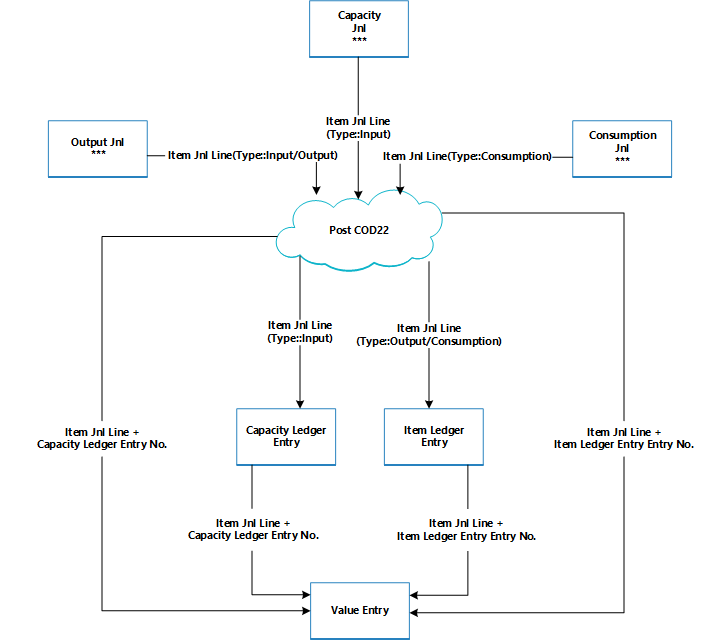

# Сведения о проектировании: учет производственного заказа
Аналогично учету заказа на сборку использованные компоненты и использованное время машины преобразуются и выпускаются как произведенный товар по завершении производственного заказа. Дополнительные сведения см. в разделе [Сведения о проектировании: учет заказа на сборку](design-details-assembly-order-posting.md). Однако поток затрат для заказов на сборку менее сложен, в частности из-за того, что учет себестоимости сборки выполняется только один раз и поэтому не создает запасы НЗП.

Транзакции, которые имеют место в производственном процессе, можно отслеживать на следующих этапах.  

1.  Приобретение материалов и других входящих материалов для производства.  
2.  Преобразование в незавершенное производство.  
3.  Преобразование в запасы готовой продукции.  
4.  Продажа готовой продукции.  

Следовательно, помимо стандартных счетов запасов производственная компания должна создать три отдельных счета запасов для записи транзакций на разных этапах производства.  

|Счет запасов|Описанием|  
|-----------------------|---------------------------------------|  
|**Счет сырья**|Включает себестоимость сырья, приобретенного, но еще не перемещенного в производство. Баланс на счету "Сырье" обозначает стоимость сырья в наличии.   Когда сырье перемещается в производственный отдел, стоимость материалов переносится со счета сырья на счет НЗП.|  
|**Счет незавершенного производства (НЗП)**|Накапливает затраты, возникающие в процессе производства в учетный период. Счет НЗП дебетуется на стоимость сырья, перенесенного со склада сырья, стоимость прямых трудозатрат и накладных производственных расходов, понесенных производителем.   Счет НЗП кредитуется на общую стоимость производства единиц продукции, которые производятся на фабрике и переносятся на склад готовой продукции.|  
|**Счет готовой продукции**|Этот счет включает общую стоимость производства товаров, которые произведены, но еще не проданы. На момент продажи себестоимость проданных единиц перемещается со счета "Готовая продукция" на счет "Стоимость проданных товаров".|  

Стоимость переоценки вычисляется путем трассировки затрат всех расходов и приходов, как видно в следующем выражении:  

* стоимость запасов = начальное сальдо запасов + стоимость всех приходов - стоимость всех расходов  

В зависимости от типа запасов приход и расход представляются разными транзакциями.  

||Увеличение|Уменьшение|  
|-|---------------|---------------|  
|**Запасы сырья**|-   Чистые покупки материала -   Выход сборочных узлов -   Отрицательное потребление|Расход материалов|  
|**Запасы НЗП**|-   Расход материалов -   Потребление производственных мощностей -   Производственные накладные расходы|Выход конечных товаров (себестоимость произведенных товаров).|  
|**Запасы готовой продукции**|Выход конечных товаров (себестоимость произведенных товаров).|-   Продажи (стоимость проданных товаров) -   Отрицательный выход|  
|**Запасы сырья**|-   Чистые покупки материала -   Выход сборочных узлов -   Отрицательное потребление|Расход материалов|  

Значения приходов и расходов записываются в разные типы изготовленных запасов так же, как и для приобретенных запасов. Каждый раз, когда выполняется транзакция по приходу или расходу склада, создается операция книги товаров и соответствующая операция главной книги для суммы. Дополнительные сведения см. в разделе [Сведения о проектировании: учет запасов](design-details-inventory-posting.md).  

Хотя значения транзакций, связанных с приобретенными товарами, учитываются только как операции книги товаров с соответствующими операциями стоимости, транзакции, связанные с производимыми товарами, учитываются как операции книги операций производственных мощностей с соответствующими операциями стоимости помимо операций книги товаров.  

## Структура учета  
Учет производственных заказов на складе НЗП включает выход, потребление и производственные мощности.  

На следующей схеме показаны процедуры учета в учета в модуле codeunit 22.  

  

На следующей схеме показаны связи между результирующими операциями и объектами затрат.  

  

Книга операций по произв. мощностям описывается использование производственных мощностей в терминах времени, в то время как соответствующая операция стоимости описывает стоимость соответствующего потребления мощности.  

Операция журнала товаров описывает потребление материалов или выпуск с количественной точки зрения, в то время как операция стоимости описывает стоимость конкретного потребления или выпуска материалов.  

Операцию стоимости, которая описывает стоимость запасов НЗП, можно связать с одной из следующих комбинаций объектов затрат:  

-   Строка производственного заказа, рабочий или машинный центр и операция книги операций производственных мощностей.  
-   Строка производственного заказа, товар и операция производственной мощности.  
-   Только строка производственного заказа  

Дополнительные сведения о том, как выполнить учет себестоимости производства и сборки в главной книге, см. в разделе [Сведения о проектировании: учет запасов](design-details-inventory-posting.md).  

## Учет производственной мощности  
Учет выхода в последней строке маршрута производственного заказа приводит к созданию операции книги операций производственных мощностей для конечного товара в дополнение к приходу склада.  

 Книга операций по произв. мощностям представляет собой запись о времени, потраченном на производство товара. Связанная операция стоимости описывает увеличение стоимости склада НЗП, то есть значение себестоимости преобразования. Дополнительные сведения см. в пункте "Из книги производственных мощностей" раздела [Сведения о проектировании: счета в главной книге](design-details-accounts-in-the-general-ledger.md).  

## Учет себестоимости по производственному заказу  
 Для контроля стоимости запасов и производственных расходов производственная компания должна измерить стоимость производственных заказов, потому что стандартная предопределенная стоимость каждого произведенного товара капитализируется в балансовом отчете. Дополнительные сведения о причине того, почему произведенные товары используют метод учета себестоимости "По стандартной", см. в разделе [Сведения о проектировании: методы учета себестоимости](design-details-costing-methods.md).  

> [!NOTE]  
>  В средах, в которых не используется метод учета себестоимости "По стандартной", в балансовом отчете прописными буквами указывается фактическая, а не стандартная себестоимость произведенных товаров.  

Фактическая стоимость производственного заказа состоит из следующих компонентов.  

-   Фактическая себестоимость материалов  
-   Фактическая себестоимость производственных мощностей или себестоимость субподрядных работ  
-   Производство - накл. расх.  

Фактические затраты учитываются в производственном заказе и сравниваются со стандартной себестоимостью для вычисления отклонений. Отклонения вычисляются для каждого из компонентов себестоимости товара: сырье, производственные мощности, издержки субподрядчиков, накладные расходы по производственным мощностям и накладные расходы по производству. Вариации можно проанализировать, чтобы определить проблемы, например излишки отходов в обработке.  

В средах со стандартной себестоимостью учет производственного заказа основывается на следующем механизме.  

1.  Если последняя операция маршрута учтена, стоимость производственного заказа учитывается в книге товаров и настраивается с ожидаемой себестоимостью.  

    Эта себестоимость равна выходному количеству, которое учитывается в журнале выпуска, умноженному на стандартную себестоимость, которая копируется с карточки товара. Стоимость обрабатывается как ожидаемая себестоимость до завершения производственного заказа. Дополнительные сведения см. в разделе [Сведения о проектировании: учет ожидаемой себестоимости](design-details-expected-cost-posting.md).  

    > [!NOTE]  
    >  Это отличатся от учета заказов на сборку, в которых всегда учитываются фактические затраты. Дополнительные сведения см. в разделе [Сведения о проектировании: учет заказа на сборку](design-details-assembly-order-posting.md).  
2.  Если для производственного заказа задано значение **Готовые**, выставляется счет на этот заказ путем выполнения пакетного задания **Коррекция себест. заказов**. В результате итоговая себестоимость заказа вычисляется на основе стандартной себестоимости использованных материалов и производственных мощностей. Вариации между вычисленными стандартными затратами и фактическими производственными затратами вычисляются и учитываются.  

## См. также  
 [Сведения о проектировании: себестоимость запасов](design-details-inventory-costing.md)   
 [Сведения о проектировании: учет заказа на сборку](design-details-assembly-order-posting.md)  
 [Управление себестоимостью товаров](finance-manage-inventory-costs.md) [Финансы](finance.md)  
 [Работа с Dynamics NAV](ui-work-product.md)

