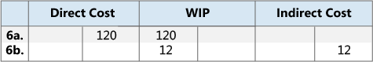

# Сведения о проектировании: выверка с главной книгой
При учете складских транзакций, таких как расходные накладные, выход произведенной продукции или отрицательные коррекции, изменения количества и стоимости товара регистрируются в операциях книги товаров и операциях стоимости соответственно. Следующим шагом процесса является учет стоимостей товаров на счетах товаров в главной книге.  

Существует два способа выверки журнала запасов и ГК.  

* Вручную, выполнив пакетное задание **Учет себест. запасов в ГК**.  
* Автоматически при каждом учете складской транзакции.  

## Пакетное задание "Учет себест. запасов в ГК".  
При запуске пакетного задания **Учет себест. запасов в ГК** операции главной книги создаются на основе операций стоимости. Можно составить сводку записей главной книги для каждой операции стоимости либо создать записи главной книги для каждой комбинации даты учета, кода склада, учетной группы товаров, общей учетной бизнес-группы и общей товарной учетной группы.  

Даты учета операций ГК настроены на дату учета соответствующей операции стоимости, за исключением случаев, когда операция стоимости приходится на закрытый период учета. В этом случае операция стоимости пропускается, и необходимо изменить настройки общей книги или настройки пользователя, чтобы включить учет в диапазоне дат.  

При выполнении пакетного задания **Учет себест. запасов в ГК** можно получить ошибки из-за отсутствующей настройки или несовместимой настройки измерений. Если обнаруживается ошибка в настройке измерения, пакетное задание игнорирует эти ошибки и использует измерения из операции стоимости. В случае всех других ошибок пакетное задание не учитывает операции стоимости и включает их в виде списка в конце отчета в разделе **Пропущенные операции**. Чтобы учесть эти операции, сначала необходимо исправить ошибки. Чтобы просмотреть список ошибок перед выполнением пакетного задания, можно сформировать отчет **Учет себест. запасов в ГК - тест**. В этом отчете указаны все ошибки, которые произошли при тестовом учете. Эти ошибки можно исправить и выполнить пакетное задание учета себестоимости запасов, не пропуская операции.  

## Автомат. учет себест.  
Чтобы настроить автоматический учет затрат в ГК при учете складской транзакции, установите флажок **Автомат. учет себест.** в окне **Настройка запасов**. Дата учета операции ГК та же, что и дата учета операции журнала товаров.  

## Типы счета  
Во время выверки стоимости запасов учитываются на счете товаров в балансовом отчете. Та же сумма, но с обратным знаком, учитывается на соответствующем балансирующем счету. Как правило, балансирующий счет — это счет отчета о прибылях и убытках. Однако при учете прямых затрат, связанных с потреблением или выходом, балансирующий счет является счетом балансового отчета. Тип операции журнала товаров и операция стоимости определяют, на каком счету ГК выполняется учет.  

Тип операции указывает, на каком счету ГК учитывается операция. Это определяется знаком количества в операции журнала товаров или оцененным количеством операции стоимости, поскольку эти количества всегда имеют один и тот же знак. Например, операция продажи с положительным количеством описывает расход склада, вызванный продажей, а операция продажи с отрицательным количеством описывает приход склада, вызванный возвратом продажи.  

### Пример  
В следующем примере показано производство велосипедной цепи из приобретенных звеньев. В этом примере показано, как разные типы счетов ГК используются в стандартном сценарии.  

Установлен флажок **Учет ожидаемой себест. в ГК** в окне **Настройка запасов**, и определена следующая настройка.  

В следующей таблице показано, как звено описано в карточке товара.  

|Настройка поля|Значение|  
|-----------------|-----------|  
|**Метод учета себестоимости**|Стандартная|  
|**Стандартная себестоимость**|1,00 руб.|  
|**Норма накладных расходов**|0,02 руб.|  

В следующей таблице показано, как эта цепь описана в карточке товара.  

|Настройка поля|Значение|  
|-----------------|-----------|  
|**Метод учета себестоимости**|Стандартная|  
|**Стандартная себестоимость**|150,00 руб.|  
|**Норма накладных расходов**|25,00 руб.|  

В следующей таблице показано, как производственный центр описан в карточке производственного центра.  

|Настройка поля|Значение|  
|-----------------|-----------|  
|**Прямая себестоимость единицы**|2,00 руб.|  
|**Процент косвенных затрат**|10|  

##### Сценарий  
1. Пользователь приобретает 150 звеньев и учитывает заказ на покупку как полученный. (Покупка)  
2. Пользователь учитывает заказ на покупку как с выставленным счетом. Создается сумма накладных расходов для распределения в количестве 3,00 руб. и сумма отклонения в количестве 18,00 руб. (Покупка)  

    1. Промежуточные счета списываются. (Покупка)  
    2. Учитываются прямые затраты. (Покупка)  
    3. Косвенные затраты вычисляются и разносятся. (Покупка)  
    4. Отклонение покупки вычисляется и учитывается (только для товаров со стандартной себестоимостью). (Покупка)  
3. Пользователь продает одну цепь и учитывает заказ на продажу как отгруженный. (Продажа)  
4. Пользователь учитывает заказ на продажу как с выставленным счетом. (Продажа)  

    1. Промежуточные счета списываются. (Продажа)  
    2. Стоимость проданных товаров (COGS) учтена. (Продажа)  

          
5. Пользователь учитывает потребление 150 звеньев, то есть число звеньев, используемое для создания одной цепи. (Расход, материал)  

      
6. Производственному центру потребовалось на производство цепи 60 минут. Пользователь учитывает себестоимость преобразования. (Потребление, производственная мощность)  

    1. Учитываются прямые затраты. (Потребление, производственная мощность)  
    2. Косвенные затраты вычисляются и разносятся. (Потребление, производственная мощность)  

          
7. Пользователь учитывает ожидаемую себестоимость одной цепи. (Выход)  
8. Пользователь завершает производственный заказ и выполняет пакетное задание **Коррекция себест. запасов**. (Выход)  

    1. Промежуточные счета списываются. (Выход)  
    2. Прямые затраты переносятся со счета незавершенного производства на товарный счет. (Выход)  
    3. Косвенные затраты (накладные) переносятся со счета косвенных затрат на складской счет. (Выход)  
    4. В результате сумма отклонения составляет 157,00 руб. Отклонения вычисляются только для товаров со стандартной себестоимостью. (Выход)  

          

        > [!NOTE]  
        >  Для простоты отображается только один счет отклонений. Фактически существует пять различных счетов:  
        >   
        >  * Отклонение по материалам  
        >  * Отклонение по произв. мощн.  
        >  * Накл. рас. по пр. мощ. - откл.  
        >  * Отклонение по субподряду  
        >  * Производство - накладные расходы - отклонение  

9. Пользователь переоценивает цепь со 150,00 до 140,00 рублей. (Коррекция/Переоценка/Округление/Перемещение)  

      

Дополнительные сведения об отношениях между типами счетов и другими типами операций стоимости см. в разделе [Сведения о проектировании: счета в главной книге](design-details-accounts-in-the-general-ledger.md).  

## См. также  
[Сведения о проектировании: себестоимость запасов](design-details-inventory-costing.md)   
[Сведения о проектировании: учет ожидаемой себестоимости](design-details-expected-cost-posting.md)   
[Сведения о проектировании: коррекция себестоимости](design-details-cost-adjustment.md)
[Управление себестоимостью товаров](finance-manage-inventory-costs.md)  
[Финансы](finance.md)  
[Работа с [!INCLUDE[d365fin](includes/d365fin_md.md)]](ui-work-product.md)

