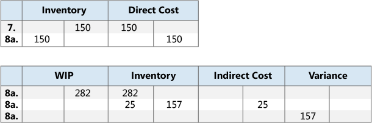
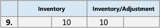

# Сведения о проектировании: выверка с главной книгойDesign Details: Reconciliation with the General Ledger
При учете складских транзакций, таких как расходные накладные, выход произведенной продукции или отрицательные коррекции, изменения количества и стоимости товара регистрируются в операциях книги товаров и операциях стоимости соответственно.When you post inventory transactions, such as sales shipments, production output, or negative adjustments, the quantity and value changes to the inventory are recorded in the item ledger entries and the value entries, respectively. Следующим шагом процесса является учет стоимостей товаров на счетах товаров в главной книге.The next step in the process is to post the inventory values to the inventory accounts in the general ledger.  

Существует два способа выверки журнала запасов и ГК.There are two ways to reconcile the inventory ledger with the general ledger:  

* Вручную, выполнив пакетное задание **Учет себест. запасов в ГК**.Manually, by running the **Post Inventory Cost to G/L** batch job.  
* Автоматически при каждом учете складской транзакции.Automatically, every time that you post an inventory transaction.  

## Пакетное задание "Учет себест. запасов в ГК".Post Inventory Cost to G/L Batch Job  
При запуске пакетного задания **Учет себест. запасов в ГК** операции главной книги создаются на основе операций стоимости.When you run the **Post Inventory Cost to G/L** batch job, the general ledger entries are created based on value entries. Можно составить сводку записей главной книги для каждой операции стоимости либо создать записи главной книги для каждой комбинации даты учета, кода склада, учетной группы товаров, общей учетной бизнес-группы и общей товарной учетной группы.You have the option to summarize general ledger entries for each value entry, or create general ledger entries for each combination of posting date, location code, inventory posting group, general business posting group, and general product posting group.  

Даты учета операций ГК настроены на дату учета соответствующей операции стоимости, за исключением случаев, когда операция стоимости приходится на закрытый период учета.The posting dates of the general ledger entries are set to the posting date of the corresponding value entry, except when the value entry falls in a closed accounting period. В этом случае операция стоимости пропускается, и необходимо изменить настройки общей книги или настройки пользователя, чтобы включить учет в диапазоне дат.In this case, the value entry is skipped, and you must change either the general ledger setup or the user setup to enable posting in the date range.  

При выполнении пакетного задания **Учет себест. запасов в ГК** можно получить ошибки из-за отсутствующей настройки или несовместимой настройки измерений.When you run the **Post Inventory Cost to G/L** batch job, you might receive errors because of missing setup or incompatible dimension setup. Если обнаруживается ошибка в настройке измерения, пакетное задание игнорирует эти ошибки и использует измерения из операции стоимости.If the batch job encounters errors in the dimension setup, it overrides these errors and uses the dimensions of the value entry. В случае всех других ошибок пакетное задание не учитывает операции стоимости и включает их в виде списка в конце отчета в разделе **Пропущенные операции**.For other errors, the batch job does not post the value entries and lists them at the end of the report in a section titled, **Skipped Entries**. Чтобы учесть эти операции, сначала необходимо исправить ошибки.To post these entries, you must first fix the errors. Чтобы просмотреть список ошибок перед выполнением пакетного задания, можно сформировать отчет **Учет себест. запасов в ГК - тест**.To see a list of errors before you run the batch job, you can run the **Post Invt. Cost to G/L - Test** report. В этом отчете указаны все ошибки, которые произошли при тестовом учете.This report lists all of the errors that are encountered during a test posting. Эти ошибки можно исправить и выполнить пакетное задание учета себестоимости запасов, не пропуская операции.You can fix the errors, and then run the inventory cost posting batch job without skipping any entries.  

## Автомат. учет себест.Automatic Cost Posting  
Чтобы настроить автоматический учет затрат в ГК при учете складской транзакции, установите флажок **Автомат. учет себест.** в окне **Настройка запасов**.To set up cost posting to the general ledger to run automatically when you post an inventory transaction, select the **Automatic Cost Posting** check box in the **Inventory Setup** window. Дата учета операции ГК та же, что и дата учета операции журнала товаров.The posting date of the general ledger entry is the same as the posting date of the item ledger entry.  

## Типы счетаAccount Types  
Во время выверки стоимости запасов учитываются на счете товаров в балансовом отчете.During reconciliation, inventory values are posted to the inventory account in the balance sheet. Та же сумма, но с обратным знаком, учитывается на соответствующем балансирующем счету.The same amount, but with the reverse sign, is posted to the relevant balancing account. Как правило, балансирующий счет — это счет отчета о прибылях и убытках.Usually the balancing account is an income statement account. Однако при учете прямых затрат, связанных с потреблением или выходом, балансирующий счет является счетом балансового отчета.However, when you post direct cost related to consumption or output, the balancing account is a balance sheet account. Тип операции журнала товаров и операция стоимости определяют, на каком счету ГК выполняется учет.The type of the item ledger entry and value entry determines which general ledger account to post to.  

Тип операции указывает, на каком счету ГК учитывается операция.The entry type indicates which general ledger account to post to. Это определяется знаком количества в операции журнала товаров или оцененным количеством операции стоимости, поскольку эти количества всегда имеют один и тот же знак.This is determined either by the sign of the quantity on the item ledger entry or the valued quantity on the value entry, since the quantities always have the same sign. Например, операция продажи с положительным количеством описывает расход склада, вызванный продажей, а операция продажи с отрицательным количеством описывает приход склада, вызванный возвратом продажи.For example, a sales entry with a positive quantity describes an inventory decrease caused by a sale, and a sales entry with a negative quantity describes an inventory increase caused by a sales return.  

### ПримерExample  
В следующем примере показано производство велосипедной цепи из приобретенных звеньев.The following example shows a bike chain that is manufactured from purchased links. В этом примере показано, как разные типы счетов ГК используются в стандартном сценарии.This example shows how the various general ledger account types are used in a typical scenario.  

Установлен флажок **Учет ожидаемой себест. в ГК** в окне **Настройка запасов**, и определена следующая настройка.The **Expected Cost Posting to G/L** check box in the **Inventory Setup** window is selected, and the following setup is defined.  

В следующей таблице показано, как звено описано в карточке товара.The following table shows how the link is set up on the item card.  

|Настройка поляSetup Field|ЗначениеValue|  
|-----------------|-----------|  
|**Метод учета себестоимости****Costing Method**|СтандартнаяStandard|  
|**Стандартная себестоимость****Standard Cost**|1,00 руб.LCY 1.00|  
|**Норма накладных расходов****Overhead Rate**|0,02 руб.LCY 0.02|  

В следующей таблице показано, как эта цепь описана в карточке товара.The following table shows how the chain is set up on the item card.  

|Настройка поляSetup Field|ЗначениеValue|  
|-----------------|-----------|  
|**Метод учета себестоимости****Costing Method**|СтандартнаяStandard|  
|**Стандартная себестоимость****Standard Cost**|150,00 руб.LCY 150.00|  
|**Норма накладных расходов****Overhead Rate**|25,00 руб.LCY 25.00|  

В следующей таблице показано, как производственный центр описан в карточке производственного центра.The following table shows how the work center is set up on the work center card.  

|Настройка поляSetup Field|ЗначениеValue|  
|-----------------|-----------|  
|**Прямая себестоимость единицы****Direct Unit Cost**|2,00 руб.LCY 2.00|  
|**Процент косвенных затрат****Indirect Cost Percentage**|1010|  

##### СценарийScenario  
1. Пользователь приобретает 150 звеньев и учитывает заказ на покупку как полученный.The user purchases 150 links and posts the purchase order as received. (Покупка)(Purchase)  
2. Пользователь учитывает заказ на покупку как с выставленным счетом.The user posts the purchase order as invoiced. Создается сумма накладных расходов для распределения в количестве 3,00 руб. и сумма отклонения в количестве 18,00 руб.This creates an overhead amount of LCY 3.00 to be allocated and a variance amount of LCY 18.00. (Покупка)(Purchase)  

    1. Промежуточные счета списываются.The interim accounts are cleared. (Покупка)(Purchase)  
    2. Учитываются прямые затраты.The direct cost is posted. (Покупка)(Purchase)  
    3. Косвенные затраты вычисляются и разносятся.The indirect cost is calculated and posted. (Покупка)(Purchase)  
    4. Отклонение покупки вычисляется и учитывается (только для товаров со стандартной себестоимостью).The purchase variance is calculated and posted (only for standard-cost items). (Покупка)(Purchase)  
3. Пользователь продает одну цепь и учитывает заказ на продажу как отгруженный.The user sells one chain and posts the sales order as shipped. (Продажа)(Sale)  
4. Пользователь учитывает заказ на продажу как с выставленным счетом.The user posts the sales order as invoiced. (Продажа)(Sale)  

    1. Промежуточные счета списываются.The interim accounts are cleared. (Продажа)(Sale)  
    2. Стоимость проданных товаров (COGS) учтена.Cost of goods sold (COGS) is posted. (Продажа)(Sale)  

          
5. Пользователь учитывает потребление 150 звеньев, то есть число звеньев, используемое для создания одной цепи.The user posts consumption of 150 links, which is the number of links used to produce one chain. (Расход, материал)(Consumption, Material)  

      
6. Производственному центру потребовалось на производство цепи 60 минут.The work center used 60 minutes to produce the chain. Пользователь учитывает себестоимость преобразования.The user posts the conversion cost. (Потребление, производственная мощность)(Consumption, Capacity)  

    1. Учитываются прямые затраты.The direct costs are posted. (Потребление, производственная мощность)(Consumption, Capacity)  
    2. Косвенные затраты вычисляются и разносятся.The indirect costs are calculated and posted. (Потребление, производственная мощность)(Consumption, Capacity)  

          
7. Пользователь учитывает ожидаемую себестоимость одной цепи.The user posts the expected cost of one chain. (Выход)(Output)  
8. Пользователь завершает производственный заказ и выполняет пакетное задание **Коррекция себест. запасов**.The user finishes the production order and runs the **Adjust Cost - Item Entries** batch job. (Выход)(Output)  

    1. Промежуточные счета списываются.The interim accounts are cleared. (Выход)(Output)  
    2. Прямые затраты переносятся со счета незавершенного производства на товарный счет.The direct cost is transferred from the WIP account to the inventory account. (Выход)(Output)  
    3. Косвенные затраты (накладные) переносятся со счета косвенных затрат на складской счет.The indirect cost (overhead) is transferred from the indirect cost account to the inventory account. (Выход)(Output)  
    4. В результате сумма отклонения составляет 157,00 руб.This results in a variance amount of LCY 157.00. Отклонения вычисляются только для товаров со стандартной себестоимостью.Variances are only calculated for standard-cost items. (Выход)(Output)  

          

        > [!NOTE]  
        >  Для простоты отображается только один счет отклонений.For the sake of simplicity, only one variance account is shown. Фактически существует пять различных счетов:In reality, five different accounts exist:  
        >   
        >  * Отклонение по материаламMaterial Variance  
        >  * Отклонение по произв. мощн.Capacity Variance  
        >  * Накл. рас. по пр. мощ. - откл.Capacity Overhead Variance  
        >  * Отклонение по субподрядуSubcontracting Variance  
        >  * Производство - накладные расходы - отклонениеManufacturing Overhead Variance  

9. Пользователь переоценивает цепь со 150,00 до 140,00 рублей.The user revalues the chain from LCY 150.00 to LCY 140.00. (Коррекция/Переоценка/Округление/Перемещение)(Adjustment/Revaluation/Rounding/Transfer)  

      

Дополнительные сведения об отношениях между типами счетов и другими типами операций стоимости см. в разделе [Сведения о проектировании: счета в главной книге](design-details-accounts-in-the-general-ledger.md).For more information about the relationship between the account types and the different types of value entries, see [Design Details: Accounts in the General Ledger](design-details-accounts-in-the-general-ledger.md).  

## См. такжеSee Also  
[Сведения о проектировании: себестоимость запасов](design-details-inventory-costing.md) [Design Details: Inventory Costing](design-details-inventory-costing.md)   
[Сведения о проектировании: учет ожидаемой себестоимости](design-details-expected-cost-posting.md) [Design Details: Expected Cost Posting](design-details-expected-cost-posting.md)   
[Сведения о проектировании: коррекция себестоимости](design-details-cost-adjustment.md)
[Управление себестоимостью товаров](finance-manage-inventory-costs.md)[Design Details: Cost Adjustment](design-details-cost-adjustment.md)
[Managing Inventory Costs](finance-manage-inventory-costs.md)  
[ФинансыFinance](finance.md)  
[Работа с [!INCLUDE[d365fin](includes/d365fin_md.md)]](ui-work-product.md)[Working with [!INCLUDE[d365fin](includes/d365fin_md.md)]](ui-work-product.md)

