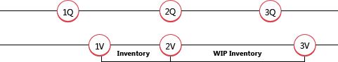

# Сведения о проектировании: переоценкаDesign Details: Revaluation
Можно переоценить запасы с учетом базы оценки, которая наиболее точно отражает стоимость запасов.You can revalue the inventory based on the valuation base that most accurately reflects the inventory value. Можно записать переоценку задним числом, чтобы себестоимость проданных товаров правильно обновлялась для уже проданных элементов.You can also backdate a revaluation, so that the cost of goods sold (COGS) is correctly updated for items that have already been sold. Товары с методом учета себестоимости "По стандартной", по которым счет выставлен не полностью, также можно переоценить.Items using the Standard costing method that have not been completely invoiced can also be revalued.  

В [!INCLUDE[d365fin](includes/d365fin_md.md)] поддерживается следующая гибкость при переоценке:In [!INCLUDE[d365fin](includes/d365fin_md.md)], the following flexibility is supported regarding revaluation:  

-   Переоцениваемое количество можно вычислить для любой даты, даже в прошлом.The revaluable quantity can be calculated for any date, also back in time.  
-   В случае товаров, для которых используется метод учета себестоимости "По стандартной", ожидаемые операции себестоимости включены в переоценку.For items using Standard costing method, expected cost entries are included in revaluation.  
-   Обнаруживаются расходы склада, на которые повлияла переоценка.Inventory decreases affected by revaluation are detected.  

## Расчет количества, доступного для переоценкиCalculating the Revaluable Quantity  
 Переоцениваемое количество — это остаток запасов, доступный переоценке на заданную дату.The revaluable quantity is the remaining quantity on inventory that is available for revaluation on a given date. Оно вычисляется как общая сумма количеств операций книги товаров, по которым полностью выставлен счет и дата учета которых совпадает или предшествует дате учета переоценки.It is calculated as the sum total of the quantities of completely invoiced item ledger entries that have a posting date equal to or earlier than the revaluation posting date.  

> [!NOTE]  
>  Товары с методом учета себестоимости "По стандартной" обрабатываются по-разному при расчете переоцениваемого количества по товару, складу и варианту.Items using the Standard costing method are treated differently when calculating the revaluable quantity per item, location, and variant. Количества и стоимость операций журнала товаров, счета за которые выставлены не полностью, включаются в переоцениваемое количество.The quantities and values of item ledger entries that are not completely invoiced are included in the revaluable quantity.  

После учета переоценки можно учитывать расход или приход склада с датами учета до даты учета переоценки.After a revaluation has been posted, you can post an inventory increase or decrease with a posting date that comes before the revaluation posting date. Однако переоценка не повлияет на это количество.However, this quantity will not be affected by the revaluation. Чтобы уравновесить запасы, учитывается только исходное переоцениваемое количество.To balance the inventory, only the original revaluable quantity is considered.  

Поскольку переоценку можно выполнить в любой день, необходимы соглашения, определяющие, когда товар считается частью запасов с финансовый точки зрения.Because revaluation can be made on any date, you must have conventions for when an item is considered part of inventory from a financial point of view. Например, если товар хранится в запасах и если товар является незавершенным производством (НЗП).For example, when the item is on inventory and when the item is work in process (WIP).  

### ПримерExample  
В следующем примере показано, когда перенесенные товары НЗП становятся частью запасов.The following example illustrates when a WIP item transitions to become part of inventory. Пример основан на создании цепочки из 150 звеньев.The example is based on the production of a chain with 150 links.  

  

**1К**. Пользователь учитывает приобретенные звенья как полученные.**1Q**: The user posts the purchased links as received. В следующей таблице показана результирующая операция журнала товаров.The following table shows the resulting item ledger entry.  

|Дата учетаPosting Date|ТоварItem|Тип операцииEntry Type|КоличествоQuantity|Номер операцииEntry No.|  
|------------------|----------|----------------|--------------|---------------|  
|01-01-2001-01-20|СВЯЗЬLINK|ПокупкаPurchase|150150|11|  

> [!NOTE]  
>  Теперь товар с методом учета себестоимости "По стандартной" доступен для переоценки.Now an item using the Standard costing method is available for revaluation.  

**1C**. Пользователь учитывает приобретенные звенья как звенья, по которым выставлен счет, и звенья становятся частью запасов с финансовой точки зрения.**1V**: The user posts the purchased links as invoiced and the links become part of inventory, from a financial point of view. В следующей таблице показаны результирующие операции стоимости.The following table shows the resulting value entries.  

|Дата учетаPosting Date|Тип операцииEntry Type|Дата оценкиValuation Date|Сумма себестоимости (факт.)Cost Amount (Actual)|Номер товарной операцииItem Ledger Entry No.|Номер операцииEntry No.|  
|------------------|----------------|--------------------|----------------------------|---------------------------|---------------|  
|01-15-2001-15-20|Прямая себестоимостьDirect Cost|01-01-2001-01-20|150,00150.00|11|11|  

 **2К + 2С**. Пользователь учитывает приобретенные звенья как использованные в производстве железной цепи.**2Q + 2V**: The user posts the purchased links as consumed for the production of the iron chain. С финансовый точки зрения, связи становятся частью запасов НЗП.From a financial point of view, the links become part of WIP inventory.  В следующей таблице показана результирующая операция журнала товаров.The following table shows the resulting item ledger entry.  

|Дата учетаPosting Date|ТоварItem|Тип операцииEntry Type|КоличествоQuantity|Номер операцииEntry No.|  
|------------------|----------|----------------|--------------|---------------|  
|02-01-2002-01-20|СВЯЗЬLINK|ПотреблениеConsumption|-150-150|11|  

В следующей таблице показана результирующая операция стоимости.The following table shows the resulting value entry.  

|Дата учетаPosting Date|Тип операцииEntry Type|Дата оценкиValuation Date|Сумма себестоимости (факт.)Cost Amount (Actual)|Номер товарной операцииItem Ledger Entry No.|Номер операцииEntry No.|  
|------------------|----------------|--------------------|----------------------------|---------------------------|---------------|  
|02-01-2002-01-20|Прямая себестоимостьDirect Cost|02-01-2002-01-20|-150,00-150.00|22|22|  

Дата оценки устанавливается на дату учета потребления (02-01-20) в качестве обычного складского расхода.The valuation date is set to the date of the consumption posting (02-01-20), as a regular inventory decrease.  

**3К**. Пользователь учитывает цепь как выход и завершает производственный заказ.**3Q**: The user posts the chain as output and finishes the production order. В следующей таблице показана результирующая операция журнала товаров.The following table shows the resulting item ledger entry.  

|Дата учетаPosting Date|ТоварItem|Тип операцииEntry Type|КоличествоQuantity|Номер операцииEntry No.|  
|------------------|----------|----------------|--------------|---------------|  
|02-15-2002-15-20|ЦЕПЬCHAIN|ВыходOutput|11|33|  

**3C**. Пользователь выполняет пакетное задание **Коррекция себест. запасов**, в ходе которого цепь учитывается как цепь, по которой выставлен счет, чтобы указать, что по всем потребленным материалам полностью выставлен счет.**3V**: The user runs the **Adjust Cost - Item Entries** batch job, which posts the chain as invoiced to indicate that all material consumption has been completely invoiced. С финансовый точки зрения связи больше не являются частью запасов НЗП, когда по выходу полностью выставлен счет и выход откорректирован.From a financial point of view, the links are no longer part of WIP inventory when the output is completely invoiced and adjusted. В следующей таблице показаны результирующие операции стоимости.The following table shows the resulting value entries.  

|Дата учетаPosting Date|Тип операцииEntry Type|Дата оценкиValuation Date|Сумма себестоимости (факт.)Cost Amount (Actual)|Номер товарной операцииItem Ledger Entry No.|Номер операцииEntry No.|  
|------------------|----------------|--------------------|----------------------------|---------------------------|---------------|  
|01-15-2001-15-20|Прямая себестоимостьDirect Cost|01-01-2001-01-20|150,00150.00|22|22|  
|02-01-2002-01-20|Прямая себестоимостьDirect Cost|02-01-2002-01-20|-150,00-150.00|22|22|  
|02-15-2002-15-20|Прямая себестоимостьDirect Cost|02-15-2002-15-20|150.00150.00|33|33|  

## Ожидаемая себестоимость в переоценкеExpected Cost in Revaluation  
Переоцениваемое количество XE "Переоцениваемое количество" XE "Количество;Переоцениваемое" вычисляется как сумма количеств XE "количество" по операциями XE "Журнал товаров" журнала товаров, за которые полностью выставлен счет XE "Счет", с датой учета равной или предшествующей дате XE "Переоценка" переоценки.The revaluable quantity XE "Revaluable Quantity"  XE "Quantity;Revaluable"  is calculated as the sum of quantity XE "quantity"  for completely invoiced XE "Invoice"  item ledger XE "Item Ledger"  entries with a posting date equal to or earlier than the revaluation XE "Revaluation"  date. Это означает, что если некоторые товары получены или отгружены, но счет за них не выставлен, их инвентарную стоимость XE "Инвентарная стоимость" вычислить невозможно.This means that when some items are received/shipped but not invoiced, their inventory value cannot be calculated XE "Inventory Value" . Товары с методом учета себестоимости "По стандартной" не ограничены в этом отношении.Items using the Standard costing method are not limited in this respect. XE "Значение"XE "Value"  

> [!NOTE]  
>  Еще одним типом ожидаемой себестоимости, которую можно переоценить, являются запасы НЗП при соблюдении некоторых правил.Another type of expected cost that can be revalued is WIP inventory, within certain rules. Дополнительные сведения см. в разделе "Переоценка товаров на складе НЗП" этой статьи.For more information, see the “WIP Inventory Revaluation” section in this topic.  

При вычислении переоцениваемого количества товаров с использованием стандартного метода учета затрат включаются в вычисление операций журнала товаров, счета за которые выставлены не полностью.When calculating the revaluable quantity for items using the Standard costing method, item ledger entries that have not been completely invoiced are included in the calculation. Эти операции затем переоцениваются при учете переоценки.These entries are then revalued when you post the revaluation. При выставлении счета для переоцененной операции создаются следующие операции стоимости.When you invoice the revalued entry, the following value entries are created:  

-   Обычная учтенная операция стоимости с типом **Прямые затраты**.The usual invoiced value entry with an entry type of **Direct Cost**. Сумма себестоимости этого товара — это прямые затраты из исходной строки.The cost amount on this entry is the direct cost from the source line.  
-   Операция стоимости с типом **Отклонение**.A value entry with an entry type of **Variance**. Эта операция записывает разницу между стоимостью, на которую выставлен счет, и переоцененной стандартной стоимостью.This entry records the difference between the invoiced cost and the revalued standard cost.  
-   Операция стоимости с типом **Переоценка**.A value entry with an entry type of **Revaluation**. Эта операция записывает сторнирование переоценки ожидаемой стоимости.This entry records the reversal of the revaluation of the expected cost.  

### ПримерExample  
В следующем примере демонстрируется создание трех типов операций при производстве цепи из предыдущего примера.The following example, which is based on the production of the chain in the previous example, illustrates how the three types of entries are created. Он основан на следующем сценарии:It is based on the following scenario:  

1.  Пользователь учитывает приобретенные звенья как полученные со стоимостью единицы 2,00 руб.The user posts the purchased links as received with a unit cost of LCY 2.00.  
2.  Затем пользователь учитывает переоценку цепей с новой стоимостью единицы 3,00 руб., обновляя стандартную стоимость до 3,00 рублей.The user then posts a revaluation of the links with a new unit cost of LCY 3.00, updating the standard cost to LCY 3.00.  
3.  Пользователь учитывает исходную покупку звеньев как с выставленным счетом, в результате чего получается следующее.The user posts the original purchase of the links as invoiced, which creates the following:  

    1.  Учтенная операция стоимости с типом **Прямые затраты**.An invoiced value entry with an entry type of **Direct Cost**.  
    2.  Операция стоимости с типом **Переоценка** для записи сторнирования переоценки ожидаемой себестоимости.A value entry with an entry type of **Revaluation** to record the reversal of the revaluation of the expected cost.  
    3.  Операция стоимости с типом "Отклонение", записывающая разницу между стоимостью по счету и переоцененной стандартной себестоимостью.A value entry with an entry type of Variance, recording the difference between the invoiced cost and the revalued standard cost.  
В следующей таблице показаны результирующие операции стоимости.The following table shows the resulting value entries.  

|ШагStep|Дата учетаPosting Date|Тип операцииEntry Type|Дата оценкиValuation Date|Сумма себестоимости (ожид.)Cost Amount (Expected)|Сумма себестоимости (факт.)Cost Amount (Actual)|Номер товарной операцииItem Ledger Entry No.|Номер операцииEntry No.|  
|----------|------------------|----------------|--------------------|------------------------------|----------------------------|---------------------------|---------------|  
|1.1.|01-15-2001-15-20|Прямая себестоимостьDirect Cost|01-15-2001-15-20|300,00300.00|0,000.00|11|11|  
|2.2.|01-20-2001-20-20|ПереоценкаRevaluation|01-20-2001-20-20|150,00150.00|0,000.00|11|22|  
|3.a.3.a.|01-15-2001-15-20|Прямая себестоимостьDirect Cost|01-15-2001-15-20|-300,00-300.00|0,000.00|11|33|  
|3.b.3.b.|01-15-2001-15-20|ПереоценкаRevaluation|01-20-2001-20-20|-150,00-150.00|0,000.00|11|44|  
|3.c.3.c.|01-15-2001-15-20|ОтклонениеVariance|01-15-2001-15-20|0,000.00|450,00450.00|11|55|  

## Определение влияния переоценки на расход складаDetermining if an Inventory Decrease Is Affected by Revaluation  
Дата учета или переоценки используется, чтобы определить, влияет ли переоценка на уменьшение запасов.The date of the posting or the revaluation is used to determine if an inventory decrease is affected by a revaluation.  

В следующей таблице показаны критерии, используемые для товара, который не использует метод средней себестоимости.The following table shows the criteria that is used for an item that does not use the Average costing method.  

|СценарийScenario|Номер операцииEntry No.|ВремяTiming|Затронуто переоценкойAffected by revaluation|  
|--------------|---------------|------------|-----------------------------|  
|АA|До номера операции переоценкиEarlier than revaluation entry number|До даты учета переоценкиEarlier than revaluation posting date|НетNo|  
|БB|До номера операции переоценкиEarlier than revaluation entry no.|На дату учета переоценкиEqual to revaluation posting date|НетNo|  
|CC|До номера операции переоценкиEarlier than revaluation entry no.|После даты учета переоценкиLater than revaluation posting date|ДаYes|  
|DD|После номера операции переоценкиLater than revaluation entry no.|До даты учета переоценкиEarlier than revaluation posting date|ДаYes|  
|ВE|После номера операции переоценкиLater than revaluation entry no.|На дату учета переоценкиEqual to revaluation posting date|ДаYes|  
|ЖF|После номера операции переоценкиLater than revaluation entry no.|После даты учета переоценкиLater than revaluation posting date|ДаYes|  

### ПримерExample  
В следующем примере демонстрируется переоценки товара с использованием метода учета затрат FIFO. В примере иллюстрируется следующий сценарий.The following example, which illustrates revaluation of an item that uses the FIFO costing method, is based on the following scenario:  

1.  01-01-20 пользователь учитывает покупку 6 единиц.On 01-01-20, the user posts a purchase of 6 units.  
2.  02-01-20 пользователь учитывает продажу 1 единицы.On 02-01-20, the user posts a sale of 1 unit.  
3.  03-01-20 пользователь учитывает продажу 1 единицы.On 03-01-20, the user posts a sale of 1 unit.  
4.  04-01-20 пользователь учитывает продажу 1 единицы.On 04-01-20, the user posts a sale of 1 unit.  
5.  03-01-20 пользователь рассчитывает стоимость запасов для товара и учитывает переоценку себестоимости единицы товара с 10,00 до 8,00 руб.On 03-01-20, the user calculates the inventory value for the item, and posts a revaluation of the item’s unit cost from LCY 10.00 to LCY 8.00.  
6.  02-01-20 пользователь учитывает продажу 1 единицы.On 02-01-20, the user posts a sale of 1 unit.  
7.  03-01-20 пользователь учитывает продажу 1 единицы.On 03-01-20, the user posts a sale of 1 unit.  
8.  04-01-20 пользователь учитывает продажу 1 единицы.On 04-01-20, the user posts a sale of 1 unit.  
9. Пользователь запускает пакетное задание **Коррекция себест. запасов**.The user runs the **Adjust Cost - Item Entries** batch job.  

В следующей таблице показаны результирующие операции стоимости.The following table shows the resulting value entries.  

|СценарийScenario|Дата учетаPosting Date|Тип операцииEntry Type|Дата оценкиValuation Date|Оцен. кол-воValued Quantity|Сумма себестоимости (факт.)Cost Amount (Actual)|Номер товарной операцииItem Ledger Entry No.|Номер операцииEntry No.|  
|--------------|------------------|----------------|--------------------|---------------------|----------------------------|---------------------------|---------------|  
||01-01-2001-01-20|ПокупкаPurchase|01-01-2001-01-20|66|60,0060.00|11|11|  
||03-01-2003-01-20|ПереоценкаRevaluation|03-01-2003-01-20|44|-8,00-8.00|11|55|  
|АA|02-01-2002-01-20|ПродажаSale|02-01-2002-01-20|-1-1|-10,00-10.00|22|22|  
|БB|03-01-2003-01-20|ПродажаSale|03-01-2003-01-20|-1-1|-10,00-10.00|33|33|  
|CC|04-01-2004-01-20|ПродажаSale|04-01-2004-01-20|-1-1|-10,00-10.00|44|44|  
||04-01-2004-01-20|ПродажаSale|04-01-2004-01-20|-1-1|2,002.00|44|99|  
|DD|02-01-2002-01-20|ПродажаSale|03-01-2003-01-20|-1-1|-10,00-10.00|55|66|  
||02-01-2002-01-20|ПродажаSale|03-01-2003-01-20|-1-1|2,002.00|55|1010|  
|ВE|03-01-2003-01-20|ПродажаSale|03-01-2003-01-20|-1-1|-10,00-10.00|66|77|  
||03-01-2003-01-20|ПродажаSale|03-01-2003-01-20|-1-1|2,002.00|66|1111|  
|ЖF|04-01-2004-01-20|ПродажаSale|04-01-2004-01-20|-1-1|-10,00-10.00|77|88|  
||04-01-2004-01-20|ПродажаSale|04-01-2004-01-20|-1-1|2,002.00|77|1212|  

## Переоценка запасов НЗПWIP Inventory Revaluation  
Переоценка запасов НЗП подразумевает переоценку компонентов, которые зарегистрированы как часть запасов НЗП на момент переоценки.Revaluation of WIP inventory implies revaluing components that are registered as part of WIP inventory at the time of the revaluation.  

Помня это, важно установить правила, когда товар считается частью НЗП на складе с финансовой точки зрения.With this in mind, it is important to establish conventions as to when an item is considered part of the WIP inventory from a financial point of view. В [!INCLUDE[d365fin](includes/d365fin_md.md)] существуют следующие соглашения:In [!INCLUDE[d365fin](includes/d365fin_md.md)], the following conventions exist:  

-   Приобретенный компонент становится частью запасов сырья с момента учета покупки как покупки, по которой выставлен счет.A purchased component becomes part of the raw material inventory from the time of posting a purchase as invoiced.  
-   Приобретенный компонент/подкомпонент становится частью запасов НЗП с момента учета его потребления в соответствии с производственным заказом.A purchased/subassembled component becomes part of the WIP inventory from the time of posting its consumption in connection with a production order.  
-   Приобретенный компонент/подкомпонент остается частью запасов НЗП до момента выставления счета по производственному заказу (произведенному товару).A purchased/subassembled component remains part of the WIP inventory until the time when a production order (manufactured item) is invoiced.  

Способ задания даты оценки для операции стоимости потребления следует тем же правилам, что и для запасов НЗП.The way the valuation date for the value entry of consumption is set, follows the same rules as for non-WIP inventory. Дополнительные сведения см. в разделе "Определение влияния переоценки на расход склада" этой статьи.For more information, see the “Determining if an Inventory Decrease Is Affected by Revaluation” section in this topic.  

Запасы НЗП можно переоценить при условии, что дата переоценки — не позже, чем дата учета соответствующих операций журнала товаров типа "Потребление", а счет за соответствующий производственный заказ еще не выставлен.WIP inventory can be revalued as long as the revaluation date is not later than the posting date of the corresponding item ledger entries of type Consumption and as long as the corresponding production order has not been invoiced yet.  

> [!CAUTION]  
>  Отчет **Оценка стоимости запасов — НЗП** позволяет сравнить стоимость операций производственного заказа, что может несколько осложнять работу с товарами НЗП, которые были переоценены.The **Inventory Valuation - WIP** report shows the value of posted production order entries and may therefore be a little confusing for WIP items that have been revalued.  

## См. такжеSee Also  
 [Сведения о проектировании: себестоимость запасов](design-details-inventory-costing.md) [Design Details: Inventory Costing](design-details-inventory-costing.md)   
 [Сведения о проектировании: методы учета себестоимости](design-details-costing-methods.md) [Design Details: Costing Methods](design-details-costing-methods.md)   
 [Сведения о проектировании: оценка стоимости запасов](design-details-inventory-valuation.md) [Управление себестоимостью товаров](finance-manage-inventory-costs.md)[Design Details: Inventory Valuation](design-details-inventory-valuation.md) [Managing Inventory Costs](finance-manage-inventory-costs.md)  
 [ФинансыFinance](finance.md)  
 [Работа с [!INCLUDE[d365fin](includes/d365fin_md.md)]](ui-work-product.md)[Working with [!INCLUDE[d365fin](includes/d365fin_md.md)]](ui-work-product.md)

