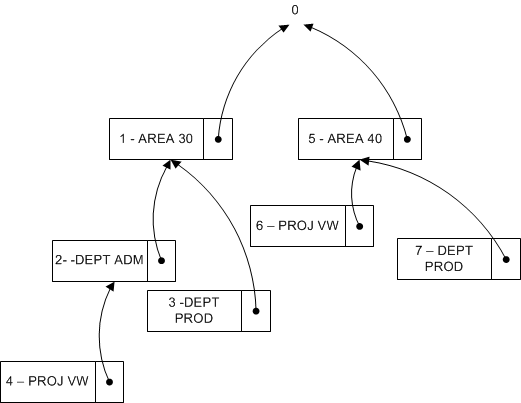

# <a name="design-details-searching-for-dimension-combinations"></a>Сведения о проектировании: поиск комбинаций измерений
Если окно закрывается после редактирования набора измерений [!INCLUDE[d365fin](includes/d365fin_md.md)] определяет, существует ли отредактированный набор измерений. Если набор не существует, создается новый набор и возвращается код комбинации измерений.  

## <a name="building-search-tree"></a>Создание дерева поиска  
 Таблица 481 **Узел дерева набора измерений** используется, когда [!INCLUDE[d365fin](includes/d365fin_md.md)] выполняет оценку того, существует ли набор измерений в таблице 480 **Операция набора измерений**. Оценка выполняется путем рекурсивного обхода дерева поиска начиная с верхнего уровня (0). Верхний уровень 0 представляет набор измерений без операций набора измерений. Дочерние элементы этого набора измерений представляют наборы измерений только с одной операцией набора измерений. Дочерние элементы этих наборов измерений представляют наборы измерений с двумя дочерними элементами и т. д.  

### <a name="example-1"></a>Пример 1  
 На следующей схеме представлено дерево поиска с шестью наборами измерений. На схеме отображается только идентификационная операция набора измерений.  

   

 В следующей таблице описан полный список операций набора измерений, формирующих каждый набор измерений.  

|Наборы измерений|Записи набора измерений|  
|--------------------|---------------------------|  
|Комплект 0|Нет|  
|Комплект 1|AREA 30|  
|Комплект 2|AREA 30, DEPT ADM|  
|Комплект 3|AREA 30, DEPT PROD|  
|Комплект 4|AREA 30, DEPT ADM, PROJ VW|  
|Комплект 5|AREA 40|  
|Комплект 6|AREA 40, PROJ VW|  

### <a name="example-2"></a>Пример 2  
 Этот пример показывает, как [!INCLUDE[d365fin](includes/d365fin_md.md)] оценивает, существует ли набор измерений, состоящий из операций набора измерений AREA 40, DEPT PROD.  

 Сначала [!INCLUDE[d365fin](includes/d365fin_md.md)] также обновляет таблицу **Узел дерева набора измерений**, чтобы гарантировать, что дерево поиска будет выглядеть так, как на следующей схеме. Таким образом, набор измерений 7 становится дочерним набором набора измерений 5.  

   

### <a name="finding-dimension-set-id"></a>Поиск кода набора измерений  
 На концептуальном уровне **Родительский код**, **Измерение** и **Значение измерения** в дереве поиска объединяются и используются как первичный ключ, поскольку [!INCLUDE[d365fin](includes/d365fin_md.md)] перемещается по дереву в том же порядке, что и операции измерений. Функция GET (запись) используется для поиска ИД набора измерений. В следующем примере кода показано, как найти ИД набора измерений с тремя значениями измерений.  

```  
DimSet."Parent ID" := 0;  // 'root'  
IF UserDim.FINDSET THEN  
  REPEAT  
      DimSet.GET(DimSet."Parent ID",UserDim.DimCode,UserDim.DimValueCode);  
  UNTIL UserDim.NEXT = 0;  
EXIT(DimSet.ID);  

```  

 Однако чтобы сохранить возможность [!INCLUDE[d365fin](includes/d365fin_md.md)] переименовывать измерение и значение измерения, в таблицу 348 **Значение измерения** добавлено целочисленное поле **ИД значения измерения**. Эта таблица преобразует пару полей **Измерение** и **Значение измерения** в целочисленное значение. Переименовав измерение и значение измерения, целое значение не меняется.  

```  
DimSet."Parent ID" := 0;  // 'root'  
IF UserDim.FINDSET THEN  
  REPEAT  
      DimSet.GET(DimSet.ParentID,UserDim."Dimension Value ID");  
  UNTIL UserDim.NEXT = 0;  
EXIT(DimSet.ID);  

```  

## <a name="see-also"></a>См. также  
 [Функция GET (запись)](https://msdn.microsoft.com/en-us/library/dd301056.aspx)    
 [Сведения о проектировании: операции набора измерений](design-details-dimension-set-entries.md)   
 [Обзор записей набора измерений](design-details-dimension-set-entries-overview.md)   
 [Сведения о проектировании: структура таблицы](design-details-table-structure.md)   
 [Сведения о проектировании: Codeunit 408 Dimension Management](design-details-codeunit-408-dimension-management.md)   
 [Сведения о проектировании: примеры кода измененных шаблонов в модификациях](design-details-code-examples-of-changed-patterns-in-modifications.md)

