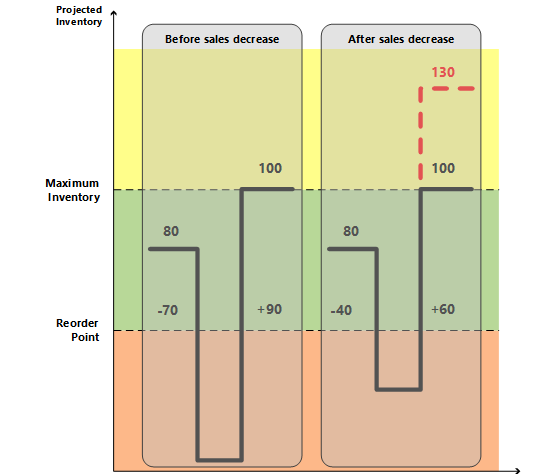

# Сведения о проектировании: нахождение ниже уровня допустимого избытка
При использовании политик максимального количества и фиксированного количества повторного заказа система планирования концентрируется на прогнозируемых складских запасов исключительно в данном горизонте планирования. Это означает, что система планирования может предложить поставку с излишками, если происходят изменения отрицательного спроса или положительного предложения за пределами заданного горизонта планирования. Если, по этой причине предлагается излишняя поставка, система планирования вычисляет количество, на которое следует уменьшить поставку, чтобы избежать излишней поставки. Это количество называется "допустимый избыток". Он передается как строка планирования с действием **Изменить кол-во (уменьшить)** или **Отмена** и следующим предупреждением.  

*Внимание! Прогнозируемые запасы [xx] больше, чем допустимый избыток [xx] на срок выполнения [xx].*  

  

##  Расчет допустимого избытка  
Допустимый избыток вычисляется разными способами в зависимости от настройки планирования.  

### Политика дозаказа "Максимальное кол-во"  
Допустимый избыток = Максимальный запас  

> [!NOTE]  
>  Если существует минимальное количество заказа, оно будет добавлено следующим образом: допустимый избыток = максимальный запас + минимальное количество заказа.  

### Политика дозаказа "Фикс. кол-во дозаказа"  
Допустимый избыток = кол-во для дозаказа + точка дозаказа  

> [!NOTE]  
>  Если минимальное количество заказа выше точки дозаказа, оно заменяется следующим образом: допустимый избыток = количество дозаказа + минимальное количество заказа  

### Заказать несколько  
Если существует множитель заказа, он корректирует допустимый избыток для политик дозаказа "Максимальное кол-во" и "Фикс. кол-во дозаказа".  

##  Создание строки планирования с предупреждением о переполнении  
Если из-за существующей поставки прогнозируемые запасы выше допустимого избытка по окончании горизонта планирования, создается строка планирования. Чтобы предупредить о возможных излишках поставки, строка планирования содержит предупреждение, поле **Принять указание** не выбрано, а указание имеет значение "Отмена" или "Изменить кол-во".  

### Расчет количества строки планирования  
Количество строки планирования = текущее количество поставки - (ожидаемые запасы - допустимый избыток)  

> [!NOTE]  
>  Как и во всех строках предупреждений любое максимальное/минимальное количество заказа или множитель заказа будут игнорироваться.  

### Определение типа сообщения о действии  

-   Если количество в строке планирования выше или равно 0, отображается сообщение о действии "Изменить кол-во".  
-   Если количество в строке планирования ниже или равно 0, отображается сообщение о действии "Отмена".  

### Создание предупреждающего сообщения  
В случае избытка в окне **Нетрассируемые элементы планирования** отображается предупреждающее сообщение со следующими сведениями:  

-   Прогнозируемый уровень запасов, инициировавший предупреждение  
-   Вычисленный допустимый избыток  
-   Дата оплаты события предложения.  

Пример. Прогнозируемые запасы 120 больше, чем допустимый избыток 60 в 28-01-11  

## Сценарий  
В этом сценарии клиент меняет количество заказа на продажу с 70 на 40 штук в период между двумя процессами планирования. Функция переполнения устанавливается для уменьшения покупки, которая была предложена для первоначального количества продаж.  

### Настройка товара  

|Политика повтора заказа|Максимальное кол-во|  
|-----------------------|------------------|  
|Максимальное количество заказа|100|  
|Точка повтора заказа|50|  
|Запасы|80|  

### Ситуация до снижения продаж  

|Событие|Изменить кол-во|Ожидаемые запасы|  
|-----------|-----------------|-------------------------|  
|День первый|Нет|80|  
|Продажа|-70|10|  
|Конец горизонта планирования|Нет|10|  
|Предложение нового возврата покупки|+90|100|  

### Ситуация после снижения продаж  

|Изменение|Изменить кол-во|Ожидаемые запасы|  
|------------|-----------------|-------------------------|  
|День первый|Нет|80|  
|Продажа|-40|40|  
|Покупка|+90|130|  
|Конец горизонта планирования|Нет|130|  
|Предложение по уменьшению количества покупки   заказ с 90 до 60|-30|100|  

### Результирующие строки планирования  
 Создается одна строка планирования (предупреждение) для уменьшения количества покупки 30 с 90 до 60 для соответствия прогнозируемых запасов 100 допустимому избытку.  

  

> [!NOTE]  
>  Без функции допустимого избытка никаких предупреждений не создается, если прогнозируемый уровень склада выше максимальных запасов. Это может вызвать поставку с излишками в количестве 30.  

## См. также  
[Сведения о проектировании: политики дозаказа](design-details-reordering-policies.md)   
[Сведения о проектировании: параметры планирования](design-details-planning-parameters.md)   
[Сведения о проектировании: обработка политик дозаказа](design-details-handling-reordering-policies.md)   
[Сведения о проектировании: планирование поставок](design-details-supply-planning.md)

