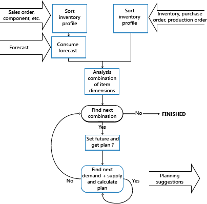

# Сведения о проектировании: краткие сведения о балансировке
Спрос предоставляется клиентами организации. Поставка — это то, что организация может создать или удалить для обеспечения баланса. Система планирования начинает с независимого спроса, а затем в обратном направлении выполняет отслеживание до предложения.  
  
 Профили инвентаризации используются для хранения информации о спросе и предложении, количествах и времени. Эти профили составляют две стороны шкалы уравновешивания.  
  
 Задача механизма планирования — уравновешивать спрос и предложение товара, чтобы убедиться, что предложение соответствует спросу и это достигается целесообразным способом, как определено параметрами и правилами планирования.  
  
   
  
## См. также  
 [Сведения о проектировании: балансировка спроса и поставки](design-details-balancing-demand-and-supply.md)   
 [Сведения о проектировании: основные понятия системы планирования](design-details-central-concepts-of-the-planning-system.md)   
 [Сведения о проектировании: планирование поставок](design-details-supply-planning.md)
