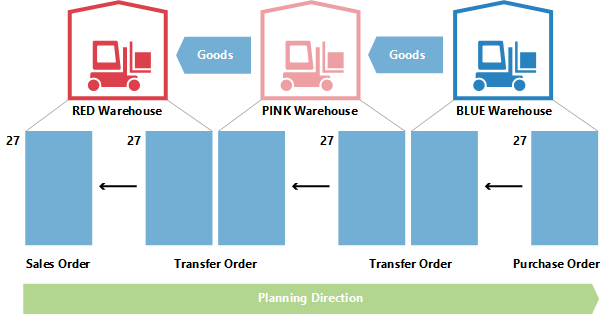

# Сведения о проектировании: перемещения при планировании
Заказы на перемещение также являются источником поставок при работе на уровне единиц складского хранения. При использовании нескольких местоположений (например, складов) систему пополнения единиц хранения можно настроить на перемещение, подразумевая, что расположение пополняется путем переноса товаров из другого местоположения. Если в организации используется несколько складов, она может иметь цепочку перемещений, в которой поставка на склад ЗЕЛЕНЫЙ перемещается со склада ЖЕЛТЫЙ, поставка на склад ЖЕЛТЫЙ перемещается со склада КРАСНЫЙ и так далее. В начале цепочки находится система пополнения "Произ. зак." или "Покупка".  
  
  
  
При сравнении ситуации, когда заказ на поставку напрямую ориентирован на заказ по требованию, и ситуации, когда заказ на продажу выполняется поставками в виде цепочки перемещений складских единиц, очевидно, что планирование в последнем случае может быть очень сложным. Изменение спроса может привести к волновому эффекту в цепочке, поскольку потребуется изменить все заказы на перемещение и производственный заказ/заказ на покупку на другом конце цепочки для восстановления баланса между спросом и поставкой.  
  
  
  
## Почему перенос является особым случаем?  
Заказ на перемещение очень похож на любой другой заказ в программе. Однако на практике все сильно отличается.  
  
Одним основным отличием перемещения в планировании от заказов на покупку и производственных заказов является то, что строка перемещения представляет спрос и поставку одновременно. Исходящая часть, которая отгружается со старого склада, является спросом. Входящая часть, которая должна быть получена на новом складе, является на этом складе поставкой.  
  
  
  
Это означает, что если система совершает какие-либо операции на стороне поставки перемещения, необходимо внести те же изменения и на стороне спроса.  
  
## Перемещения зависят от спроса  
Сопутствующий спрос и предложение в некотором роде напоминают компоненты строки производственного заказа, однако разница в том, что компоненты находятся на следующем уровне планирования и относятся к другому товару, в то время как две части перемещения находятся на одном уровне для одного и того же товара.  
  
Важное сходство заключается в том, что спрос перемещения является зависимым спросом так же, как компоненты. Спрос из строки перемещения определяется на стороне поставки перемещения в том смысле, что если предложение меняется, это напрямую влияет на спрос.  
  
Если только гибкость планирования не имеет значения "Нет", строка перемещения никогда не должна расцениваться в планировании как независимый спрос.  
  
В процедуре планирования спрос перемещения следует учитывать только после того, как система планирования выполнит обработку на стороне поставки. Перед этим фактический спрос не известен. Следовательно, последовательность изменений очень важна, когда речь идет о заказах на перемещение.  
  
## Порядок планирования  
На следующей иллюстрации показано, как могла бы выглядеть строка перемещений.  
  
  
  
В данном примере клиент заказывает товар на складе ЗЕЛЕНЫЙ. Поставка на склад ЗЕЛЕНЫЙ выполняется путем перемещения из центрального склада КРАСНЫЙ. КРАСНЫЙ цвет центрального склада получается путем переноса из производства на складе СИНИЙ.  
  
В этом примере система планирования начнет обработку со спроса клиента и продолжит ее в обратном направлении по цепочке. Спрос и предложение обрабатываются в одном местоположении за раз.  
  
  
  
## Код уровня перемещения  
Последовательность обработки складов в системе планирования определяется кодом уровня перемещения единицы хранения.  
  
Код уровня перемещения — это внутреннее поле, вычисляемое автоматически и сохраняемое в единицах складского хранения при создании и изменении последних. Расчет выполняется для всех единиц хранения для заданной комбинации "товар/вариант", а код склада и код код источника определяют маршрут, который должен использоваться системой планирования при переходе по единицам хранения, чтобы обеспечить обработку всего спроса.  
  
Код уровня перемещения равен 0 для единиц складского хранения с системой пополнения "Покупка" или "Производственный заказ" и -1 для первого уровня перемещения, -2 — для второго и т. д. Таким образом, в цепочке перемещения, описанной выше, значениями уровня будут -1 для склада КРАСНЫЙ и -2 для склада ЗЕЛЕНЫЙ, как показано на следующем рисунке.  
  
  
  
При обновлении единицы хранения система планирования обнаруживает, настроены ли единицы хранения с перемещением в системе пополнения с циклическими ссылками.  
  
## Планирование перемещений без единиц хранения  
  
Даже если функция единицы хранения не применяется, можно использовать склады и вручную перемещать товары между складами. Для организаций с менее сложными настройками склада система планирования поддерживает сценарии, в которых запасы перемещаются на другой склад вручную, например для выполнения заказа на продажу на данном складе. В то же время система планирования должна реагировать на изменения в спросе.  
  
Чтобы обеспечить поддержку перемещений вручную планирование анализирует существующие заказы на перемещение, а затем планирует заказ, в котором должны быть обработаны склады. Для внутренних целей система планирования будет работать со временными единицами хранения, включающими коды уровней перемещения.  
  
  
  
Если существует несколько перемещений на данный склад, первый заказ на перемещение будет определять направление планирования. Перемещения, выполняемые в противоположном направлении, отменяются.  
  
## Изменение количества с резервированиями  
При изменении количеств существующего предложения система планирования учитывает резервирование в том смысле, что зарезервированное количество представляет низший лимит для уменьшения предложения.  
  
При изменении количества в строке существующего заказа на перемещение помните, что низший лимит будет определяться как наибольшее зарезервированное количество в строке исходящего и входящего переноса.  
  
Например, если строка заказа на перемещение с количеством 117 штук была зарезервирована в соответствии со строкой продажи с количеством 46 штук и строкой покупки с количеством 24 штуки, то невозможно уменьшить количество в строке перемещения до значения менее 46 штук, даже если это может привести к излишку на исходящей стороне.  
  
  
  
## Изменение количества в цепочке перемещения  
В следующем примере отправной точкой является сбалансированная ситуация, когда в цепочке перемещения в заказе на продажу поставляется 27 штук на склад КРАСНЫЙ с соответствующим заказом на покупку на складе СИНИЙ через склад РОЗОВЫЙ. Следовательно, помимо продажи и покупки существуют два заказа на перемещение: с СИНЕГО в РОЗОВЫЙ и с РОЗОВОГО в КРАСНЫЙ.  
  
  
  
Теперь планировщик на складе РОЗОВЫЙ выбирает резервирование по покупке.  
  
  
  
Как правило, это означает, что система планирования проигнорирует заказ покупки и требование о перемещении. Пока доступен баланс, проблем нет. Но что произойдет, если клиент на складе КРАСНЫЙ пожелает частично отменить заказ и изменить его на 22?  
  
  
  
При повторном запуске системы планирования необходимо избавиться от излишков. Однако в результате резервирования будут заблокированы покупка и перемещение количества 27.  
  
  
  
Перемещение между РОЗОВЫМ и КРАСНЫМ складом сокращено до 22. Входящая часть перемещения между СИНИМ и РОЗОВЫМ не зарезервирована, но поскольку исходящая часть зарезервирована, невозможно уменьшить это количество ниже 27.  
  
## Рассчитанное время подготовки заказа  
При вычислении даты оплаты заказа на перемещение учитываются разные типы времени подготовки.  
  
Активное время подготовки при планировании заказа на перемещение.  
  
* Исходящие - время обработки склада  
* Время отгрузки  
* Входящие - время обработки склада  
* В строке планирования следующие поля используются для предоставления сведений о расчете.  
* Дата расх. накладной на перемещение  
* Дата начала  
* Дата окончания  
* Дата выполнения  
  
Дата расходной накладной в строке документа о перемещении отображается в поле "Дата расходной накладной на перемещение", а дата приемки в строке документа о перемещении отображается в поле "Срок оплаты".  
  
Начальные и конечные даты будут использованы для описания фактического периода транспортировки.  
  
На следующей иллюстрации показана интерпретация начальных и конечных дат и времени в строках планирования, связанных с заказами на перемещение.  
  
  
  
В данном примере это означает следующее:  
  
* Дата отгрузки + исходящая обработка = дата начала  
* Дата начала + время отгрузки = дата окончания  
* Дата окончания + входящая обработка = дата приемки  
  
## Страховой запас времени  
Поле "Страховой запас времени подготовки по умолчанию" в окне "Настройка производства" и сопутствующее поле "Страховой запас времени подготовки" на карточке товара не учитываются при расчете заказа на перемещение. Однако страховой запас времени подготовки все же будет влиять как на общий план, так и на заказ на пополнение (заказы на покупку или производственные заказы) в начале цепочки перемещения, если товары размещены на складе, с которого они будут перемещаться.  
  
  
  
В строке производственного заказа "Дата окончания + Страховой запас времени + Входящие - время обработки склада = Срок выполнения.  
  
В строке производственного заказа "Плановая дата приемки + Страховой запас времени + Входящие - время обработки склада = Ожидаемая дата приемки".  
  
## Перепланирование  
При перепланировании существующей строки перемещения система планирования должна отслеживать исходящую часть и менять дату и время соответственно. Важно отметить, что если определить время подготовки, будет перерыв между отгрузкой и приемкой. Как было сказано ранее, время подготовки может состоять из нескольких элементов, таких как время транспортировки и время обработки склада. На временной шкале система планирования переместится в обратном направлении, выполняя балансировку элементов.  
  
  
  
Следовательно, при изменении срока оплаты в строке перемещения необходимо вычислить время подготовки, чтобы обновить исходящую сторону переноса.  
  
## Серийные номера/номера партий в цепочках перемещения  
Если спрос содержит серийные номера/номера партий и запущен модуль планирования, будут вызваны некоторые непосредственно созданные заказы на перемещение. Дополнительные сведения об этом понятии см. в разделе "Атрибуты товаров". Однако если серийные номера/номера партий удаляются из спроса, созданные заказы на перемещение в цепочке по-прежнему будут включать серийные номера или номера партий и, следовательно, будут игнорироваться при планировании (но не будут удалены).  
  
## Связи "заказ-в-заказ"  
В данном примере при настройке единицы хранения склада СИНИЙ включается политика дозаказа, в то время как для складов РОЗОВЫЙ и КРАСНЫЙ используется политика "Партия на партию". Если заказ на продажу из 27 создан на КРАСНОМ складе, инициируется цепочка переносов, последним звеном которой является резервирование с привязкой СИНЕГО склада. В этом примере резервирования являются не окончательными резервированиями, созданными планировщиком на складе РОЗОВЫЙ, а привязками, созданными системой планирования. Важная разница в том, что система планирования может изменить последнее.  
  
  
  
Если изменить спрос с 27 на 22, система уменьшит количество вниз по цепочке, при этом будет уменьшено связанное резервирование.  
  
## См. также  
[Сведения о проектировании: параметры планирования](design-details-planning-parameters.md)   
[Сведения о проектировании: таблица "Назначение произ. плана"](design-details-planning-assignment-table.md)   
[Сведения о проектировании: обработка политик дозаказа](design-details-handling-reordering-policies.md)   
[Сведения о проектировании: спрос на пустом складе](design-details-demand-at-blank-location.md)   
[Сведения о проектировании: основные понятия системы планирования](design-details-central-concepts-of-the-planning-system.md)   
[Сведения о проектировании: балансировка спроса и поставки](design-details-balancing-demand-and-supply.md)   
[Сведения о проектировании: планирование поставок](design-details-supply-planning.md)
