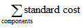

# Сведения о проектировании: отклонение
Отклонение определяется как разница между фактическими и стандартными затратами, как описано в следующей формуле.  

 фактическая себестоимость - стандартная себестоимость = отклонение  

 Если фактическая себестоимость меняется, например, в результате учета товарных издержек в более позднюю дату, отклонение обновляется соответствующим образом.  

> [!NOTE]  
>  Переоценка не влияет на расчет отклонения, поскольку переоценка меняет только стоимость запасов.  

## Пример  
 В следующем примере показано вычисление вариации для приобретенных товаров. Он основан на следующем сценарии:  

1.  Пользователь приобретает товар по цене 90,00 руб., однако стандартная цена — 100,00 руб. Соответственно, вариация покупки составляет 10,00 руб.  
2.  10,00 руб. кредитуется на счет отклонения для покупки.  
3.  Пользователь учитывает товарные издержки — 20,00 рублей. Соответственно, фактические затраты увеличиваются до 110,00 рублей, а значение вариации покупки составляет 10,00 руб.  
4.  20,00 руб. дебетуется на счет отклонения для покупки. Соответственно, чистая вариация покупки составит 10,00 руб.  
5.  Пользователь переоценивает товар со 100,00 до 70,00 рублей. Это не влияет на вычисление отклонений — только на стоимость запасов.  

 В следующей таблице показаны результирующие операции стоимости.  

   

## Определение стандартной себестоимости  
 Стандартная стоимость используется при расчете вариации и капитализируемой суммы. Поскольку стандартную себестоимость можно изменять с течением времени в результате внесенных вручную обновлений расчета, необходимо указать точку во времени, когда стандартная себестоимость будет фиксированной для расчета отклонения. Это точка, когда выставляется счет на складской приход. В случае произведенных или собранных товаров стандартная себестоимость определяется при коррекции себестоимости.  

 В следующей таблице показано, как вычисляются разные доли стоимости для произведенных и собранных товаров при использовании функции "Расчет стандартной стоимости".  

|Доля себестоимости|Приобретенный товар|Произведенный или собранный товар|  
|----------------|--------------------|------------------------------|  
|**Стандартная себестоимость**||Одноуровневая стоимость материалов + одноур. стоимость произв. мощности + одноуровневая субподрядная себестоимость + одноуровневая себестоимость накладных расходов производственной мощности + одноуров. произ. накладные расходы|  
|**Одноуровневая стоимость материалов**|Себестоимость единицы||  
|**Одноур. стоимость произв. мощности**|Неприменимо||  
|**Одноуровневая субподрядная себестоимость**|Неприменимо||  
|**Одноуровневая себестоимость накладных расходов производственной мощности**|Неприменимо||  
|**Одноуров. произ. накладные расходы**|Неприменимо|(Одноуровневая стоимость материалов + одноуровневая стоимость производственной мощности + одноуровневая субподрядная себестоимость) * косвенные затраты % / 100 + норма накладных расходов|  
|**Сведенная себест. материалов**|Себестоимость единицы||  
|**Сведенная стоимость произв. мощностей**|Неприменимо||  
|**Сведенная себест. субподряда**|Неприменимо||  
|**Свернутая себестоимость накладных расходов по производственным мощностям**|Неприменимо||  
|**Сведенная стоимость накладных расходов производства**|Неприменимо||  

## См. также  
 [Сведения о проектировании: себестоимость запасов](design-details-inventory-costing.md)   
 [Сведения о проектировании: методы учета себестоимости](design-details-costing-methods.md) [Управление себестоимостью товаров](finance-manage-inventory-costs.md)  
 [Финансы](finance.md)  
 [Работа с [!INCLUDE[d365fin](includes/d365fin_md.md)]](ui-work-product.md)

