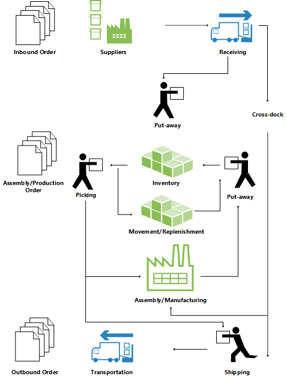

# Сведения о проектировании: обзор складаDesign Details: Warehouse Overview
Для обеспечения поддержки физической обработки товаров на уровне зон и ячеек все сведения должны отслеживаться для каждой транзакции или перемещения на складе.To support the physical handling of items on the zone and bin level, all information must be traced for each transaction or movement in the warehouse. Управление этим осуществляется в таблице **Складская операция**.This is managed in the **Warehouse Entry** table. Каждая транзакция хранится в складском регистре.Each transaction is stored in a warehouse register.  

Складские документы и складской журнал используются для регистрации перемещений товаров на складе.Warehouse documents and a warehouse journal are used to register item movements in the warehouse. При каждом перемещении, получении, размещении, подборе, отгрузке или коррекции товара на складе регистрируются складские операции для хранения физической информации о зоне, ячейке и количестве.Every time that an item in the warehouse is moved, received, put away, picked, shipped, or adjusted, warehouse entries are registered to store the physical information about zone, bin, and quantity. Дополнительные сведения см. в разделе [Сведения о проектировании: входящий складской поток](design-details-outbound-warehouse-flow.md).For more information, see [Design Details: Inbound Warehouse Flow](design-details-outbound-warehouse-flow.md).  

Таблица **Содержимое ячейки** используется для обработки разнообразных измерений содержимого ячейки для товара, например единицы измерения, максимального количества и минимального количества.The **Bin Content** table is used to handle all the different dimensions of the contents of a bin per item, such as unit of measure, maximum quantity, and minimum quantity. Таблица **Содержимое ячейки** также содержит поля FlowField для складских операций, инструкций склада и строк складского журнала, что обеспечивает возможность быстрого вычисления доступности товара по ячейкам и ячеек для товаров.The **Bin Content** table also contains flow fields to the warehouse entries, warehouse instructions, and warehouse journal lines, which ensures that the availability of an item per bin and a bin for an item can be calculated quickly. Дополнительные сведения см. в разделе [Сведения о проектировании: наличие на складе](design-details-availability-in-the-warehouse.md).For more information, see [Design Details: Availability in the Warehouse](design-details-availability-in-the-warehouse.md).  

Если учет товаров осуществляется за пределами складского модуля, ячейка корректировки по умолчанию для конкретного склада используется для синхронизации складских операций с операциями инвентаризации.When item postings occur outside the warehouse module, a default adjustment bin per location is used to synchronize warehouse entries with inventory entries. Во время инвентаризации склада любые расхождения между расчетными и подсчитанными количествами регистрируются в ячейке для коррекций, а затем учитываются как корректирующие операции книги товаров.During physical inventory of the warehouse, any differences between the calculated and counted quantities are recorded in the adjustment bin and then posted as correcting item ledger entries. Дополнительные сведения см. в разделе [Сведения о проектировании: интеграция с запасом](design-details-integration-with-inventory.md).For more information, see [Design Details: Integration with Inventory](design-details-integration-with-inventory.md).  

На следующей иллюстрации показаны типичные складские потоки.The following illustration outlines typical warehouse flows.  

  

## Базовые или расширенные функции складаBasic or Advanced Warehousing  
Складская функциональность в [!INCLUDE[d365fin](includes/d365fin_md.md)] может быть реализована на разных уровнях сложности в зависимости от процессов и объема заказов компании.Warehouse functionality in [!INCLUDE[d365fin](includes/d365fin_md.md)] can be implemented in different complexity levels, depending on a company’s processes and order volume. Основное различие в том, что действия выполняются на уровне отдельных заказов в базовом складировании, когда они консолидируются для нескольких заказов в расширенном складировании.The main difference is that activities are performed order-by-order in basic warehousing when they are consolidated for multiple orders in advanced warehousing.  

 Чтобы различить разные уровни сложности, в этой документации используется два общих понятия — базовое и расширенное складирование.To differentiate between the different complexity levels, this documentation refers to two general denominations, Basic and Advanced Warehousing. Эта простая дифференциация охватывает несколько разных уровней сложности, как определено областями продукции и настройками склада, каждый из которых поддерживается разными документами ИП.This simple differentiation covers several different complexity levels as defined by product granules and location setup, each supported by different UI documents. Дополнительные сведения см. в разделе [Сведения о проектировании: настройка склада](design-details-warehouse-setup.md).For more information, see [Design Details: Warehouse Setup](design-details-warehouse-setup.md).  

> [!NOTE]  
>  Самый расширенный уровень складирования — установки WMS в этой документации, поскольку этот уровень требует самой широкой функциональности, системы управления складом.The most advanced level of warehousing is referred to as “WMS installations” in this documentation, since this level requires the most advanced granule, Warehouse Management Systems.  

 Следующие документы ИП используются в основном и расширенном складировании.The following different UI documents are used in basic and advanced warehousing.  

## Основные документы пользовательского интерфейсаBasic UI Documents  

-   **Размещение запасов****Inventory Put-away**  
-   **Подбор запасов****Inventory Pick**  
-   **Перемещение запасов****Inventory Movement**  
-   **Журнал товаров****Item Journal**  
-   **Журнал реклассификации товаров****Item Reclassification Journal**  
-   (Различные отчеты)(Various reports)  

## Документы по расширенному пользовательскому интерфейсуAdvanced UI Documents  

-   **Складская приемка****Warehouse Receipt**  
-   **Журнал размещения****Put-away Worksheet**  
-   **Складское размещение****Warehouse Put-away**  
-   **Журнал подбора****Pick Worksheet**  
-   **Складской подбор****Warehouse Pick**  
-   **Журнал перемещения****Movement Worksheet**  
-   **Складское перемещение****Warehouse Movement**  
-   **Внутренний подбор склада****Internal Whse. Pick**  
-   **Внутреннее размещение склада****Internal Whse. Put-away**  
-   **Журнал создания ячеек****Bin Creation Worksheet**  
-   **Журнал создания содержимого ячеек****Bin Content Creation Worksheet**  
-   **Журнал товаров склада****Whse. Item Journal**  
-   **Журнал реклассификации складских товаров****Whse. Item Reclass. Journal**  
-   (Различные отчеты)(Various reports)  

Дополнительные сведения о каждом документе см. в соответствующих разделах окон.For more information about each document, see the respective window topics.  

### ТерминологияTerminology  
Для того чтобы скоординировать с финансовыми понятиями покупки и продажи, складская документация [!INCLUDE[d365fin](includes/d365fin_md.md)] использует следующие термины для обозначения потока товаров на складе.To align with the financial concepts of purchases and sales, [!INCLUDE[d365fin](includes/d365fin_md.md)] warehouse documentation refers to the following terms for item flow in the warehouse.  

|ТерминTerm|ОписаниемDescription|  
|----------|---------------------------------------|  
|Входящий потокInbound flow|Товары, перемещаемые на склад, например покупки и входящие перемещения.Items moving into the warehouse location, such as purchases and inbound transfers.|  
|Внутренний потокInternal flow|Товары, перемещаемые в пределах склада, например производственные компоненты и выход.Items moving inside the warehouse location, such as production components and output.|  
|Исходящий потокOutbound flow|Товары, перемещаемые со склада, например продажи и исходящие перемещения.Items moving out of the warehouse location, such as sales and outbound transfers.|  

## См. такжеSee Also  
 [Сведения о проектировании: управление складомDesign Details: Warehouse Management](design-details-warehouse-management.md)

