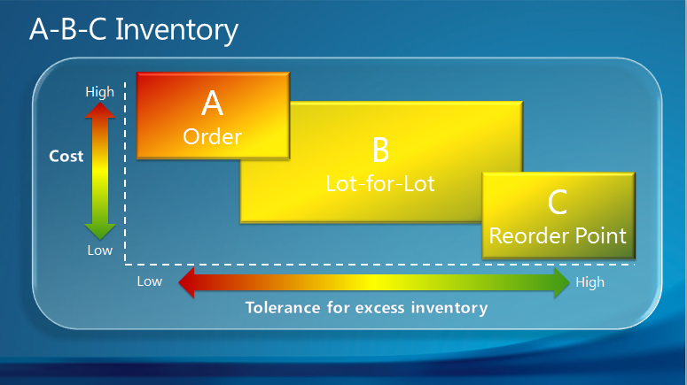

# Рекомендации по настройке. Политики повторного заказаSetup Best Practices: Reordering Policies
Поле **Политика дозаказа** в карточках товара содержит четыре разных метода планирования, которые определяют способ взаимодействия отдельных параметров планирования.The **Reordering Policy** field on item cards offers four different planning methods that determine how the individual planning parameters interact.  

Одной из ведущих основ при выборе политики повторного заказа является классификация товаров в алфавитном порядке.One best-practice foundation for selecting a reordering policy is the item’s ABC classification. При использовании ABC-классификации для контроля инвентаря и планирования поставок товары управляются в соответствии с 3 различными классами в зависимости от их значений и объема по отношению к общим запасам.When you use ABC classification for inventory control and supply planning, items are managed according to three different classes depending on their value and volume relative to the total stock. Распределение стоимости по объему для этих трех классов показано в следующей таблице.The value-volume distribution of the three classes is shown in the following table.

|КлассClass|Процент общего объема запасовPercent of total stock volume|Процент общей стоимости запасовPercent of total stock value|
|-----|-----------------------------|----------------------------|
|АA|10-2010-20|50-7050-70|
|БB|2020|2020|
|CC|60-7060-70|10-3010-30|

ABC-классификация показывает, что время и средства можно сэкономить, используя более свободное управление товарами для низкого уровня "стоимость-объем" в отличие от высокого уровня "стоимость-объем".The ABC classification states that effort and money can be saved by applying looser control to items of low value-volume than to items of high value-volume. На следующей иллюстрации показано, как политика повтора заказа в [!INCLUDE[d365fin](includes/d365fin_md.md)] лучше всего подходит для товара A, B и C соответственно.The following illustration shows which reordering policy in [!INCLUDE[d365fin](includes/d365fin_md.md)] is best suited for A, B, and C items respectively.

В следующей таблице приведены рекомендации по выбору одной из четырех политик.The following table provides best practices for selecting between the four policies.  

|Параметр настройкиSetup option|РекомендацияBest practice|КомментарийComment|  
|------------------|-------------------|-------------|  
|**Заказ****Order**|Используйте для товаров А.Use for A items.   Используйте для товаров, изготавливаемых на заказ.Use for make-to-order items.   При производстве используйте для наиболее важных товаров и для дорогостоящих компонентов и узлов.In manufacturing, use for top-level items and for expensive components and subassemblies.   Используйте для товаров, которые приобретались с прямой поставкой или по специальному заказу.Use for items that are purchased as drop shipments and special orders.   Не используйте, если вы не принимаете автоматическое резервирование.Do not use if you do not accept automatic reservation.|Товары, например кожаные диваны в мебельном магазине, являются ценными предметами с низкой и нерегулярной скоростью заказа, при которой формирование запасов неприемлемо, или обязательные атрибуты различаются.A items, such as leather couches in a furniture store, are high-value items with low and irregular order velocity where inventory is unacceptable, or the required attributes vary. Лучшая политика повтора заказа — это политика, которая осуществляет планирование по каждому варианту спроса.The best reordering policy is therefore one that plans specifically for each demand.|  
|**Партия на партию****Lot-for-Lot**|Используйте для товаров B.Use for B items.   При производстве используйте для компонентов, которые могут использоваться нескольких спецификациях.In manufacturing, use for components that occur in multiple BOMs. Это гарантирует объединение заказов на покупку одного поставщика, чтобы можно было провести переговоры по снижению цен.This ensures that purchase orders are combined for the same vendor, so better prices can be negotiated.   Используйте, если вы не знаете, какую политику дозаказа выбрать.Use if you are not sure about which reordering policy to select.|Товары класса Б, например стулья, имеют регулярную и довольно высокую скорость заказа, но также высокие затраты на обслуживание.B items, such as dining chairs, have a regular and fairly high order velocity, but also high carrying costs. Наилучшая политика повторного заказа товаров B заключается в объединении спроса в цикле повтора заказов.The best reordering policy for B items is therefore one that is economical by bundling demand in the reorder cycle.   Эту политику могут использовать 80 процентов товаров.80 percent of items can use this policy.   Может успешно использоваться без параметров планирования.Can be used successfully without planning parameters.|  
|**Фикс. кол-во повтора заказа****Fixed Reorder Qty.**|Используйте для товаров C.Use for C items.   Объедините с параметрами точки повтора заказа.Combine with reorder-point parameters.   При производстве используйте для наименее важных компонентов.In manufacturing, use for lowest-level components.   Не используйте, если товар часто резервируется.Do not use if the item is often reserved.|Товары C, например чайные чашки, это товары низкой стоимости с высокой и регулярной скоростью заказа.C items, such as tea cups, are low-value items with high and regular order velocity. Лучшая политика повтора заказа для товаров C — это политика, которая гарантирует постоянное наличие за счет постоянного нахождения выше точки повторного заказа.The best reordering policy for C items is therefore one that guarantees constant availability by always staying above a reorder point.   Если пользователь резервирует количество для выполнения отдаленного требования, то будет нарушена основа планирования.If the user reserves a quantity for some distant demand, then the planning foundation will be disturbed. Даже если прогнозируемый уровень запасов является приемлемым в отношении точки повторного заказа, количества могут быть недоступны из-за резервирования.Even if the projected inventory level is acceptable with regard to the reorder point, the quantities may not be available because of the reservation.|  
|**Максимальное кол-во****Maximum Qty.**|Используйте для товаров C с высокими затратами на обслуживание или ограничениями по хранению.Use for C items with high carrying costs or storing limitations.   Объедините с одним или несколькими модификаторами заказов ("Минимальное/максимальное кол-во заказа" или "Заказать несколько").Combine with one or more order modifiers (Minimum/Maximum Order Quantity or Order Multiple).|Товары C, например чайные чашки, это товары низкой стоимости с высокой и регулярной скоростью заказа.C items, such as tea cups, are low-value items with high and regular order velocity. Лучшая политика повтора заказа для товаров C — это политика, которая гарантирует постоянное наличие за счет постоянного нахождения выше точки повторного заказа, но ниже точки максимального количества запасов.The best reordering policy for C items is therefore one that guarantees constant availability by always staying above a reorder point, but below a maximum inventory quantity.   Чтобы изменить предлагаемый заказ, может потребоваться сократить количество заказов до указанного максимального количества заказов, увеличить его до указанного минимального количества заказов либо округлить для соответствия указанному множителю заказов.To modify the suggested order, you may want the order quantity to be decreased to a specified maximum order quantity, increased to a specified minimum order quantity, or rounded up to meet a specified order multiple. **Примечание.** При использовании точки повторного заказа запасы остаются в пределах точки повторного заказа и максимального количества.**Note:**  If used with a reorder point, then inventory stays between the reorder point and the maximum quantity.|  

## См. такжеSee Also  
 [Рекомендации по настройке. Планирование поставок](setup-best-practices-supply-planning.md) [Setup Best Practices: Supply Planning](setup-best-practices-supply-planning.md)   
 [Сведения о проектировании: политики дозаказа](design-details-reordering-policies.md) [Design Details: Reordering Policies](design-details-reordering-policies.md)   
 [Сведения о проектировании: заказ](design-details-order.md) [Design Details: Order](design-details-order.md)   
 [Сведения о проектировании: партия на партию](design-details-lot-for-lot.md) [Design Details: Lot-for-Lot](design-details-lot-for-lot.md)   
 [Сведения о проектировании: фиксированное количество дозаказа](design-details-fixed-reorder-qty.md) [Design Details: Fixed Reorder Qty.](design-details-fixed-reorder-qty.md)   
 [Сведения о проектировании: максимальное количество](design-details-maximum-qty.md) [Design Details: Maximum Qty.](design-details-maximum-qty.md)   
 [Настройка сложных областей приложения с помощью рекомендацийSet Up Complex Application Areas Using Best Practices](set-up-complex-application-areas-using-best-practices.md)  
 [Работа с [!INCLUDE[d365fin](includes/d365fin_md.md)]](ui-work-product.md)[Working with [!INCLUDE[d365fin](includes/d365fin_md.md)]](ui-work-product.md)

