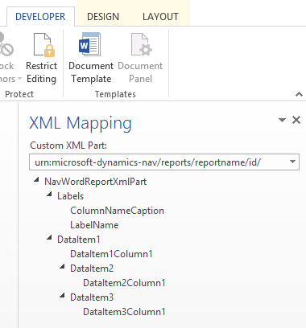

# Практическое руководство. Добавление полей в макет отчета Word
Набор данных отчета может состоять из полей, отображающих метки, данные и изображения. В этом разделе описывается процедура добавления полей набора данных отчета в существующий макет отчета Word для отчета. Поля добавляются с использованием пользовательской части XML в Word для отчета и путем добавления элементов управления содержимым, сопоставляемых полям в наборе данных отчета. Добавление полей требует определенных знаний набора данных отчета, чтобы можно было идентифицировать поля, которые требуется добавить в макет.  
  
> [!NOTE]  
>  Невозможно изменить встроенные макеты отчетов<!--Onprem. Built-in layouts can only be modified by using the development environment-->.  

##   Открытие пользовательской части XML для отчета в Word  
  
1.  Если это еще не сделано, откройте макет отчета Word в Word.  
  
     Дополнительные сведения см. в разделе [Практическое руководство. Создание и изменение пользовательского макета отчета](ui-how-create-custom-report-layout.md).  
  
2.  Отобразите вкладку **Разработчик** на ленте Microsoft Word.  
  
     По умолчанию вкладка **Разработчик** не отображается на ленте. Дополнительные сведения см. в разделе [Практическое руководство. Отображение вкладки разработчика на ленте](http://go.microsoft.com/fwlink/?LinkID=389631).  
  
3.  На вкладке **Разработчик** выберите **Область сопоставления XML**.  
  
4.  В области **Сопоставление XML** в раскрывающемся списке **Пользовательская XML-часть** выберите пользовательскую XML-часть для отчета ADD INCLUDE<!--[!INCLUDE[navnow](../../includes/navnow_md.md)]-->, который обычно последний в списке. Имя пользовательской XML-части имеет следующий формат.  
  
     urn:microsoft-dynamics-nav/reports/*имя_отчета*/*ИД*  
  
     *имя_отчета* — это имя, назначенное отчету<!--OnPrem as specified by the report's [Name Property-duplicate](../FullExperience/nav_dev_long_md.md)]-->.  
  
     *ИД* — это идентификационный номер отчета.  
  
     После выбора пользовательской XML-части в области сопоставления XML отображаются метки и элементы управления полем, доступные для отчета.  
  
### Добавление поля метки или данных  
  
1.  Поместите курсор в документ, где требуется добавить элемент управления.  
  
2.  В области **Сопоставления XML** щелкните правой кнопкой мыши элемент управления, который требуется добавить, щелкните **Вставить элемент управления содержимым** и щелкните **Обычный текст**.  
  
    > [!NOTE]  
    >  Невозможно добавить поле, вручную введя название поля набора данных в элементе управления содержимым. Необходимо использовать область **Сопоставление XML** для сопоставления полей.  
  
### Добавление повторяющихся строк полей данных для создания списка  
  
1.  В таблице добавьте строку таблицы со столбцом для каждого поля, которое должно повторяться.  
  
     Эта строка будет функционировать как местозаполнитель для повторяющихся полей.  
  
2.  Выберите всю строку.  
  
3.  В области **Сопоставления XML** щелкните правой кнопкой мыши элемент управления, соответствующий элементу данных отчета, который содержит повторяемые поля, щелкните **Вставить элемент управления содержимым** и выберите **Повторяющийся**.  
  
4.  Добавьте повторяющиеся поля на строку следующим образом.  
  
    1.  Поместите указатель в столбец.  
  
    2.  В области **Сопоставления XML** щелкните правой кнопкой мыши элемент управления, который требуется добавить, щелкните **Вставить элемент управления содержимым** и щелкните **Обычный текст**.  
  
    3.  Для каждого поля повторите шаги а и б.  
  
## Добавление полей изображений  
 Набор данных отчета может включать поле, содержащее изображение, например логотип компании или изображение товара. Чтобы добавить изображение из набора данных отчета, вставьте элемент управления содержимым **Изображение**.  
  
 Изображения выравниваются в верхнем левом углу элемента управления содержимым и автоматически меняют свой размер пропорционально границе элемента управления содержимым.  
  
> [!IMPORTANT]  
>  Можно добавить изображения только в формате, поддерживаемом Word, например BMP, JPEG и PNG. При добавлении изображения в формате, не поддерживаемом Word, получается ошибка при выполнении отчета из клиента ADD INCLUDE<!--[!INCLUDE[navnow](../../includes/navnow_md.md)]-->.  
  
#### Добавление изображения  
  
1.  Поместите указатель в документ, где требуется добавить элемент управления.  
  
2.  В области **Сопоставления XML** щелкните правой кнопкой мыши элемент управления, который требуется добавить, щелкните **Вставить элемент управления содержимым** и щелкните **Изображение**.  
  
3.  Чтобы увеличить или уменьшить размер изображения, перетащите маркер размера по направлению к центру элемента управления содержимым или от него.  

## Обзор пользовательской XML-части
Макеты отчетов Word создаются на базе *пользовательских XML-частей*. Пользовательская XML-часть для отчета состоит из элементов, соответствующих элементам данных, столбцам и меткам, составляющим набор данных отчета. <!--OnPrem The data as defined in the Report Dataset Designer in Microsoft Dynamics NAV Development Environment. -->Пользовательская XML-часть используется для сопоставления данных в отчете при выполнении отчета.

  
### Структура XML и пользовательская часть XML  
В следующей таблице приведен упрощенный обзор XML пользовательской XML-части.  
  
|XML-элементы|Описанием|  
|------------------|-----------------|  
|`<?xml version="1.0" encoding="utf-16"?>`|Заголовок|  
|`<WordReportXmlPart xmlns="urn:microsoft-dynamics-365/report/<reportname>/<id>/"`|Спецификация пространства имен XML. `<reportname>` — это имя, назначенное отчету. `<id>` — это ИД, назначенный отчету.|  
|`..<Labels>`   `....<ColumnNameCaption>ColumnNameCaption</ColumnNameCaption>`   `....<LabelName>LabelCaption</LabelName>`   `..</Labels>`|Содержит все метки отчета.<!--OnPren The element includes labels that are related to columns that have the [IncludeCaption Property](../FullExperience/Name%20Property-duplicate.md).--> -   Элементы меток, связанные со столбцами, имеют формат `<ColumnNameCaption>ColumnNameCaption</ColumnNameCaption>`<!--OnPrem where `ColumnName` is determined by the column's Name Property.-->. -  Элементы меток имеют формат `<LabelName>LabelName</LableName`<!--OnPrem where LabelName is determined by the label's Name Property.-->. -   Метки перечислены в алфавитном порядке.|  
|`..<DataItem1>`   `....<DataItem1Column1>DataItem1Column1</DataItem1Column1>`|Элементы данных и столбцы верхнего уровня. Столбцы перечислены в алфавитном порядке.<!--OnPrem    The element names and values are determined by the [Name Property-duplicate](../FullExperience/Name%20Property-duplicate.md) of the data item or column.-->|  
|`....<DataItem2>`   `......<DataItem2Column1>DataItem2Column1</DataItem2Column1>`   `....</DataItem2>`   `....<DataItem3>`   `......<DataItem3Column1>DataItem3Column1</DataItem3Column1>`   `....</DataItem3>`|Элементы данных и столбцы, вложенные в элемент данных верхнего уровня. Столбцы перечислены в алфавитном порядке под соответствующим элементом данных.|  
|`..</DataItem1>`   `</WordReportXmlPart>`|Заключительный элемент.|  
  
### Пользовательская часть XML в Word  
 В Word следует открыть пользовательскую XML-часть в области **Сопоставление XML**, а затем воспользоваться этой областью для сопоставления этих элементов элементам управления содержимым в документе Word. Область **Сопоставление XML** можно открыть на вкладке **Разработчик** (для получения дополнительных сведений см. [Практическое руководство. Отображение вкладки разработчика на ленте](http://go.microsoft.com/fwlink/?LinkID=389631)).  
  
 Элементы в области **Сопоставление XML** отображается в структуре, схожей с XML-источником. Поля меток группируются под общим элементом **Метки**, а элементы данных и столбцы упорядочены в иерархическую структуру, соответствующую источнику XML, где столбцы отображаются в алфавитном порядке. Элементы идентифицируются по имени, как определено свойством "Имя" в конструкторе наборов данных отчетов в ADD INCLUDE<!--[!INCLUDE[nav_dev_short](../../includes/nav_dev_short_md.md)]-->.  
  
 На приведенном ниже рисунке изображена простая пользовательская XML-часть из предыдущего раздела в области **Сопоставление XML** документа Word.  
  
   
  
-   Для добавления метки или поля в макет вставьте элемент управления содержимым, соответствующий элементу в области **Сопоставление XML**.  
  
-   Для создания повторяющихся строк столбцов вставьте элемент управления содержимым **Повторяющийся** для родительского элемента данных и добавьте элемент управления содержимым для столбцов.  
  
-   Для меток фактический текст, отображаемый в созданном отчете, — это значение свойства **Заголовок** для поля в таблице элементов данных (если метка связана со столбцом в наборе данных отчета) или для метки в конструкторе меток отчетов (если метка не связана со столбцом в наборе данных).  
  
-   Язык метки, отображаемый при выполнении отчета, зависит от настройки языка объекта отчета. <!--OnPrem For more information, see [Multiple Document Languages](../FullExperience/Viewing%20the%20Application%20in%20Different%20Languages.md).-->  
  
## См. также  
 [Практическое руководство. Создание и изменение пользовательского макета отчета](ui-how-create-custom-report-layout.md)   
