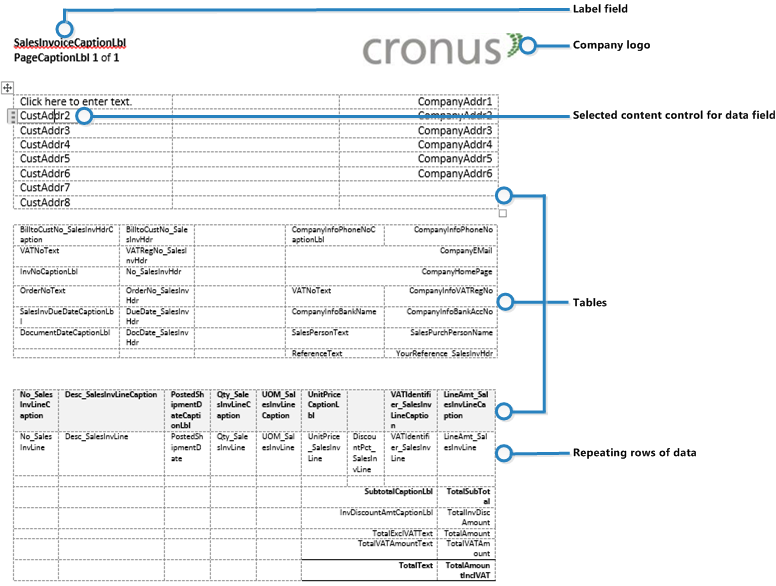

# Управление макетами отчетов и документовManaging Report and Document Layouts
Макет отчета контролирует содержимое и формат отчета, включая то, какие поля данных набора данных отчета отображаются в нем и как они упорядочены, а также стиль текста, изображения и т. д.A report layout controls content and format of the report, including which data fields of a report dataset appear on the report and how they are arranged, text style, images, and more. В [!INCLUDE[d365fin](includes/d365fin_md.md)] можно изменить используемый в отчете макет, создать новый макет или изменить текущие макеты.From [!INCLUDE[d365fin](includes/d365fin_md.md)], you can change which layout is used on a report, create new layout, or modify the existing layouts.

> [!NOTE]  
>   В [!INCLUDE[d365fin](includes/d365fin_md.md)] термин "отчет" также означает внешние документы, такие как счета продажи и подтверждения заказов, которые вы отправляете клиентам в виде PDF-файлов.In [!INCLUDE[d365fin](includes/d365fin_md.md)], the term "report" also covers externally-facing documents, such as sales invoices and order confirmations that you send to customers as PDF files.

В частности, макет отчета настраивает следующее.In particular, a report layout sets up the following:

* Поля меток и данных для включения из набора данных отчета [!INCLUDE[d365fin](includes/d365fin_md.md)].The label and data fields to include from the dataset of the [!INCLUDE[d365fin](includes/d365fin_md.md)] report.
* Текстовый формат, например тип, размер и цвет шрифта.The text format, such as font type, size, and color.
* Логотип компании и его расположение.The company logo and its position.
* Общие параметры страницы, такие как поля и фоновые изображения.General page settings, such as margins and background images.

[!INCLUDE[d365fin](includes/d365fin_md.md)] можно настроить с несколькими макетами, между которыми можно при необходимости переключаться.A [!INCLUDE[d365fin](includes/d365fin_md.md)] can be set up with multiple report layouts, which you can switch among as required. Можно использовать один из встроенных макетов отчета или создать пользовательские макеты отчета и назначить их отчетам.You can use one of the built-in report layouts or you can create custom report layouts and assign them to your reports as needed. Дополнительные сведения см. в разделе [Практическое руководство. Создание пользовательского макета отчета или документа](ui-how-create-custom-report-layout.md).For more information, see [How to: Create a Custom Report or Document Layout](ui-how-create-custom-report-layout.md).

Существует два типа макетов отчета, которые можно использовать в отчетах — Word и RDLC.There are two types of report layouts that you can use on reports; Word and RDLC.

## Обзор макета отчетов WordWord report layout overview
Макет отчета Word основан на документе Word (тип файла DOCX).A Word report layout is a based on Word document (.docx file type). Макеты отчетов Word позволяют разрабатывать макеты отчетов с помощью Microsoft Word 2013 или более поздней версии.Word report layouts enable you to design report layouts by using Microsoft Word 2013 or later. Макет отчета Word определяет содержимое отчета, расположение элементов отчета и их внешний вид.A Word report layout determines the report's content - controlling how that content elements are arranged and how they look. Документ макета отчетов Word, как правило, использует таблицы для организации содержимого, клетки которых могут содержать поля данных, текст или изображения.A Word report layout document will typically use tables to arrange content, where the cells can contain data fields, text, or pictures.

   

## Обзор макета RDLCRDLC layout overview
Макеты RDLC основаны на клиентских макетах определения отчета (типы файла RDLC или RDL).RDLC layouts are based on client report definition layouts (.rdlc or .rdl file types). Эти макеты создаются и изменяются с использованием конструктора отчетов SQL Server Report Builder.These layouts are created and modified by using SQL Server Report Builder. Дизайнерская концепция макетов RDLC схожа с макетами Word, где макет определяет общий формат отчета и включаемые в него поля из набора данных.The design concept for RDLC layouts is similar to Word layouts, where the layout defines the general format of the report and determines the fields from the dataset to include. Разработка макетов RDLC более сложная, чем макетов Word.Designing RDLC layouts is more advanced than Word layouts. Дополнительные сведения см. в разделе [Разработка макетов отчетов RDLC](https://msdn.microsoft.com/en-us/dynamics-nav/designing-rdlc-report-layouts).For more information, see [Designing RDLC Report Layouts](https://msdn.microsoft.com/en-us/dynamics-nav/designing-rdlc-report-layouts).

## Встроенные и пользовательские макеты отчетовBuilt-in and custom report layouts
[!INCLUDE[d365fin](includes/d365fin_md.md)] включает несколько встроенных макетов. includes several built-in layouts. Встроенные макеты — это предопределенные макеты, предназначенные для определенных отчетов.Built-in layouts are predefined layouts that are designed for specific reports. Отчеты [!INCLUDE[d365fin](includes/d365fin_md.md)] будут иметь встроенный макет RDLC, макет отчета Word, а в некоторых случаях оба макета.[!INCLUDE[d365fin](includes/d365fin_md.md)] reports will have a built-in layout as either an RDLC report layout, Word report layout, or in some cases both. Невозможно изменить встроенные макеты отчетов в [!INCLUDE[d365fin](includes/d365fin_md.md)], но можно использовать их в качестве начальной точки для создания собственных пользовательских макетов отчетов.You cannot modify a built-in report layout from [!INCLUDE[d365fin](includes/d365fin_md.md)] but you use them as a starting point for building your own custom report layouts.

Пользовательские макеты — это макеты отчетов, созданные пользователем для изменения внешнего вида отчета.Custom layouts are report layouts that you design to change the appearance of a report. Обычно пользовательский макет создается на основании встроенного макета, но его можно создать с нуля или из копии существующего пользовательского макета.You typically create a custom layout based on a built-in layout, but you can create them from scratch or from a copy of an existing custom layout. Пользовательские макеты позволяют настроить несколько макетов для одного и того же отчета. При необходимости можно переключаться между ними.Custom layouts enable you to have multiple layouts for the same report, which you switch among as needed. Например, можно иметь разные макеты для каждой организации [!INCLUDE[d365fin](includes/d365fin_md.md)] или разные макеты для одной и той же организации, но разных случаев или событий, например специальной кампании или сезона отпусков.For example, you can have different layouts for each [!INCLUDE[d365fin](includes/d365fin_md.md)] company, or you can have different layouts for the same company for specific occasions or events, like a special campaign or holiday season.

## Выбор между макетом отчета RDLC и WordDeciding whether to use a Word or RDLC report layout
В основе макета отчета может лежать документ Word или файл RDLC.A report layout can be based on either a Word document or RDLC file. Принятие решения об использовании макета отчета Word или RDLC зависит от того, как должен выглядеть готовый отчет, и ваших знаний о построителе отчетов SQL Server или Word.Deciding on whether to use a Word report layout or RDLC report layout type will depend on how you want the generated report to look and your knowledge of Word and SQL Server Report Builder.

Общие концепции дизайна макетов Word и RDLC очень схожи.The general design concepts for Word and RDLC layouts are very similar. Однако каждый тип имеет определенные особенности дизайна, влияющие на отображение созданного отчета в [!INCLUDE[d365fin](includes/d365fin_md.md)].However each type has certain design features that affect how the generated report is appears in [!INCLUDE[d365fin](includes/d365fin_md.md)]. Это означат, что один и тот же отчет может выглядеть по-разному при использовании макетов отчетов Word и RDLC.This means that the same report might look different when using the Word report layout compared to the RDLC report layout.

Процедура настройки макетов отчетов Word и RDLC в отчетах одинакова.The process for setting up Word report layouts and RDLC report layouts on reports is the same. Основное различие — в способе изменения макетов.The main difference is in the way you modify the layouts. Макеты отчетов Word, как правило, проще создавать и изменять, чем макеты отчетов RDLC, поскольку можно использовать Word.Word report layouts are typically easier to create and modify than RDLC report layouts because you can use Word. Макеты отчетов RDLC изменяются с помощью построителя отчетов SQL Server, предназначенного для более продвинутых пользователей.RDLC report layouts are modified by using SQL Server Report builder which targets more advanced users.

Дополнительные сведения о том, как изменять используемый макет, см. в разделе [Практическое руководство. Изменение макета, в настоящее время используемого в отчете](ui-how-change-layout-currently-used-report.md).For information on how to change which layout to use, see [How to: Change Which Layout is Currently Used on a Report](ui-how-change-layout-currently-used-report.md).

## См. такжеSee Also
[Обновление макетов отчетов или документовUpdating Report or Document Layouts](ui-update-report-layouts.md)  
[Работа с [!INCLUDE[d365fin](includes/d365fin_md.md)]](ui-work-product.md)[Working with [!INCLUDE[d365fin](includes/d365fin_md.md)]](ui-work-product.md)  
[Практическое руководство. Создание и изменение пользовательского макета отчета или документаHow to: Create and Modify a Custom Report or Document Layout](ui-how-create-custom-report-layout.md)  
[Практическое руководство. Импорт и экспорт пользовательского макета отчета или документаHow to: Import and Export a Custom Report or Document Layout](ui-how-import-and-export-report-layout.md)  
[Практическое руководство. Отправка документов по электронной почтеHow to: Send Documents by Email](ui-how-send-documents-email.md)  
[Работа с отчетамиWorking with Reports](ui-work-report.md)  

